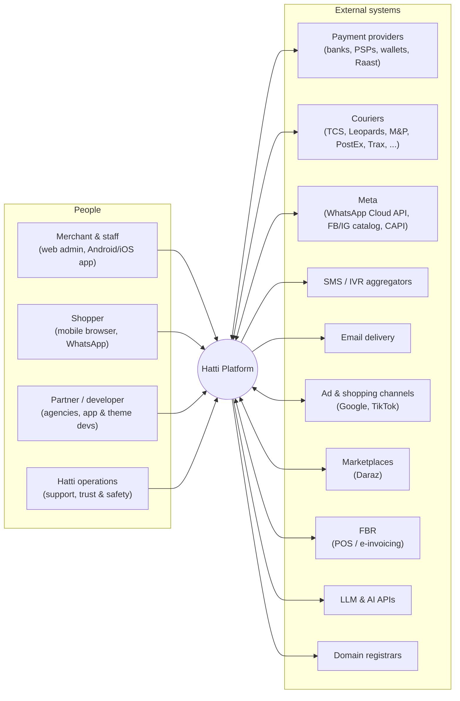
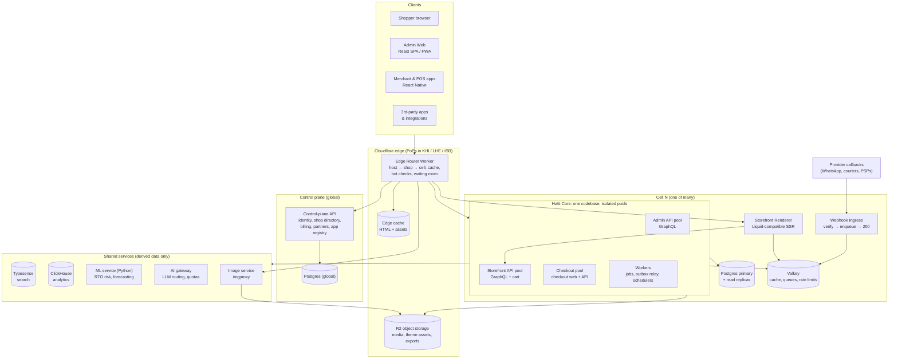
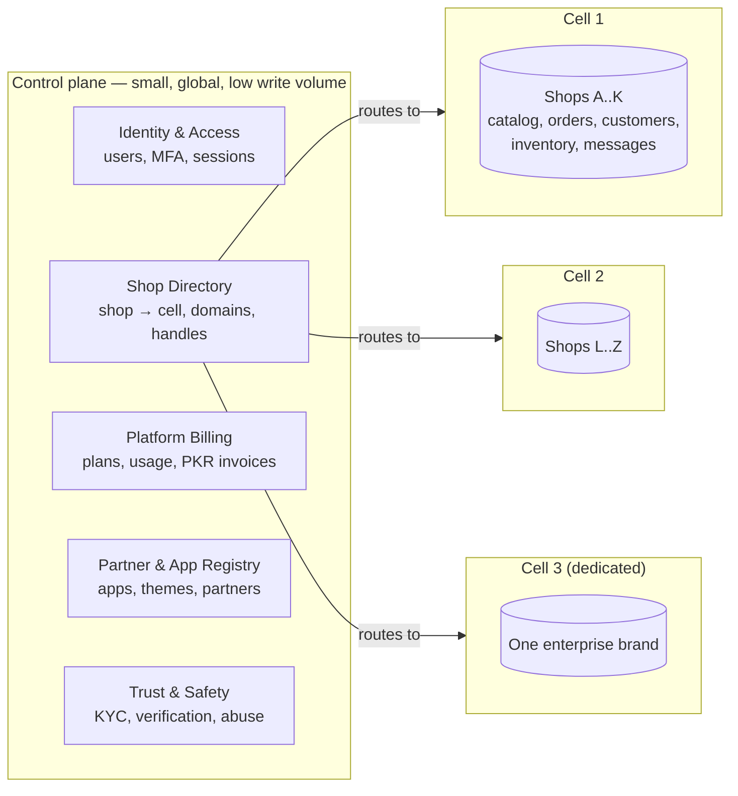
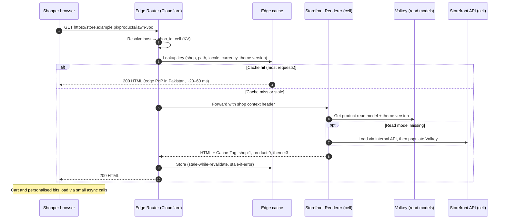
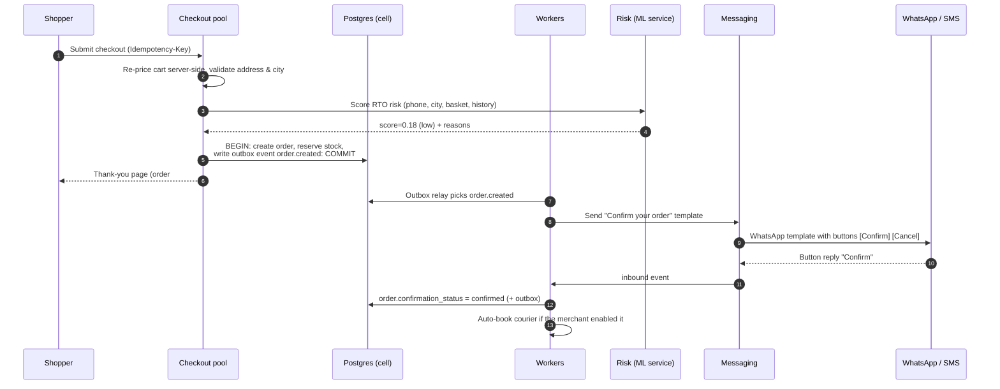
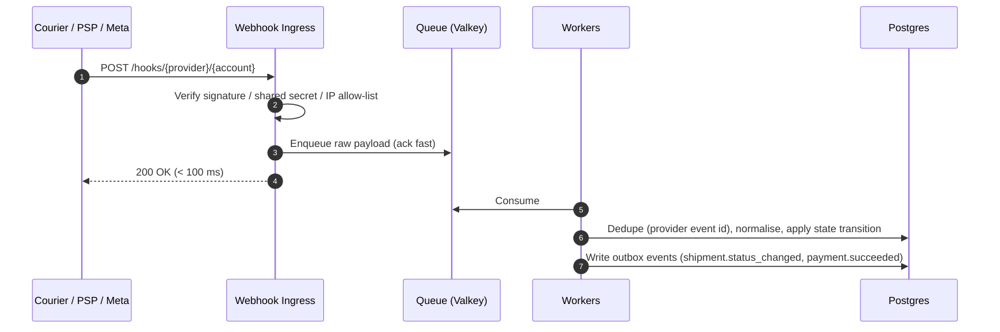
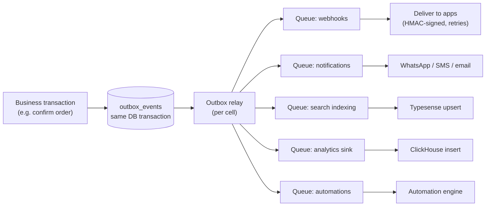

# 01 · System Architecture Overview

> **Status:** Draft v0.1 · **Last updated:** 2026-09-27 · **Scope:** whole platform
> Working name used throughout: **Hatti** (Punjabi: ہٹی, "shop"). It is a placeholder until branding is settled.

This document is the entry point to the architecture. It describes the forces that shape the
system, the big building blocks, how they talk to each other, and how the design evolves from
MVP to a platform serving 100k+ stores. Detailed designs live in the numbered documents that
follow.

---

## 1. Architecture drivers

These quality attributes are ranked. When two of them conflict, the higher one wins.

| # | Driver | What it means for us | Design consequence |
|---|--------|----------------------|--------------------|
| 1 | **Checkout & order integrity** | A lost order, double charge, or oversold item destroys merchant trust. | Server-authoritative pricing, idempotency everywhere, transactional outbox, explicit state machines. |
| 2 | **Affordability (cost per store)** | We charge in PKR at a fraction of Shopify's price. Infra must cost **< US$0.50 per active store per month** at scale. | Shared multi-tenancy, aggressive edge caching, zero-egress object storage, lean runtimes, no per-tenant infrastructure. |
| 3 | **Performance on real Pakistani conditions** | Shoppers use Rs 25–60k Android phones on congested 4G; networks see disruptions. | HTML-first storefront, tiny JS budgets, CDN PoPs in Karachi/Lahore/Islamabad, stale-if-error caching. |
| 4 | **Integration resilience** | Courier APIs, payment gateways and messaging channels are slow, inconsistent or intermittently down. | Adapters behind queues, retries with backoff, reconciliation jobs, channel fallback (WhatsApp → SMS). |
| 5 | **Tenant isolation & security** | One merchant must never see another's data. Payment and customer PII must be protected. | `shop_id` scoping + Postgres Row-Level Security, envelope-encrypted secrets, PCI scope minimisation. |
| 6 | **Team velocity** | Small team (8–15 engineers in year 1). | Modular monolith in one language (TypeScript), one database technology, boring infrastructure. |
| 7 | **Scalability & burst handling** | Eid, White Friday, 11.11 and lawn-collection launches create 20–100× spikes. | Cells, read models, a waiting room ("Drop Mode"), queue-based admission, autoscaling. |
| 8 | **Extensibility** | Agencies, freelancers and apps must build on us. | Versioned GraphQL APIs, webhooks, OAuth apps, Liquid-compatible themes, later Wasm Functions. |

---

## 2. Architecture at a glance

**Style:** a **modular monolith** ("Hatti Core", TypeScript) with strictly enforced module boundaries.
It is deployed as several **process pools** (admin API, storefront API, checkout, workers) so that
one kind of traffic cannot starve another. A few components with very different runtime profiles
are separate deployables: the storefront renderer, the edge layer, the webhook ingress, and the
ML service.

**Scale-out model:** **cells** (also called pods). A small global **control plane** holds identities,
billing and the shop directory. Each **cell** is a self-contained slice (Postgres, Valkey, workers,
API pools) serving a subset of shops. We launch with one cell and add cells as we grow, like
Shopify's pod architecture. Blast radius stays small and there is never a single database for
every shop.
*Built so far:* the identity login opens shops in the shop directory for the accounts it keeps,
until the control plane does ([ADR-145](./13-decision-log.md#adr-145--a-signed-up-user-opens-a-shop-of-their-own-through-the-identity-login-its-name-a-handle-made-from-it-or-chosen-and-never-the-platforms-the-user-its-owner-and-shopopened-for-its-storefront-in-one-transaction)).

**Edge-first delivery:** Cloudflare terminates TLS for merchant custom domains (Cloudflare for
SaaS), caches storefront HTML and media at Pakistani PoPs, runs bot protection, and routes each
request to the correct cell.

### 2.1 System context (C4 level 1)

### 2.2 Containers (C4 level 2)

**Reading the diagram**

* Every request enters through the **Edge Router Worker**. It resolves the hostname (custom domain
  or `*.hatti.pk`) to a shop and its cell using a KV-cached copy of the shop directory. It serves from
  cache when it can and otherwise forwards to the right cell.
* Inside a cell, the **same Core codebase** runs as separate pools (admin, storefront, checkout,
  workers). A traffic spike on storefronts cannot exhaust checkout or admin capacity. These are
  bulkheads.
* Provider callbacks (payment confirmations, courier status, WhatsApp replies) land on a tiny
  **webhook ingress** that verifies and enqueues them, so slow processing never causes providers to
  time out.
* **Search, analytics, image processing, ML and the AI gateway** are shared services, logically
  partitioned by `shop_id`. They hold derived data only and can be rebuilt from the cells.
  *Built so far:* images are checked and cleaned by the core's worker and served, at their sizes
  and formats, by the core's API behind the edge, until imgproxy takes the path over at the same
  addresses ([ADR-158](./13-decision-log.md#adr-158--hatti-keeps-products-images-itself-the-worker-reads-each-from-the-shops-upload-or-fetches-it-from-its-url-never-reaching-a-private-network-checks-it-and-keeps-a-clean-copy-without-its-metadata-at-most-4096-pixels-a-side-the-api-serves-it-at-nine-widths-in-avif-webp-or-its-own-format-each-made-the-first-time-it-is-asked-for-and-kept-and-an-image-goes-from-storage-and-the-edge-with-its-media)).

---

## 3. Control plane vs cells

*Built so far* ([ADR-154](./13-decision-log.md#adr-154--shops-pay-hatti-for-a-plan-in-rupees-by-the-month-or-the-year-through-hattis-own-payment-gateway-account-a-bigger-plan-begins-once-its-invoice-is-paid-less-what-is-left-of-the-period-it-cuts-short-a-smaller-one-when-the-period-ends-each-period-is-invoiced-a-week-ahead-and-a-week-unpaid-puts-the-shop-on-free-other-modules-ask-each-plans-limits-through-a-port)): Platform Billing's plans and invoices, in a `billing` schema
of the one database, each shop's subscription under RLS as cells' data is: Free, Starter, Growth
and Pro in rupees, paid through Hatti's own Safepay account, the plans' limits on staff and
locations asked through a port; and the credit each shop's messages are paid from, bought the
same way, which the messaging module charges through a port of its own ([ADR-155](./13-decision-log.md#adr-155--a-shops-messages-are-paid-from-credit-in-rupees-it-buys-from-hatti-with-an-invoice-of-its-own-each-is-charged-as-it-is-sent-at-what-it-costs-hatti-and-hattis-fee-in-a-ledger-kept-beside-the-balance-a-message-the-credit-cannot-pay-for-waits-and-a-code-is-not-sent-and-what-whatsapp-could-not-deliver-is-given-back)).

| Concern | Control plane | Cell |
|---|---|---|
| Data | Users, organisations, memberships, support agents and owners' grants to them ([ADR-156](./13-decision-log.md#adr-156--hattis-support-looks-at-a-shop-only-while-its-owner-allows-it-15-minutes-to-a-day-its-agents-hattis-own-people-signed-in-with-a-second-factor-come-as-a-caller-of-their-own-with-every-read-scope-numbers-masked-change-nothing-and-each-of-their-requests-goes-on-the-shops-audit-log-before-it-runs)), shop directory, domains, platform subscriptions, partner accounts, app/theme registry, KYC status | Everything shop-scoped: catalog, inventory, customers, carts, orders, payments, shipments, messages, themes, content, app installations, audit log |
| Write volume | Low | High |
| Failure impact | Login and new sign-ups degrade; **existing storefronts and checkouts keep working** (directory cached at edge) | Only shops in that cell are affected |
| Scaling | Vertical plus read replicas | Add more cells; move shops between cells |

**Rules**

1. A shop's commerce data lives in **exactly one cell**. No query ever joins across cells.
2. Cross-shop features (network risk signals, courier performance benchmarks, platform
   analytics) use **derived, aggregated data** in shared services, never live cross-cell queries.
3. IDs are globally unique (UUIDv7), so a shop can be **moved** to another cell without rewriting
   keys. See [03 · Multi-tenancy & Data](./03-multi-tenancy-and-data.md).
4. Enterprise merchants can get a **dedicated cell** (noisy-neighbour isolation, custom maintenance
   windows). The software is the same; only the placement differs.

---

## 4. Modules (bounded contexts)

Core is split into modules with explicit public interfaces. A module owns its tables. Other modules
never read those tables directly: they call the module's service facade (synchronous, in-process)
or react to its domain events (asynchronous). Boundaries are enforced in CI with lint rules; see
[02 · Tech Stack](./02-tech-stack.md).

| Module | Responsibility | Owns (examples) | Emits (examples) |
|---|---|---|---|
| **Catalog** | Products, variants, options, collections, metafields/metaobjects, media references, taxonomy. *Built:* products' images, read from the shop's uploads or fetched from their URLs by the worker, checked and kept as a clean copy, served by the API at the sizes and formats browsers ask for, and removed with their media ([ADR-158](./13-decision-log.md#adr-158--hatti-keeps-products-images-itself-the-worker-reads-each-from-the-shops-upload-or-fetches-it-from-its-url-never-reaching-a-private-network-checks-it-and-keeps-a-clean-copy-without-its-metadata-at-most-4096-pixels-a-side-the-api-serves-it-at-nine-widths-in-avif-webp-or-its-own-format-each-made-the-first-time-it-is-asked-for-and-kept-and-an-image-goes-from-storage-and-the-edge-with-its-media)) | `products`, `variants`, `collections`, `product_media`, `media_removals` | `product.created`, `product.updated` |
| **Inventory** | Locations, stock levels, reservations, adjustments, transfers, purchase orders | `inventory_levels`, `reservations` | `inventory_level.updated`, `inventory.low_stock` |
| **Pricing & Promotions** | Price lists, discount rules, codes, automatic promotions, bundles | `discounts`, `price_lists` | `discount.redeemed` |
| **Online Store** | Themes, templates, pages, blogs, menus, redirects, translations, SEO | `themes`, `pages`, `menus` | `theme.published` |
| **Cart & Checkout** | Carts, checkout sessions, shipping/payment selection, order placement | `carts`, `checkouts` | `checkout.started`, `checkout.abandoned` |
| **Payments** | Payment method config, payment intents, transactions, refunds, gateway adapters, payment links. *Built:* the shop's own gateway accounts, Safepay first, and payments online of what an order waits for from its page, recorded once from the gateway's signed return or webhook and paid on the order through the orders module's functions, a port the orders module defines, checkout's online method, its order placed to wait for its total and paid from its thank-you page, and refunds given back through the gateway that took the payment ([ADR-153](./13-decision-log.md#adr-153--money-paid-online-goes-back-through-the-gateway-that-took-it-as-far-as-its-adapter-can-give-it-back-safepay-a-payment-whole-each-refund-is-recorded-before-the-gateway-is-asked-and-written-on-its-order-once-the-gateway-says-it-is-sent-a-refusal-is-said-and-a-refund-without-an-answer-holds-its-amount-until-staff-settle-it-from-the-gateways-dashboard)) ([ADR-152](./13-decision-log.md#adr-152--checkout-offers-paying-online-where-the-shop-has-a-gateway-the-order-is-placed-to-wait-for-its-total-as-a-transfers-does-and-its-thank-you-page-sends-the-shopper-to-the-shops-gateway-which-sends-them-back-to-the-checkouts-address-on-the-core)) ([ADR-151](./13-decision-log.md#adr-151--shops-take-payments-online-through-their-own-gateway-accounts-safepay-first-their-credentials-sealed-for-each-account-an-order-waiting-for-its-money-offers-to-take-it-on-its-page-a-session-is-recorded-before-the-customer-leaves-for-the-gateway-and-the-gateways-signed-return-or-webhook-whichever-comes-first-records-it-paid-once-and-pays-what-the-order-owes-of-it-a-sandboxs-payments-pay-nothing)) | `payment_intents`, `transactions` | `payment.succeeded`, `payment.failed` |
| **Orders** | Order lifecycle, confirmation, edits, cancellations, returns, refunds, invoices, risk | `orders`, `order_lines`, `returns` | `order.created`, `order.confirmed`, `order.cancelled` |
| **Fulfillment & Logistics** | Shipping profiles and rates, fulfillment orders, courier booking, labels, tracking, COD remittance reconciliation. *Built:* couriers' remittance statements, and orders booked with the shop's own courier accounts, PostEx first: the worker books each through the courier's adapter, ships it with the courier's number and follows the parcel ([ADR-149](./13-decision-log.md#adr-149--shops-book-orders-with-their-own-courier-accounts-their-credentials-sealed-for-each-account-each-booking-waits-in-postgres-until-the-worker-books-it-through-the-couriers-adapter-keeps-the-couriers-number-before-shipping-the-order-with-it-and-follows-the-parcel-by-asking-the-couriers-words-read-through-mappings-kept-as-data)); each parcel's way kept step by step, which its customer's order page shows ([ADR-160](./13-decision-log.md#adr-160--each-parcels-way-is-kept-step-by-step-as-shopifys-fulfillmentevent-its-couriers-changes-recorded-once-from-the-workers-tracking-and-staffs-for-couriers-hatti-does-not-follow-the-orders-page-shows-them-the-latest-first-in-english-and-urdu-the-shipped-message-links-that-page-and-a-parcel-out-for-delivery-with-cash-to-collect-tells-its-customer-what-to-keep-ready)) | `shipments`, `tracking_events`, `remittances` | `shipment.booked`, `shipment.status_changed`, `remittance.reconciled` |
| **Customers** | Profiles (phone-first), addresses, segments, consent, customer accounts (OTP login) | `customers`, `consents` | `customer.created` |
| **Messaging** | Notification templates, channel routing (WhatsApp/SMS/email/push), delivery tracking, unified inbox. *Built:* customers told of their orders on WhatsApp from Hatti's shared number or by SMS, each message queued once from the orders' events, sent and tried again by the worker, followed through WhatsApp's webhook, and never sent to a number that asked the shop to stop; and the codes merchants sign in with, sent by the API at once at Hatti's cost, never a shop's ([ADR-159](./13-decision-log.md#adr-159--merchants-open-an-account-and-sign-in-with-their-mobile-number-and-a-code-sent-to-it-on-whatsapp-or-by-sms-from-hattis-own-number-at-hattis-cost-six-digits-for-ten-minutes-and-five-tries-a-number-sent-five-an-hour-and-ten-a-day-a-number-proved-is-one-accounts-alone-one-only-typed-never-signs-in-and-an-accounts-second-factor-is-still-asked), [ADR-146](./13-decision-log.md#adr-146--a-shops-customers-hear-of-their-orders-from-hattis-shared-whatsapp-number-or-by-sms-where-the-shop-saves-or-whatsapp-cannot-deliver-each-message-waits-in-postgres-queued-once-from-the-orders-events-until-the-worker-sends-it-and-whatsapps-webhook-follows-it-and-hears-customers-ask-to-stop)) | `messages`, `conversations`; `settings`, `opt_outs` | `message.delivered`, `message.failed`; `messaging_settings.updated` |
| **Marketing** | Campaigns, automations, loyalty, referrals, affiliates, pixels and conversion APIs, catalog feeds. *Built:* the shop's Meta dataset, and each order placed through checkout sent to Meta's conversions API as it is placed, confirmed and delivered ([ADR-143](./13-decision-log.md#adr-143--orders-placed-through-checkout-go-to-metas-conversions-api-from-the-worker-as-they-are-placed-confirmed-and-delivered-the-shop-choosing-which-is-purchase-each-moment-waits-in-postgres-until-meta-takes-it-or-its-seven-days-are-up)), with the browser and click IDs the shop's pixel gave its customer, the pixel being on the storefront's pages ([ADR-144](./13-decision-log.md#adr-144--a-shops-storefront-loads-its-meta-pixel-while-meta-is-connected-for-the-steps-shoppers-take-before-checkout-orders-go-from-the-server-alone-each-keeping-the-pixels-browser-and-click-ids-for-them)); the catalog feed is the storefront's | `campaigns`, `automations`; `meta_settings`, `conversions` | `automation.triggered`; `meta_conversions.updated`, `meta_conversions.deleted` |
| **Channels** | POS, WhatsApp commerce, marketplace connectors (Daraz), social catalogs | `channel_listings`, `pos_sessions` | `listing.synced` |
| **Tax & Compliance** | Tax rules, FBR-compliant invoice numbering, POS fiscalisation, withholding reports. *Built:* the shop's sales tax, a rate included in its prices and rates of their own for categories that variants' tax codes name, which each order keeps as it was placed ([ADR-096](./13-decision-log.md#adr-096--sales-tax-is-included-in-prices-at-a-rate-the-tax-module-keeps-each-order-keeps-the-tax-in-it-as-it-was-placed-line-by-line-and-in-its-delivery), [ADR-097](./13-decision-log.md#adr-097--tax-categories-are-the-shops-codes-with-rates-of-their-own-which-variants-name-by-shopifys-tax-code-every-other-variant-it-taxes-is-at-the-shops-rate)), refunds give back their share of, and the sales report adds up ([ADR-105](./13-decision-log.md#adr-105--a-refund-keeps-its-share-of-its-orders-sales-tax-the-orders-tax-in-all-it-has-refunded-less-what-the-refunds-before-it-gave-back-the-sales-report-adds-up-the-tax-its-sales-include)), and drafts say before they are placed ([ADR-106](./13-decision-log.md#adr-106--a-draft-says-the-sales-tax-its-prices-include-an-open-ones-at-the-shops-rates-now-as-placing-it-would-work-it-out-a-completed-ones-as-its-order-keeps-it)) | `tax_rules`, `fiscal_invoices` | `invoice.fiscalised`; `tax_settings.updated` |
| **Apps & Webhooks** | App installations, access tokens, scopes, webhook subscriptions and delivery | `app_installations`, `webhook_deliveries` | n/a (consumes all) |
| **Analytics** | Event collection, report queries (ClickHouse-backed), dashboards | *(ClickHouse)* | n/a |
| **AI** | Content generation, copilot tools, risk scoring facade | `ai_jobs` | `ai.job_completed` |
| **Files** | Uploads, media metadata, signed URLs. *Built:* staged uploads made files once checked ([ADR-079](./13-decision-log.md#adr-079--files-are-kept-in-object-storage-under-each-shops-prefix-uploaded-straight-there-through-urls-the-admin-api-signs-and-shown-only-through-short-lived-signed-urls-a-directory-stands-in-for-r2-in-development)); customers' receipts for transfers are the orders module's, kept in the same storage by order ([ADR-080](./13-decision-log.md#adr-080--a-customer-sends-the-receipt-of-their-transfer-through-their-orders-page-in-a-form-the-core-reads-and-keeps-in-storage-by-order-the-shop-sees-it-with-the-order)); the shop's brand, its logo one of its files, for its checkout ([ADR-081](./13-decision-log.md#adr-081--a-shops-logo-is-one-of-its-files-chosen-as-its-brands-the-checkouts-page-shows-it-in-place-of-the-shops-name-through-a-url-signed-for-an-hour-that-the-pages-policy-allows-alone)); and its square logo, for its link page ([ADR-205](./13-decision-log.md#adr-205--a-shops-brand-has-shopifys-square-logo-beside-its-logo-one-of-its-files-served-by-the-api-at-an-address-of-its-own-the-shops-document-names-where-each-logo-is-served-each-address-naming-its-file-and-the-link-page-shows-the-square-logo-else-the-logo-at-its-top)) | `files`, `brands` | `file.created`, `file.deleted`, `shop_brand.updated`; `file.processed` once images are resized |

---

## 5. Key runtime flows

### 5.1 Storefront page view

Cart state, customer session and live inventory are **not** baked into cached HTML. They are fetched
by a ~5 KB script after first paint, so pages stay cacheable.

### 5.2 COD order placement (happy path)

### 5.3 Inbound integration callbacks (couriers, PSPs, Meta)

Webhooks are never trusted blindly. For payments, the worker **re-queries the provider** ("inquiry
API") before marking an order paid. For couriers without webhooks, a scheduler **polls** tracking
APIs adaptively: often while a parcel is out for delivery, rarely while it is in a warehouse.

### 5.4 Domain events

* **At-least-once** delivery with idempotent consumers keyed by event ID.
* Events carry `shop_id`, `event_id` (UUIDv7), `occurred_at`, `version` and a **thin payload**
  (IDs plus changed fields). Consumers fetch full state when they need it.
* MVP through Growth use Valkey-backed queues (BullMQ). The Scale phase adds a Kafka-compatible log (Redpanda) for
  high-volume analytics and replay. The outbox contract does not change. See
  [ADR-005](./13-decision-log.md).

---

## 6. Cross-cutting concerns

| Concern | Approach | Detail doc |
|---|---|---|
| Tenancy | `shop_id` on every shop-owned row, tenant-scoped repositories, Postgres RLS as a backstop, per-shop cache namespaces | [03](./03-multi-tenancy-and-data.md) |
| Identity | Global users with per-shop roles, signing in with a code to their mobile or an email and password, then a second factor ([ADR-159](./13-decision-log.md#adr-159--merchants-open-an-account-and-sign-in-with-their-mobile-number-and-a-code-sent-to-it-on-whatsapp-or-by-sms-from-hattis-own-number-at-hattis-cost-six-digits-for-ten-minutes-and-five-tries-a-number-sent-five-an-hour-and-ten-a-day-a-number-proved-is-one-accounts-alone-one-only-typed-never-signs-in-and-an-accounts-second-factor-is-still-asked)); shopper identity per shop with phone OTP; OAuth 2.0 for apps | [11](./11-security-and-compliance.md), [08](./08-api-and-app-platform.md) |
| Localisation | English and Urdu (RTL) across admin, storefront and notifications; Roman Urdu search; PKR-first money; `Asia/Karachi` time | [04](./04-storefront-and-themes.md) |
| Observability | OpenTelemetry traces, metrics and logs tagged with `shop_id`, `cell`, `module`; storefront RUM (Core Web Vitals) | [10](./10-infrastructure-and-devops.md) |
| Configuration | Feature flags (OpenFeature), per-plan entitlements, per-shop settings | [10](./10-infrastructure-and-devops.md) |
| Resilience | Timeouts, retries, circuit breakers per integration, queue-based decoupling, degraded modes | [12](./12-scalability-and-reliability.md) |
| Security | WAF, bot management, MFA, secrets envelope encryption, audit logs, PCI scope minimisation | [11](./11-security-and-compliance.md) |

---

## 7. Evolution path

| Phase | Stores (active) | Topology | Notable additions |
|---|---|---|---|
| **MVP** (months 0–5) | up to 500 | 1 region (Singapore), 1 cell, managed Postgres + Valkey, single k8s cluster, backups to a second region | Core commerce, COD, 4 couriers, WhatsApp/SMS |
| **V1** (months 6–9) | up to 5,000 | 1 cell with read replicas; Typesense HA; ClickHouse | App-less essentials, risk scoring, public APIs |
| **Growth** (months 10–15) | up to 25,000 | 2–4 cells; dedicated cells for top brands; **Pakistan data-centre cell pilot** | POS, marketplace sync, app platform, partner-powered payments, FBR connectors |
| **Scale** (months 16–24) | 100,000+ | N cells (PK cells as default for Pakistani shops if the pilot succeeds), Kafka-compatible event log, warm-standby DR region | Wasm Functions, reseller network, cross-border |

What we deliberately do **not** do early: microservices per module, multi-region active-active,
per-tenant databases, or running our own Kafka. Each is available later without rewriting
business logic, because module boundaries and the outbox contract are in place from day one.

---

## 8. Document map

| # | Document |
|---|---|
| 01 | System Overview *(this document)* |
| 02 | [Tech Stack](./02-tech-stack.md) |
| 03 | [Multi-tenancy & Data Architecture](./03-multi-tenancy-and-data.md) |
| 04 | [Storefront, Themes & Edge](./04-storefront-and-themes.md) |
| 05 | [Checkout & Payments](./05-checkout-and-payments.md) |
| 06 | [Orders, Fulfillment & Logistics](./06-orders-fulfillment-logistics.md) |
| 07 | [Messaging, Notifications & Marketing](./07-messaging-and-marketing.md) |
| 08 | [APIs & App Platform](./08-api-and-app-platform.md) |
| 09 | [AI & Intelligence](./09-ai-and-intelligence.md) |
| 10 | [Infrastructure & DevOps](./10-infrastructure-and-devops.md) |
| 11 | [Security, Privacy & Compliance](./11-security-and-compliance.md) |
| 12 | [Scalability, Reliability & Performance](./12-scalability-and-reliability.md) |
| 13 | [Decision Log (ADRs)](./13-decision-log.md) |
