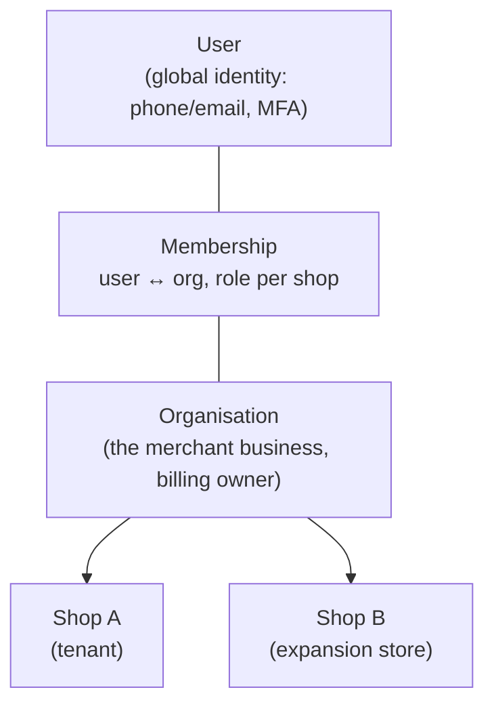
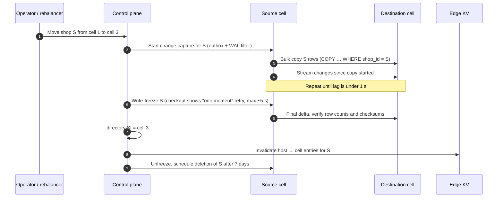
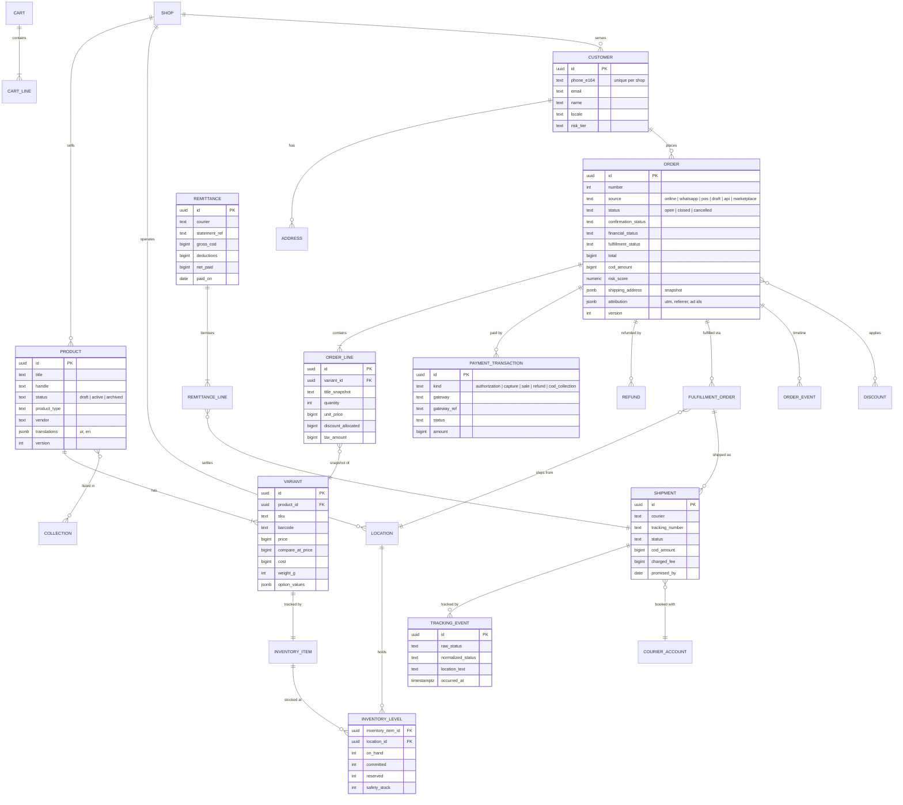

# 03 · Multi-tenancy & Data Architecture

> **Status:** Draft v0.1 · **Last updated:** 2026-09-27
> Covers the tenancy model, isolation layers, cells and shop moves, identifiers, money, the core data
> model, read models, search, analytics storage, and data lifecycle.

---

## 1. Tenancy model



* **Shop = tenant.** Every commerce record belongs to exactly one shop and carries `shop_id`.
* **Organisation** groups shops for billing and staff management (for example a brand with a
  Pakistan store and a UAE diaspora store).
* **Users are global.** One login can work across several shops, which matters for agencies and
  freelancers managing many clients. Roles are assigned per shop.
* **Shoppers are per-shop customers** (like Shopify). The primary key is a verified phone number,
  and email is optional. An opt-in, cross-store shopper identity ("Hatti Pass") is a later feature;
  see [Feature Catalog](../product/02-feature-catalog.md).

---

## 2. Isolation layers (defence in depth)

| Layer | Mechanism | Fails closed? |
|---|---|---|
| 1. Routing | Edge resolves host → `shop_id` → cell; admin/API tokens are bound to a shop | Yes: unknown host returns 404 |
| 2. Request context | `shop_id` stored in `AsyncLocalStorage`; set once by auth middleware and never taken from user input after that | Yes |
| 3. Repository scoping | All tenant repositories add `WHERE shop_id = ctx.shopId`; raw SQL helpers require `shopId` | Yes, by construction |
| 4. **Postgres RLS** | Policies compare `shop_id` with `current_setting('app.shop_id')`; app role lacks `BYPASSRLS` | Yes: unset setting matches no rows |
| 5. Caches | Keys namespaced `s:{shop_id}:…`; no un-namespaced tenant data | Yes |
| 6. Search | Per-shop **scoped API keys** with embedded `filter_by: shop_id:=…` | Yes |
| 7. Object storage | Prefix `shops/{shop_id}/…`; private objects served only via short-lived signed URLs | Yes |
| 8. Analytics | Every query is built server-side with a mandatory `shop_id` predicate; ClickHouse row policies as backstop | Yes |
| 9. Tests | Automated cross-tenant probes in CI: every GraphQL resolver is called with shop B's IDs under shop A's token and must return not-found | n/a |

### 2.1 Row-Level Security pattern

```sql
-- Applied to every shop-scoped table by a migration helper.
ALTER TABLE orders ENABLE ROW LEVEL SECURITY;
ALTER TABLE orders FORCE ROW LEVEL SECURITY;

CREATE POLICY tenant_isolation ON orders
  USING      (shop_id = current_setting('app.shop_id', true)::uuid)
  WITH CHECK (shop_id = current_setting('app.shop_id', true)::uuid);
```

```ts
// packages/platform/db/src/database.ts (simplified)
export async function withTenantTransaction<T>(pool, shopId, fn: (tx: Tx) => Promise<T>) {
  const client = await pool.connect();
  const tx = new NodePgTransaction(dialect, new NodePgSession(client, dialect, undefined));
  try {
    // One round trip: `begin`, and the shop set for this transaction only (`true` = local),
    // safe with PgBouncer transaction pooling. The ID is checked to be a UUID first (ADR-107).
    await tx.execute(sql.raw(`begin; select set_config('app.shop_id', '${shopId}', true)`));
    const result = await fn(tx);
    await tx.execute(sql`commit`);
    return result;
  } catch (error) {
    await tx.execute(sql`rollback`);
    throw error;
  } finally {
    client.release();
  }
}
```

* The application role (`hatti_app`) has no `BYPASSRLS`. Cell-wide jobs (outbox relay, shop mover,
  maintenance) use a separate audited role, `hatti_system`, available only to specific workers.
* Every index on a shop-scoped table **starts with `shop_id`**, so RLS predicates and tenant filters
  stay index-only.

---

## 3. Cells (pods)

### 3.1 Placement

* New shops go to the cell with the most headroom. The capacity score combines DB CPU, storage,
  connection count and projected growth from the shop's plan.
* Enterprise shops can be pinned to a **dedicated cell**.
* The shop directory (control plane) is the source of truth: `shop_id → cell_id`, `hostnames →
  shop_id`. The edge keeps a KV replica with a short TTL and push invalidation.

### 3.2 Shop Mover (rebalancing without downtime)



This works because **every ID is globally unique** (UUIDv7), so no rows need re-keying. It also
requires that no table carries cell-local sequences except per-shop counters, which move with the
shop.

---

## 4. Identifiers

| Kind | Format | Example | Notes |
|---|---|---|---|
| Internal primary key | UUIDv7 (`uuid` column) | `01929f3e-…` | Time-ordered, so B-tree friendly; `uuidv7()` is native in Postgres 18, generated in the app on older versions |
| Public API ID | Type prefix + Crockford base32 of the UUID | `ord_01J9ZK3M8Q…` | Self-describing and copy-paste safe; used as GraphQL `ID` |
| Order number | Per-shop counter | `#1043` | Allocated in its own micro-transaction, so gaps are possible on failure (acceptable) |
| Tax invoice number | Per-shop, per-series **gapless** counter | `INV-2026-000812` | Allocated at invoice issuance (low contention); voids are recorded, never deleted |
| Shipment tracking number | From the courier | `LE123456789` | Unique per `(courier, tracking_number)` |
| Idempotency key | Client-supplied UUID | header `Idempotency-Key` | Stored 24–72 h with request hash and response |

---

## 5. Money, quantities, time

* **Money is integer minor units** (`bigint`) plus an ISO-4217 `currency`. PKR has two decimals
  (paisa), but prices are shown in whole rupees by default (a display setting). Floats are never
  used.
* Every order stores **shop currency** amounts. When multi-currency display is on, it also stores
  **presentment currency** amounts and the exchange rate snapshot (`rate`, `source`, `as_of`).
* **Tax-inclusive pricing** is the default for Pakistani shops (the shelf price includes sales tax).
  Tax lines are derived for invoices. *Built:* prices always include it; each order keeps the tax
  in each line and in its charges, at the rate when it was placed
  ([ADR-096](./13-decision-log.md#adr-096--sales-tax-is-included-in-prices-at-a-rate-the-tax-module-keeps-each-order-keeps-the-tax-in-it-as-it-was-placed-line-by-line-and-in-its-delivery)),
  and a draft works its tax out whenever it is read, keeping none ([ADR-106](./13-decision-log.md#adr-106--a-draft-says-the-sales-tax-its-prices-include-an-open-ones-at-the-shops-rates-now-as-placing-it-would-work-it-out-a-completed-ones-as-its-order-keeps-it)).
* Discounts are allocated across lines with the **largest-remainder method**, so line totals always
  add up to the order total. This matters for partial refunds and returns.
* Weights are integer **grams**. Dimensions are integer **millimetres**.
* Timestamps are `timestamptz` in UTC. The shop timezone defaults to `Asia/Karachi` (UTC+5, no DST)
  and is used for reports, cut-off times and "today" boundaries.

---

## 6. Core data model

The ERD shows the commerce core. Names are singular for readability; tables are plural in SQL.
Every entity except `SHOP` carries `shop_id`, omitted from the diagram for clarity.



A customer's order count, spend and delivery history are worked out from their orders when read,
not stored on the customer ([ADR-023](./13-decision-log.md#adr-023--customer-order-stats-are-worked-out-from-orders-when-read)).

### 6.1 Order status model

An order has **four independent status dimensions**. This mirrors Shopify's split of financial and
fulfilment status, plus a COD-specific **confirmation** dimension:

| Dimension | Values |
|---|---|
| `status` | `open` → `closed` (archived) · `cancelled` |
| `confirmation_status` | `not_required` · `pending` → `confirmed` · `rejected` · `no_response` · `needs_review` |
| `financial_status` | `pending` (COD due) · `authorized` · `paid` · `partially_paid` · `partially_refunded` · `refunded` · `voided` |
| `fulfillment_status` | `unfulfilled` · `partially_fulfilled` · `fulfilled` · `returned` · `partially_returned` |

Shipment-level states and COD cash states are detailed in
[06 · Orders, Fulfillment & Logistics](./06-orders-fulfillment-logistics.md).

### 6.2 Inventory quantities

`available = on_hand − committed − reserved − safety_stock`

| Quantity | Meaning | Changes when |
|---|---|---|
| `on_hand` | Physically in the location | Receiving, adjustments, fulfilment (decrement), RTO restock (increment) |
| `committed` | Promised to placed but unfulfilled orders | Order placed (+), fulfilled or cancelled (−) |
| `reserved` | Held by in-progress checkouts or Drop Mode tokens | Checkout hold (+), release or expiry (−) |
| `safety_stock` | Buffer never sold online | Merchant setting |

Oversell protection uses a **conditional atomic update** in the order transaction:

```sql
UPDATE inventory_levels
   SET committed = committed + $qty, updated_at = now()
 WHERE shop_id = $shop AND inventory_item_id = $item AND location_id = $loc
   AND on_hand - committed - reserved - safety_stock >= $qty
RETURNING available;
-- 0 rows → out of stock → abort checkout with a clear message
```

Every change is also appended to `inventory_movements` (an append-only ledger with reason and
reference), so stock history is auditable. For flash sales, see Drop Mode in
[12 · Scalability](./12-scalability-and-reliability.md).

As built, a change that touches several levels (an order's lines, a stock count) locks them all
in (variant, location) order, checks them together and then writes, so it applies fully or not at
all and cannot deadlock with another order. See
[ADR-022](./13-decision-log.md#adr-022--stock-changes-lock-levels-in-one-order-check-then-write).

### 6.3 Transactional outbox

```sql
CREATE TABLE outbox_events (
  id             uuid        NOT NULL DEFAULT uuidv7(),
  shop_id        uuid        NOT NULL,
  aggregate_type text        NOT NULL,          -- 'order', 'shipment', ...
  aggregate_id   uuid        NOT NULL,
  event_type     text        NOT NULL,          -- 'order.confirmed'
  payload        jsonb       NOT NULL,          -- thin: ids + changed fields
  occurred_at    timestamptz NOT NULL DEFAULT now(),
  published_at   timestamptz,
  PRIMARY KEY (occurred_at, id)
) PARTITION BY RANGE (occurred_at);            -- daily partitions, dropped after 7 days
```

The relay reads with `FOR UPDATE SKIP LOCKED` in batches, publishes to queues and marks rows
published. Consumers deduplicate on `event_id`. A later phase may switch the relay to logical decoding
(CDC) without changing the contract.

### 6.4 Tables by module (initial)

| Module | Tables |
|---|---|
| Catalog | `products`, `product_options`, `variants` (incl. `hs_code`, `unit_of_measure`, `tax_category` for FBR digital invoicing), `product_media`, `collections`, `collection_rules`, `collection_products`, `metafield_definitions`, `metafields`, `metaobject_definitions`, `metaobjects`, `taxonomy_assignments` |
| Inventory | `locations`, `inventory_items`, `inventory_levels`, `inventory_movements`, `settings` (what the shop calls low stock, ADR-125), `transfers`, `purchase_orders`, `suppliers` |
| Pricing | `price_lists`, `price_list_entries`, `discounts`, `discount_codes`, `discount_redemptions` |
| Online Store | `themes`, `theme_files`, `theme_versions`, `pages` (their HTML cleaned when saved, [ADR-045](./13-decision-log.md#adr-045--a-shops-pages-keep-html-cleaned-of-anything-that-runs-when-saved-the-storefront-shows-it-as-it-is)), `blogs`, `articles`, `menus`, `redirects`, `translations` |
| Cart & Checkout | `delivery_settings` (the shop's delivery charges, [ADR-043](./13-decision-log.md#adr-043--a-shop-charges-for-delivery-once-for-everywhere-by-zones-of-cities-and-not-at-all-from-a-subtotal)), `carts` (with their lines as JSON, [ADR-042](./13-decision-log.md#adr-042--carts-are-kept-by-the-core-and-priced-whenever-they-are-read-storefronts-change-them-with-a-key-of-their-own)), `checkouts` (a secret's digest, the cart and the order it placed, [ADR-044](./13-decision-log.md#adr-044--checkout-is-one-page-the-core-renders-and-storefronts-serve-on-the-shops-address-placing-a-cash-on-delivery-order-as-the-page-showed-it)), `checkout_events` |
| Payments | `payment_methods`, `gateway_accounts` (encrypted credentials), `payment_intents`, `payment_transactions`, `payment_links` |
| Orders | `orders` (with the risk score and its reasons, ADR-025, the member of staff each is given to, ADR-127, the order each merged one joined, ADR-132, and the order each part was split from, ADR-135), `order_lines` (written again as its items change before anything ships, ADR-131), `order_discounts`, `tax_lines`, `order_events`, `order_comments` (ADR-128), `risk_settings`, `refunds`, `refund_lines`, `returns` and `return_lines` (what customers send back of delivered parcels, ADR-136, each naming the order sent in exchange, ADR-137), `draft_orders` (with their lines and the digest of their link, ADR-031), `saved_searches` of orders, drafts and products (ADR-119, ADR-124) |
| Fulfillment | `shipping_profiles`, `shipping_zones`, `shipping_rates`, `fulfillment_orders`, `shipments`, `shipment_lines`, `tracking_events`, `courier_accounts` (encrypted), `pickups`, `load_sheets`, `remittances`, `remittance_lines`, `reconciliation_issues` |
| Customers | `customers`, `customer_phones`, `blocklist_entries`, `segments`, `consent_events`, `customer_addresses`, `customer_tags`, `customer_sessions` |
| Messaging | `message_templates`, `messages`, `conversations`, `conversation_messages`, `channel_accounts` (encrypted) |
| Marketing | `campaigns`, `automations`, `automation_runs`, `loyalty_accounts`, `loyalty_ledger`, `referrals`, `affiliates`, `affiliate_conversions`, `pixels` |
| Apps | `app_installations`, `access_tokens` (hashed), `webhook_subscriptions`, `webhook_deliveries` |
| Tax | `tax_profiles` (NTN, STRN, filer status, province, Tier-1 flag, turnover band), `tax_settings`, `fiscal_invoices` (FBR invoice number, QR payload, submission status, 72-hour edit window), `fiscal_counters`, `withholding_entries` (tax withheld by couriers/intermediaries per settlement) |
| Platform | `outbox_events`, `idempotency_keys`, `audit_log`, `shop_counters`, `files`, `jobs_dead_letter` |

### 6.5 Partitioning and hot tables

| Table | Strategy | Retention (hot) |
|---|---|---|
| `outbox_events` | Daily range partitions | 7 days |
| `tracking_events` | Monthly range partitions | 18 months, then archived to R2 as Parquet |
| `messages`, `conversation_messages` | Monthly range partitions | 12 months of content; metadata kept longer |
| `audit_log` | Monthly range partitions | 24 months hot, then archive |
| `webhook_deliveries` | Daily range partitions | 30 days |
| `orders`, `order_lines` | Not partitioned early; indexed `(shop_id, created_at DESC)` | Indefinite (tax records ≥ 6 years; confirm with counsel) |

---

## 7. Global reference data

This data lives in the control plane, is versioned, and is replicated read-only to every cell.

| Dataset | Contents | Why it matters |
|---|---|---|
| **Pakistan geography** | Provinces → districts → cities → areas/localities, with Urdu and Roman spellings and common aliases ("Pindi" = Rawalpindi, "Isb" = Islamabad) | Checkout city picker, address normalisation, delivery zones |
| **Courier city maps** | Our city ID ↔ each courier's city code/name, serviceability, COD availability, lead times | Booking, rate quotes, smart allocation |
| **Banks & wallets** | Bank names, IMD codes, IBAN formats, wallet providers | Refunds, payouts, bank-transfer instructions |
| **Holidays & calendar** | Public holidays including Islamic holidays with moon-sighting adjustments | Delivery ETAs, SLA timers, campaign planning (Ramadan, Eid) |
| **Tax tables** | Federal and provincial rates by category | Invoice tax lines |
| **Product taxonomy** | Standard category tree (Google-compatible) | Search, ad feeds, marketplace mapping |

---

## 8. Read models & caching

| Read model | Store | Key | Rebuilt on |
|---|---|---|---|
| Storefront product document (product + variants + media + availability flags + translations) | Valkey | `s:{shop}:sf:product:{id}:v{ver}` | `product.*`, `inventory_level.updated` (availability flag only) |
| Collection listing (sorted product IDs + facets) | Valkey | `s:{shop}:sf:collection:{id}:{sort}` | `product.*`, `collection.*` |
| Navigation, shop settings, theme settings | Valkey | `s:{shop}:sf:settings:v{ver}` | `menu.*`, `theme.published`, `shop.updated` |
| Compiled theme templates | Renderer memory (LRU) + R2 | `theme:{id}:{hash}` | `theme.published` |
| Shop directory | Edge KV + control plane cache | `host:{hostname}` | Domain or cell changes |

Cache invalidation is **event-driven, versioned and debounced**. Updates bump a version so stale
keys simply stop being read. Edge HTML is purged by **cache tag** (`product:{id}`, `collection:{id}`,
`theme:{id}`, `shop:{id}`) with a 2–5 s debounce, so bulk edits don't cause purge storms.

*Built so far* ([ADR-036](./13-decision-log.md#adr-036--one-publisher-per-shop-rebuilds-storefront-documents-from-the-database-its-writes-fenced-by-its-lock)):
the core's worker keeps, under `s:{shop}:sf:`, a JSON document for each active product (options,
variants with their prices and whether each can be sold online, images), each collection (its
active products' IDs in its order), `/collections/all`, the shop's menus, written whole as one
hash ([ADR-040](./13-decision-log.md#adr-040--a-shops-menus-are-kept-whole-linking-to-collections-and-products-by-id)),
and the shop's settings, with hashes finding products and collections by handle. Events mark what is stale, and
one publisher per shop at a time rebuilds it from the database, a batch at a time, so a bulk edit
is built about once. Keys carry no versions: each write is atomic, and versions come with the
edge cache. Storefronts find a shop by its handle in `s:sf:shops`, the origin's copy of the shop
directory, written with the shop's settings ([ADR-037](./13-decision-log.md#adr-037--every-shop-has-a-handle-naming-its-storefront-on-the-platforms-domain-storefronts-find-shops-through-a-directory-in-valkey)),
and by its verified domains in `s:sf:domains`, written with them ([ADR-048](./13-decision-log.md#adr-048--a-shops-own-domains-are-the-online-stores-one-shops-each-served-once-dns-points-them-at-the-platform-the-primary-one-where-pages-send-shoppers)).
The shop's main theme, its own templates, section groups and settings, is a document of its own,
written before the shop's, which names its version; storefronts keep each version they lay over
the platform theme ([ADR-039](./13-decision-log.md#adr-039--a-shops-theme-is-a-platform-theme-with-the-shops-own-json-files-over-it)).
Pages carry cache tags, their shop's and the handles they name, and the publisher purges those of
the documents that change ([ADR-047](./13-decision-log.md#adr-047--the-edge-keeps-storefront-pages-by-the-handles-they-name-before-they-stream-and-forgets-those-whose-documents-change)).
Translations, facets and a listing per sort order are to come.

---

## 9. Search

* One Typesense collection per cell per entity (`products_c1`, `customers_c1`, `orders_c1`), each
  with a `shop_id` field. Storefront search uses **per-shop scoped keys**. Admin search goes through
  our API.
* **Roman Urdu and Urdu normalisation** happens at index time and query time in our code, so it
  works for every shop without per-shop synonym sets:
  * Phonetic folding for Roman Urdu: `q→k`, `z/zh/dh→z`, `aa→a`, `ee/ii→i`, `oo/uu→u`, `w↔v`,
    doubled consonants collapsed ("kameez / qameez / kamiz" all match).
  * Urdu script normalisation: unify Arabic vs Urdu code points (`ي→ی`, `ك→ک`, `ه→ہ`), strip
    diacritics (zer, zabar, pesh), normalise zero-width joiners.
  * A curated **commerce lexicon** of Urdu, Roman and English equivalents ("joray" ↔ "suit",
    "jootay" ↔ "shoes", "dupatta/dopatta", "unstitched/an-silay"), maintained by the merchandising team.
* Merchandising: pinned and hidden results per query, boost rules (in stock, margin, new),
  "did you mean", and zero-result analytics shown to merchants.

*Built so far*
([ADR-046](./13-decision-log.md#adr-046--storefront-search-asks-the-core-which-finds-products-in-postgres-as-the-admins-search-does-until-typesense)):
there is no Typesense yet. Products, orders and customers keep their searchable fields in a
`search_text` column, folded as above but without the lexicon. The admin's product and order
searches match every word typed against it with `LIKE`. Storefronts search a shop's active
products the same way, through the core at `/storefront/shops/{shop}/search`, titles first. For
suggestions as a shopper types, the last word may be cut short (`prefix=last`): it matches
without a last vowel, which the rest of the word may fold away ("kame", on its way to
"kameez", matches as "kam").

---

## 10. Analytics storage (ClickHouse)

| Table | Source | Order key | Notes |
|---|---|---|---|
| `events` | Storefront beacon plus server events via edge collector | `(shop_id, event_date, session_id, ts)` | page_view, product_view, search, add_to_cart, checkout_step, order_placed |
| `orders_fact` | Outbox (CDC) | `(shop_id, created_at, order_id)` | ReplacingMergeTree on `version` |
| `shipments_fact` | Outbox | `(shop_id, booked_at, shipment_id)` | Outcome, courier, city, days to deliver, RTO |
| `ad_spend` | Meta/TikTok/Google APIs (daily) | `(shop_id, date, platform, campaign_id)` | Feeds true-profit and ROAS reports |
| `network_courier_perf` | Aggregated across shops (anonymised) | `(courier, city_id, week)` | Powers smart courier allocation |

Raw events are kept 13 months; aggregates are kept indefinitely. Merchants never query ClickHouse
directly. The Analytics module builds parameterised queries that always carry `shop_id`.

---

## 11. Data lifecycle & privacy

| Data | Retention | Deletion trigger |
|---|---|---|
| Active shop commerce data | Life of the shop | Shop closure + 90 days (export offered), except records legally required to be kept |
| Tax and accounting records (orders, invoices, refunds) | ≥ 6 years (confirm with counsel) | Automatic purge job after the legal period |
| Abandoned carts/checkouts | 90 days | TTL job |
| Message content | 12 months | Partition drop |
| Storefront analytics raw events | 13 months | TTL |
| Backups | 35-day PITR + monthly snapshots for 12 months | Rolling |
| Customer erasure request | Anonymise PII within 30 days; keep financial records with pseudonymised customer. Built: at once, or ten days after it is asked for unless cancelled first, once no order is open; orders keep items, amounts and city under a customer ID that no longer exists (ADR-026, ADR-110) | Merchant action or API |

**PII classes:**

* **Operational PII** (name, phone, address, email): plaintext in the DB (needed for search and
  operations), encrypted at rest, masked in logs, access-controlled by staff permission.
* **Sensitive PII and secrets** (CNIC, NTN/STRN, bank accounts, gateway/courier/WhatsApp
  credentials): **field-level envelope encryption** (AES-256-GCM; data keys wrapped by cloud KMS).
  Write-only in the UI.
* **Network signals**: phone numbers are **HMAC-hashed** with a platform secret before entering any
  cross-shop dataset (for example, delivery-reliability signals).
