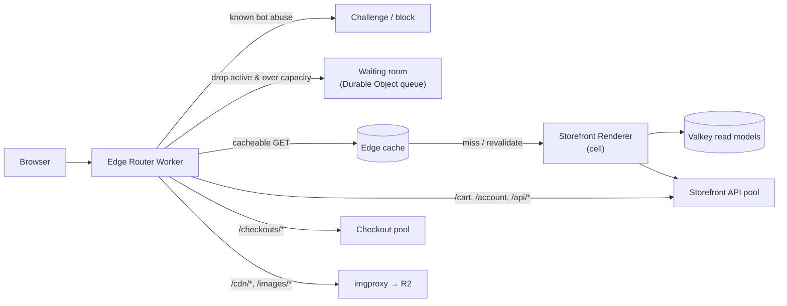
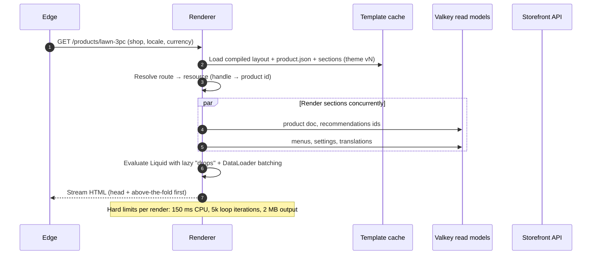
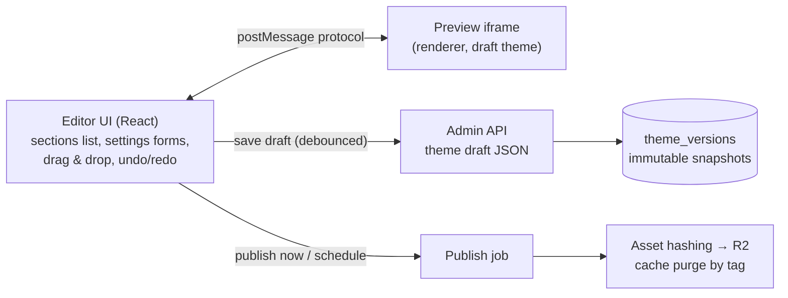

# 04 · Storefront, Themes & Edge

> **Status:** Draft v0.1 · **Last updated:** 2026-09-27
> Goal: the **fastest storefronts in Pakistan** on a Rs 25–60k Android phone over congested 4G,
> editable by non-technical merchants, and familiar to the country's large pool of Shopify/Liquid
> developers.

---

## 1. Requirements

| Requirement | Target |
|---|---|
| Largest Contentful Paint (p75, mid-range Android, 4G) | **≤ 2.0 s** |
| Interaction to Next Paint (p75) | **≤ 200 ms** |
| Cumulative Layout Shift (p75) | **≤ 0.05** |
| Edge-cached HTML TTFB inside Pakistan | ≤ 100 ms |
| Origin render (cache miss) p95 | ≤ 250 ms |
| Default theme JS (gzipped, first load) | ≤ 30 KB |
| Default theme CSS (gzipped) | ≤ 40 KB |
| Home page total transfer (first visit, images lazy) | ≤ 600 KB |
| Works without JS | Browse, search, add to cart via form post, checkout |
| Languages | English, Urdu (RTL), mixed; Roman Urdu search |
| Custom domains | Automatic TLS, apex and `www`, ≤ 5 min to go live after DNS |

---

## 2. Request path



### 2.1 Hostname routing

* **Platform subdomain:** `{handle}.hatti.pk` (wildcard certificate).
* **Custom domains:** Cloudflare for SaaS *custom hostnames*. The merchant adds a CNAME (or uses our
  nameservers for apex), and Cloudflare issues and renews certificates automatically. The edge
  looks up `host → shop_id, cell, primary_domain` in KV and 301-redirects secondary domains to the
  primary.
* **Domain purchase** (Growth phase): resell `.com`/`.pk` through a registrar partner so DNS is set up
  in one click.

### 2.2 Cache key and cacheability

```text
cache key = host + path + normalised query (whitelisted params only)
          + locale + currency + theme_version + (preview? → bypass)
```

| Route type | Cache policy |
|---|---|
| Home, collection, product, page, blog | `s-maxage=300, stale-while-revalidate=86400, stale-if-error=604800` + cache tags |
| Search results | Short TTL (60 s), keyed on normalised query |
| Cart, account, checkout, API mutations | Never cached |
| Theme assets (`/cdn/theme/{id}/{hash}/…`) | Immutable, 1 year |
| Images (`/images/{shop}/{hash}/{transform}`) | Immutable, 1 year |

`stale-if-error` is deliberate. During origin incidents or international-link degradation (submarine
cable faults have hit Pakistan before), shoppers still see the catalogue from PoPs inside the
country, and only cart and checkout calls fail.

> **Measure the edge, don't assume it.** Cloudflare has PoPs in Karachi, Lahore and Islamabad, but
> it does not peer at Pakistani internet exchanges, and 2026 measurements showed some ISPs being
> served from Singapore or Muscat edges for some sites. Before launch, and continuously after, our
> synthetic probes record which edge location serves our custom hostnames from each major ISP. We
> tune cache tiering (and our CDN plan) accordingly.

### 2.3 Personalisation without breaking the cache

HTML is identical for all shoppers. After load, `hatti.js` calls
`GET /api/storefront/session` (≈1 KB JSON) to hydrate the cart count, logged-in state, live stock
badges for the viewed product, and consent state. Merchants who need server-side personalisation
(B2B price lists, logged-in-only pricing) get a `Vary`-style bypass for authenticated sessions only.

---

## 3. Theme architecture

### 3.1 Theme package (Liquid-compatible, OS 2.0-style)

```text
my-theme/
├── layout/theme.liquid              # html shell, <head>, header/footer groups
├── templates/
│   ├── index.json                   # JSON templates: ordered sections + settings
│   ├── product.json
│   ├── product.unstitched.json      # alternate template (e.g. fabric with stitching option)
│   ├── collection.json
│   └── customers/…
├── sections/
│   ├── hero-banner.liquid           #  defines settings & blocks
│   ├── featured-collection.liquid
│   └── whatsapp-cta.liquid
├── blocks/                          # reusable theme blocks
├── snippets/
├── assets/                          # css, js, fonts, images (hashed on publish)
├── config/settings_schema.json      # global theme settings (colours, typography, …)
├── config/settings_data.json        # merchant's chosen values
└── locales/
    ├── en.default.json
    └── ur.json                      # Urdu translations of theme strings
```

**Compatibility promise:** our Liquid supports the Shopify Liquid language plus the commonly used
Shopify objects (`shop`, `product`, `variant`, `collection`, `cart`, `customer`, `request`,
`routes`, `settings`, `section`, `block`, `localization`), filters (`money`, `image_url`,
`image_tag`, `t`, `asset_url`, `handleize`, …) and tags (`section`, `sections`, `render`, `form`,
`paginate`, `schema`, `style`, `javascript`). A custom theme a merchant owns can be ported with
modest effort, and Liquid developers are productive on day one.

> **Licensing note:** themes bought from the Shopify Theme Store are licensed for use on Shopify.
> We do not provide tooling to import licensed third-party themes. We provide a porting guide for
> themes the merchant owns, plus our own free themes.

### 3.2 Hatti extensions to Liquid

| Addition | Purpose |
|---|---|
| `direction` / `locale.rtl` objects | Correct RTL layout for Urdu |
| `money_pk` filter | "Rs 12,500" formatting with optional lakh grouping ("Rs 1,25,000") |
| `whatsapp_url` filter | Pre-filled chat links (`wa.me`) with product, variant and page context |
| `delivery_estimate` object | Courier- and city-aware ETA ("Delivered in 2–4 days in Lahore") |
| `cod` object | COD availability, fee and limits for the current cart |
| `trust` object | Verified-store badge, return-policy summary, review stats |
| `stitching` block type | Unstitched → stitched upsell with measurement form (fashion vertical) |

### 3.3 Rendering pipeline



* **Drops** (lazy objects) load data only when a template touches it, batched per request, so an
  unused `product.metafields` costs nothing.
* **Streaming:** `<head>` (critical CSS, preload hints for the LCP image and fonts) is flushed
  immediately, and sections stream as they complete.
* **Sandboxing:** Liquid cannot execute arbitrary code. Merchant and app templates run with CPU,
  iteration and output limits. A failing section renders a placeholder and logs an error instead of
  breaking the page.
* **Theme Check:** a linter (CLI and editor) flags performance problems: unsized images,
  render-blocking scripts, oversized assets, N+1 patterns, missing `alt` text, missing
  translations.

*Built so far* ([spike 1](../engineering/spikes/01-liquid-rendering.md), [ADR-035](./13-decision-log.md#adr-035--the-storefront-renders-liquid-with-limits-of-its-own-fetching-lists-a-chunk-at-a-time)): `apps/storefront` renders
Hatti Base, a Dawn-class reference theme in `themes/hatti-base`, with LiquidJS. Its pages take 2
to 6 ms at p50. Two things differ from the plan above:

* Drops do not batch by request tick: LiquidJS reads one value at a time, so lists fetch their
  products a chunk at a time instead.
* The iteration limit is a count of template nodes rendered, alongside limits on time, output,
  memory and snippet depth.

It reads the documents the core publishes to Valkey
([03 §8](./03-multi-tenancy-and-data.md#8-read-models--caching),
[ADR-036](./13-decision-log.md#adr-036--one-publisher-per-shop-rebuilds-storefront-documents-from-the-database-its-writes-fenced-by-its-lock)),
each in one round trip: a product or collection by its handle through a script, a list's products
with one `MGET`. The same pages render from Valkey as from memory, in as many round trips.
Streaming and the editor are to come.

### 3.4 Theme editor (no-code)



* **Draft vs published:** every save creates an immutable version. One-click rollback.
  **Scheduled publish** lets a merchant prepare an Eid or lawn-launch look and have it go live at
  exactly 00:00.
* **Mobile-first editing:** the editor works on a phone (bottom-sheet settings, section reorder by
  drag handles), because many merchants have no laptop.
* **Content in two languages:** each text setting has English and Urdu fields. One-tap AI
  translation, always reviewable.
* **Section library:** hero, product grid, collection list, image with text, video, testimonials,
  FAQ, countdown, lookbook/"shop the look", Instagram-style gallery, trust badges, size chart,
  WhatsApp CTA, delivery info, newsletter/WhatsApp opt-in, rich text, logo list, map/store locator.

### 3.5 Free theme line-up (launch)

| Theme | Vertical | Notes |
|---|---|---|
| **Hatti Base** | Any | Reference theme, open source; the "Dawn" equivalent |
| **Lawn** | Fashion (stitched/unstitched, eastern wear) | Lookbooks, size charts, stitching upsell, drop countdowns |
| **Zevar** | Jewellery & accessories | Zoomable media, trust-heavy PDP |
| **Glow** | Beauty & personal care | Bundles, reviews-forward, routines |
| **Bazaar** | Electronics & general | Dense grids, compare, specs tables, installments badge |
| **Rasoi** | Food, bakery, grocery | Delivery date/slot picker, minimum order, area-based delivery |

A **theme marketplace** for local designers (paid themes priced in PKR, revenue share) follows in
the Growth phase.

---

## 4. Front-end performance playbook

| Technique | Detail |
|---|---|
| HTML-first | Server-rendered pages. JS only enhances (variant picker, cart drawer, predictive search) |
| Tiny runtime | `hatti.js` (< 15 KB gz) with web components: `<hatti-cart>`, `<hatti-variant-picker>`, `<hatti-search>` |
| Images | `image_url` produces AVIF/WebP via imgproxy, responsive `srcset`/`sizes`, width/height always set, LCP image `fetchpriority=high`, everything else `loading=lazy` |
| Fonts | System font stack by default. Urdu uses **Noto Nastaliq Urdu** for display text, subset per page and `font-display: swap`; body Urdu can use a lighter Naskh face at the merchant's choice |
| CSS | Critical CSS inlined; the rest loaded async; logical properties (`margin-inline-start`) so RTL needs no second stylesheet |
| Third-party scripts | Pixels loaded **after** interaction or via server-side conversion APIs, which lets merchants drop most client-side tags; see [07](./07-messaging-and-marketing.md) |
| Prefetch | Hover/touch-start prefetch of product pages from collection grids (budgeted, skipped with `Save-Data`) |
| Data saver | Respect `Save-Data` and slow `effectiveType`: lower image quality, no autoplay video |
| Offline | Service worker caches shell and recent products; offline page shows the WhatsApp contact and recently viewed items |
| RUM | Core Web Vitals beacon on every page → ClickHouse → per-store performance score shown in the admin |

---

## 5. Internationalisation (storefront)

* **Locales at launch:** `en`, `ur`. Merchants can run English only, Urdu only, or bilingual with a
  language switcher.
* **RTL:** `dir="rtl"` on `<html>` for Urdu; icons with direction (arrows, chevrons) are mirrored;
  numbers, phone numbers, prices and order IDs are wrapped in `<bdi>`/`dir="ltr"` to avoid bidi
  scrambling.
* **Content translation:** products, collections, pages, menus and theme strings all have
  translation fields (`translations` JSONB keyed by locale). AI draft translations are marked
  "machine translated" until a human approves them.
* **URLs:** `/ur/products/…` prefix for Urdu. `hreflang` alternates and localised sitemaps.
* **Numbers and currency:** default "Rs 12,500". Optional lakh/crore grouping. Diaspora
  multi-currency display (AED, SAR, GBP, USD, CAD) in the Scale phase.

---

## 6. SEO & discoverability

* Server-rendered HTML, clean URLs (`/products/{handle}`), canonical tags, automatic 301s on handle
  change, a redirect manager and bulk CSV import.
* **Structured data (JSON-LD):** `Product`, `Offer` (availability, price, `priceCurrency: PKR`),
  `AggregateRating`, `BreadcrumbList`, `Organization`, `WebSite` + `SearchAction`, `FAQPage`.
* XML sitemaps (split, auto-updated), `robots.txt` editor, Open Graph and WhatsApp link-preview
  tags (WhatsApp previews drive a large share of traffic, so `og:image` is always set and
  compressed).
* **Agent-ready storefront:** machine-readable product feeds, a public, rate-limited catalogue API
  per store, and a read-only store MCP endpoint, so AI shopping assistants can discover and
  recommend products; see [09](./09-ai-and-intelligence.md).

---

## 7. Headless (Scale phase)

* **Storefront API** (GraphQL, public token, cost-based rate limits, persisted queries) exposes
  catalogue, search, cart and customer account operations.
* **Starter kit:** a Next.js (App Router) starter with cart, checkout hand-off, i18n/RTL and SEO,
  deployable on Cloudflare or Vercel. Checkout always stays on Hatti Checkout for integrity and
  payment compliance.
