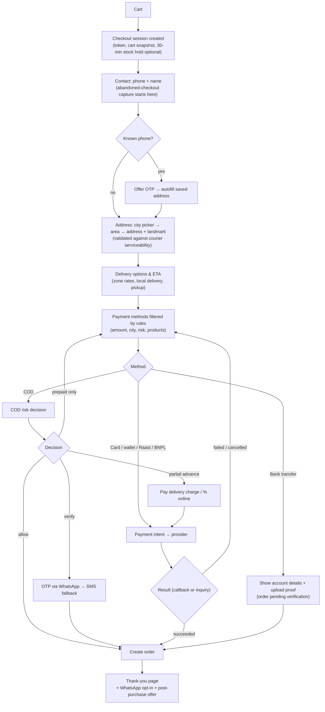
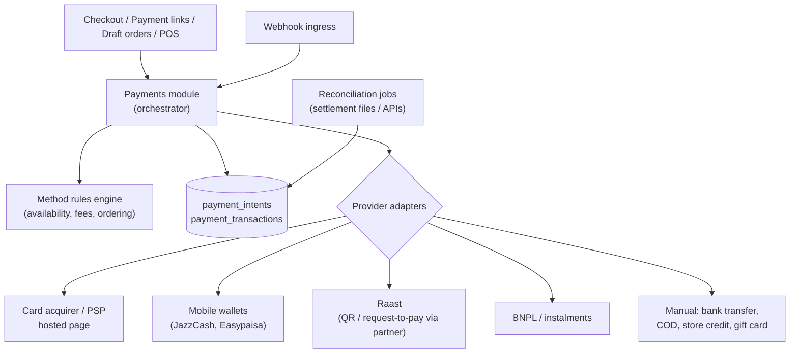
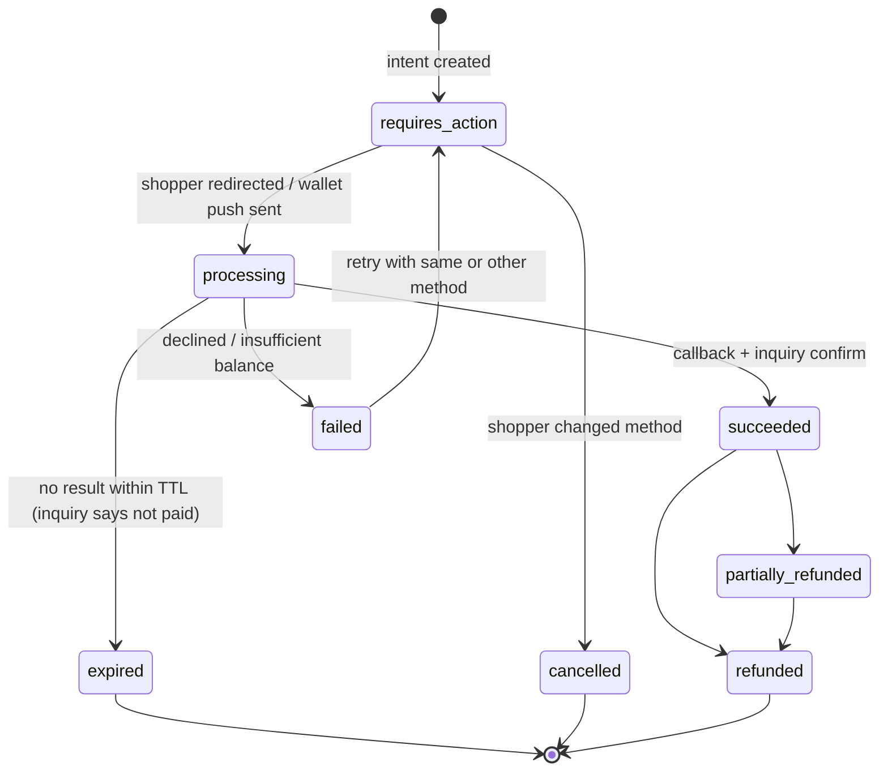
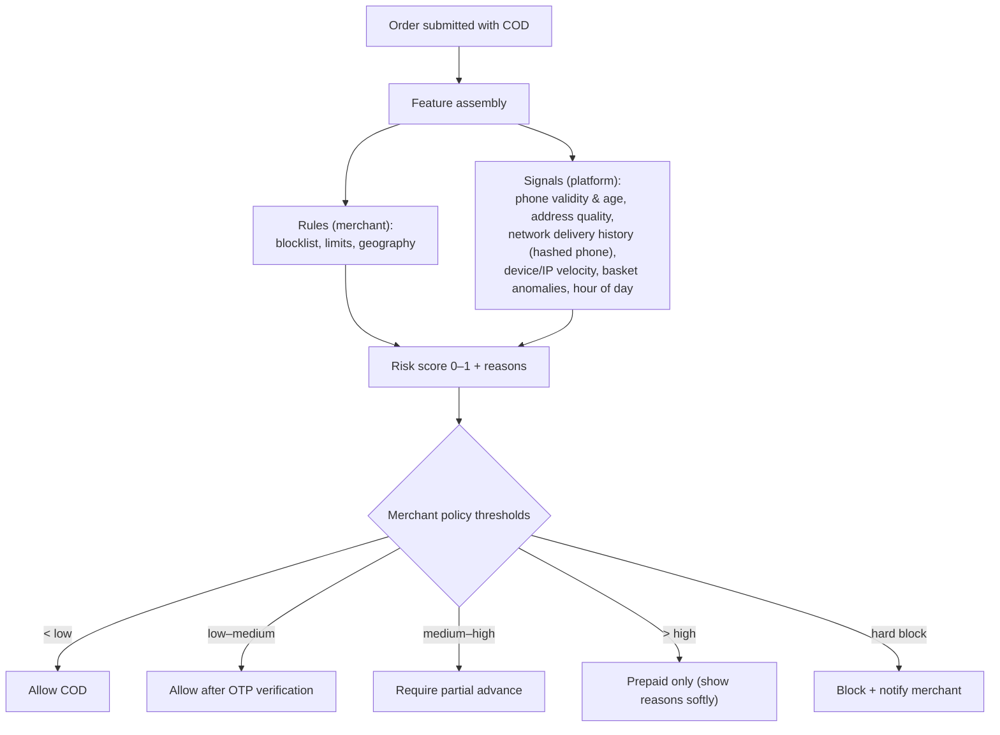

# 05 · Checkout & Payments

> **Status:** Draft v0.1 · **Last updated:** 2026-10-01
> Checkout is the most important page on the platform. It must convert on a small phone, resist
> fake orders, get every rupee right, and **never lose an order**, even when a payment app,
> gateway or network misbehaves.

---

## 1. Principles

1. **Phone-first identity.** The phone number is the shopper's identity; email is optional. A
   returning shopper verified by OTP gets saved addresses auto-filled.
2. **One page, few fields.** Name → phone → city (searchable picker) → address (free text + area +
   landmark) → delivery option → payment. Fewer than 8 inputs for a first-time buyer.
3. **Total cost is visible early.** Delivery charge by city, COD fee and prepaid discount appear as
   soon as the city is chosen. Nothing is added at the last step.
4. **Server-authoritative.** Every price, discount, fee, tax and stock check is recomputed on the
   server at each step and at submission. The client never sends a total.
5. **Idempotent and resumable.** Every mutation carries an idempotency key. A shopper who pays in the
   JazzCash app and never returns to the browser still gets an order.
6. **Progressive enhancement.** The checkout works as plain HTML forms. JS adds autocomplete,
   inline validation and OTP auto-read. Total JS is under 50 KB gzipped.
7. **Minimal PCI scope.** Card data is only ever entered on a payment provider's hosted page or
   hosted fields. Hatti servers never see a PAN.
8. **COD is first-class, not an afterthought.** Risk controls, OTP, partial advance and prepaid
   incentives are built in.

---

## 2. Checkout flow



*Built so far* ([ADR-044](./13-decision-log.md#adr-044--checkout-is-one-page-the-core-renders-and-storefronts-serve-on-the-shops-address-placing-a-cash-on-delivery-order-as-the-page-showed-it)): the cash-on-delivery path, on one page without scripts. The
cart page's checkout button (or `/checkout`) starts a checkout with a secret of its own, whose
page the core renders and the storefront serves on the shop's address: the cart at today's
prices, what delivery costs, and the name, mobile number, city, address and landmark. Placing
the order is one transaction, as the page showed it: the address checked as orders check it,
the order placed through the orders module with its stock committed, its customer found by
number and its risk scored, then the cart emptied. Placing twice places one order. The page and
its thank-you page link the shop's policies at their foot, as Shopify's checkout does
([ADR-056](./13-decision-log.md#adr-056--a-shops-policies-are-kept-as-shopify-keeps-them-shown-in-shopifys-markup-and-drafted-from-what-the-shop-has-set-never-saved-by-themselves)),
and above its button it says that placing the order agrees to them; the order keeps which
versions of them it linked, and the address and browser it was placed from
([ADR-057](./13-decision-log.md#adr-057--what-a-shopper-agrees-to-in-placing-an-order-is-kept-with-it-the-versions-of-the-shops-policies-its-checkout-linked-and-where-it-was-placed-from)).
The page is in the shop's colour: its published theme's accent on its buttons, and on its links
where it reads on white ([ADR-069](./13-decision-log.md#adr-069--the-checkouts-page-takes-the-shops-accent-colour-from-its-published-theme-on-its-buttons-and-on-its-links-where-they-stay-readable)),
and shows the shop's logo, one of the files it uploaded, in place of its name ([ADR-081](./13-decision-log.md#adr-081--a-shops-logo-is-one-of-its-files-chosen-as-its-brands-the-checkouts-page-shows-it-in-place-of-the-shops-name-through-a-url-signed-for-an-hour-that-the-pages-policy-allows-alone)).
Where the shop gives its bank account, the page offers bank transfer beside cash on delivery, and
alone for a cart above what cash on delivery may collect; the order waits for the money, and the
thank-you page shows the account, the amount and the order's number to give as the reference
([ADR-074](./13-decision-log.md#adr-074--a-shop-that-gives-its-bank-account-offers-bank-transfer-the-order-waits-for-the-money-at-a-stage-of-its-own-and-keeps-the-account-its-customer-was-told-to-pay-into)).
The shop's rules keep cash on delivery to the orders it trusts: up to a total of its own,
outside cities it names, and not for customers who refused as many parcels as it allows; the page
offers bank transfer instead, chosen for the shopper, or says why it can't take the order
([ADR-075](./13-decision-log.md#adr-075--a-shop-keeps-cash-on-delivery-to-the-orders-it-trusts-up-to-a-total-of-its-own-outside-cities-it-names-and-not-for-customers-who-refused-parcels-before-checkout-offers-transfer-instead)).
Products with the tags it names, such as pre-orders, are paid by transfer: the page offers it
alone for a cart holding one, naming the product ([ADR-078](./13-decision-log.md#adr-078--a-shop-keeps-cash-on-delivery-from-products-by-their-tags-a-cart-holding-one-is-offered-bank-transfer-alone-the-page-naming-the-product)).
Its fee for cash on delivery is added to orders paid on delivery, as an amount of the order's
own, which the page states where the shopper chooses ([ADR-076](./13-decision-log.md#adr-076--a-shops-fee-for-cash-on-delivery-is-the-orders-own-amount-apart-from-delivery-in-its-total-and-the-cash-collected-said-beside-the-option-where-the-shopper-chooses)).
What it takes off for paying by transfer, its prepaid incentive, comes off the items after any
code, to the rupee, said beside the option too; the order keeps it in its discount, apart from
the code's ([ADR-077](./13-decision-log.md#adr-077--something-off-for-paying-by-transfer-is-part-of-the-orders-discount-kept-apart-from-the-codes-off-the-items-after-any-code-to-the-rupee-said-where-the-shopper-chooses)).
Its rules may ask for an advance on cash on delivery, paid by transfer into its account: an
amount, a share of the items or the delivery charge, on every order or above a total. The page
says it beside the option, and the order it places waits for it
([ADR-084](./13-decision-log.md#adr-084--checkout-asks-for-the-advance-the-shops-rules-name-an-amount-a-share-of-the-items-or-the-delivery-charge-on-every-order-or-above-a-total-said-beside-cash-on-delivery)).
The advance may be asked only to cities the shop names, and only of customers who refused
parcels before: the page names every city and says of whom, and placing applies them to the city
and number typed, counting the number's refusals then and never for the page
([ADR-089](./13-decision-log.md#adr-089--a-shops-advance-may-be-asked-only-to-cities-it-names-and-of-customers-who-refused-parcels-before-checkout-names-every-city-and-says-of-whom-and-placing-applies-them-to-the-city-and-number-typed)).
It may be asked only of customers new to the shop, none of whose orders it delivered, and only
of orders its risk rules score at a level it chooses or higher: placing scores the order and asks
the advance if the score reaches it, instead of holding the order for review
([ADR-094](./13-decision-log.md#adr-094--a-shops-advance-may-be-asked-only-of-customers-new-to-it-and-of-orders-its-risk-rules-score-high-such-an-order-is-asked-it-instead-of-waiting-for-review)).
The shop chooses up to four trust badges from the platform's set, which the page shows under its
button in English and Urdu, each only where it holds: cash on delivery where the page offers it,
an exchange or returns linked to the refund policy, help on its WhatsApp number
([ADR-086](./13-decision-log.md#adr-086--a-shop-chooses-trust-badges-for-its-checkout-from-the-platforms-set-worded-in-english-and-urdu-and-shown-under-the-button-where-they-hold)).
Checkout takes at most three orders a day from one mobile number and twenty an hour from one
internet address, counting the orders it placed one at a time; past a limit, the page says why
([ADR-087](./13-decision-log.md#adr-087--checkout-takes-at-most-three-orders-a-day-from-one-mobile-number-and-twenty-an-hour-from-one-internet-address-counting-the-orders-it-placed-one-at-a-time)).
Not yet: the OTP, online payment, stock held during checkout, and abandoned-checkout capture.

### 2.1 Address capture tuned for Pakistan

* **City** is a searchable picker backed by the geography dataset, with aliases and Urdu spellings.
  It is mandatory and drives rates, ETA, COD availability and courier choice.
* **Area/locality** (optional picker for large cities) plus **free-text address** plus
  **nearest landmark** ("near Jamia Masjid, Block 5"). Couriers rely on landmarks.
* Optional **map pin** (only when the device grants location) stores lat/lng for riders.

*Built so far* ([ADR-070](./13-decision-log.md#adr-070--an-address-keeps-its-area-in-its-second-line-and-its-landmark-in-a-field-of-its-own-checkout-and-customers-links-ask-for-each-suggesting-the-areas-of-the-larger-cities)):
the city with its aliases, the house and street, then the area and the nearest landmark, each in
a box of its own. The area's box suggests well-known areas of the ten larger cities: the city's
once one is typed, every listed city's, by its city, before. The order keeps the area as its
address's second line, where apps built for Shopify read it, and the landmark in a field of its
own, which `formatted`, slips and the customer's pages print. Not yet: the map pin and
address-quality prompts, which need the page's scripts, and couriers' own area lists.
* **Address quality score:** heuristics and later ML flag vague addresses ("near market") and
  prompt the shopper to add detail. Poor address quality is a leading cause of failed delivery.
* Phone validation: Pakistani mobile numbers normalised to E.164 (`+923XXXXXXXXX`) with the local
  format (`03XX-XXXXXXX`) accepted. Landlines are allowed as a secondary number.

---

## 3. Cart & pricing calculation pipeline

Pricing is a deterministic pipeline. Given the same inputs (cart version, customer, address,
method), it produces the same output. The result is cached per `(cart_id, cart_version,
context_hash)`.

```mermaid
flowchart LR
    L["Lines + variants"] --> P1["1 Base price<br/>(price list for customer/market)"]
    P1 --> P2["2 Product discounts<br/>(automatic, then code)"]
    P2 --> P3["3 Order discounts<br/>(tiered, bundles, first order)"]
    P3 --> P4["4 Shipping rates<br/>(zone, weight, value, free threshold)"]
    P4 --> P5["5 Shipping discounts"]
    P5 --> P6["6 Payment adjustments<br/>(COD fee, prepaid discount)"]
    P6 --> P7["7 Taxes<br/>(inclusive by default)"]
    P7 --> P8["8 Rounding & allocation<br/>(largest remainder)"]
    P8 --> T["Totals + explanation lines"]
```



* **Explanation lines** ("You saved Rs 500 with EID500", "COD fee Rs 100", "Free delivery above Rs
  3,000") are part of the output, so every UI and receipt shows the same breakdown.
* **Discount combination rules** follow classes (product / order / shipping) with explicit
  combinability flags, like Shopify's discount combinations model.
* **Extensibility:** The Scale phase adds Wasm **Functions** at steps 2–6 (custom discounts, rates, payment
  rules) with strict time and fuel limits; see [08](./08-api-and-app-platform.md).

*Built so far* ([ADR-042](./13-decision-log.md#adr-042--carts-are-kept-by-the-core-and-priced-whenever-they-are-read-storefronts-change-them-with-a-key-of-their-own)): the core keeps
shoppers' carts, their variants, quantities and properties with the cart's note and attributes,
and prices them at step 1 whenever they are read: each variant's price in the catalog now, with
the stock that can be sold online holding back what is added. Storefronts change carts as
Shopify's cart forms and Ajax cart do. Step 4 in part: each shop's delivery charge, one for
everywhere, by zones of cities, and nothing from a subtotal
([ADR-043](./13-decision-log.md#adr-043--a-shop-charges-for-delivery-once-for-everywhere-by-zones-of-cities-and-not-at-all-from-a-subtotal)), which the storefront shows on product and cart
pages, and checkout adds to the order for the address's city
([ADR-044](./13-decision-log.md#adr-044--checkout-is-one-page-the-core-renders-and-storefronts-serve-on-the-shops-address-placing-a-cash-on-delivery-order-as-the-page-showed-it)). Step 6 in part: the shop's fee for cash on delivery
([ADR-076](./13-decision-log.md#adr-076--a-shops-fee-for-cash-on-delivery-is-the-orders-own-amount-apart-from-delivery-in-its-total-and-the-cash-collected-said-beside-the-option-where-the-shopper-chooses)), and
what it takes off for paying by transfer, after any code and to the rupee ([ADR-077](./13-decision-log.md#adr-077--something-off-for-paying-by-transfer-is-part-of-the-orders-discount-kept-apart-from-the-codes-off-the-items-after-any-code-to-the-rupee-said-where-the-shopper-chooses)). Step 7 at
one rate a shop: the sales tax its prices include, on each taxable line after its share of the
discount and on delivery and the fee where the shop says so, which the page says beside its total
and the order keeps as it was placed ([ADR-096](./13-decision-log.md#adr-096--sales-tax-is-included-in-prices-at-a-rate-the-tax-module-keeps-each-order-keeps-the-tax-in-it-as-it-was-placed-line-by-line-and-in-its-delivery)). The other
steps come later.

### 3.1 Discount types (built-in)

| Type | Example |
|---|---|
| Percentage / fixed on products or collections | 20% off Summer Lawn |
| Order-level fixed / percentage | Rs 500 off orders over Rs 5,000 |
| Buy X get Y | Buy 2 kurtas, get 1 dupatta free |
| Tiered / volume | 3+ items 10%, 5+ items 15% |
| Bundles | Fixed-price 3-piece bundle |
| Free shipping | Above Rs 3,000, or for Lahore only |
| Prepaid incentive | Rs 150 off or free delivery when paying online |
| First order / segment | First order 10%; VIP segment 15% |
| Influencer / affiliate codes | `AYESHA10` with attribution and commission |
| Automatic vs code | Both, with usage limits, schedules and per-customer limits (by phone) |

*Built so far*
([ADR-062](./13-decision-log.md#adr-062--discount-codes-are-the-pricing-modules-a-percentage-or-an-amount-off-an-orders-items-or-free-delivery-matched-in-any-letter-case)):
codes for a percentage or a fixed amount off the order, or free shipping, with a minimum, dates,
a usage limit and one use a customer, kept by the pricing module and made through the Admin API.
Checkout's page takes a code, which the cart keeps, and its use is counted with the order
([ADR-063](./13-decision-log.md#adr-063--a-shoppers-discount-code-is-kept-with-their-cart-and-counted-with-the-order-placed-with-it-in-the-orders-transaction)):
steps 3 and 5 of the pipeline, for one code at a time, with the free-delivery threshold reached
by the discounted items. Shopify's `/discount/` links and the Ajax cart's `discount` put a code
on the cart too, and the cart says what it takes off, before checkout
([ADR-064](./13-decision-log.md#adr-064--discount-links-keep-their-code-with-the-shoppers-cart-one-begun-for-it-if-need-be-and-a-cart-says-of-a-code-only-whether-it-applies)).

---

## 4. Payments architecture

### 4.1 Payment orchestration



**Adapter contract (TypeScript sketch):**

```ts
interface PaymentProvider {
  readonly id: string;                           // 'payfast', 'jazzcash', ...
  capabilities(): ProviderCapabilities;          // methods, refunds, partial refunds, tokenisation, webhooks, inquiry
  createPayment(i: PaymentIntent, ctx: Ctx): Promise<NextAction>; // redirect | form_post | wallet_push | qr | none
  parseCallback(req: RawRequest): Promise<ProviderEvent>;         // verify signature, map to canonical event
  inquire(ref: ProviderRef): Promise<ProviderStatus>;             // source of truth before marking paid
  refund(t: Transaction, amount: Money, reason: string): Promise<RefundResult>;
  void?(t: Transaction): Promise<void>;
}
```

### 4.2 Payment intent lifecycle



**Never lose a paid order:**

1. The intent is created **before** redirecting. Stock is held for the intent TTL (15 min, extendable
   while `processing`).
2. The success callback **and** a scheduled **inquiry** (at 1, 3, 10 and 30 min) both converge on the
   same idempotent `completePayment(intent)` routine, which creates the order exactly once
   (unique constraint on `checkout_id`).
3. A late success (paid after expiry) still creates the order if stock allows, or flags it for
   automatic refund and merchant review, with a notification.
4. **Daily reconciliation** against provider settlement reports catches anything the first two
   paths missed.

### 4.3 Money flow models

| Model | How it works | Licence needed by Hatti | Phase |
|---|---|---|---|
| **A. Merchant-owned gateway** | Merchant signs with a PSP/bank and pastes credentials into Hatti. Funds settle directly to the merchant. | None: we are a software provider | **MVP** |
| **B. Partner-powered payments ("Hatti Payments")** | A licensed PSP/aggregator onboards merchants as sub-merchants through our KYC flow and settles to them directly. We share the MDR. | None for us, if the partner holds funds and does settlement. Contract and KYC obligations apply. | **Growth** |
| **C. Own licence** | Hatti becomes a licensed PSP/EMI or aggregator itself | SBP licence, capital, compliance team | Only if B proves the volume |

Model A gets us to market with **zero regulatory dependency**. Model B removes the biggest
onboarding friction: small merchants cannot easily get a gateway contract. It also creates a
payments revenue line. Regulatory specifics are summarised in
[Research · Local Ecosystem](../research/03-local-ecosystem.md).

### 4.4 Method rules engine

Merchants configure rules without code:

| Rule | Example |
|---|---|
| **Platform ceiling (legal)** | COD is never offered above the regulatory cash-on-delivery cap (Rs 200,000 per order; kept in the orders module, with the law). *Built:* orders and drafts refuse more cash at the door, and checkout says so ([ADR-058](./13-decision-log.md#adr-058--no-order-collects-more-cash-on-delivery-than-the-law-allows-whoever-places-it-the-rest-is-paid-in-advance-or-the-order-is-not-placed)), offering bank transfer alone where the shop takes it ([ADR-074](./13-decision-log.md#adr-074--a-shop-that-gives-its-bank-account-offers-bank-transfer-the-order-waits-for-the-money-at-a-stage-of-its-own-and-keeps-the-account-its-customer-was-told-to-pay-into)) |
| Availability by amount | COD only for orders ≤ Rs 25,000. *Built:* the shop's own total, at checkout ([ADR-075](./13-decision-log.md#adr-075--a-shop-keeps-cash-on-delivery-to-the-orders-it-trusts-up-to-a-total-of-its-own-outside-cities-it-names-and-not-for-customers-who-refused-parcels-before-checkout-offers-transfer-instead)) |
| Availability by geography | No COD to remote areas the courier doesn't serve with COD. *Built:* cities the shop names, at checkout |
| Availability by customer | Prepaid only for customers with 2+ refused deliveries. *Built:* the shop's limit on refused parcels, at checkout, by any of the customer's numbers |
| Availability by product | Pre-orders and custom stitching are prepaid or partial-advance only. *Built:* products with the tags the shop names are paid by transfer, at checkout ([ADR-078](./13-decision-log.md#adr-078--a-shop-keeps-cash-on-delivery-from-products-by-their-tags-a-cart-holding-one-is-offered-bank-transfer-alone-the-page-naming-the-product)) |
| Fees and discounts | COD fee Rs 100; prepaid discount 5% (cap Rs 300). *Built:* the COD fee, kept apart from delivery ([ADR-076](./13-decision-log.md#adr-076--a-shops-fee-for-cash-on-delivery-is-the-orders-own-amount-apart-from-delivery-in-its-total-and-the-cash-collected-said-beside-the-option-where-the-shopper-chooses)), and the discount for paying by transfer, a percentage up to a cap or an amount, kept apart from the codes' ([ADR-077](./13-decision-log.md#adr-077--something-off-for-paying-by-transfer-is-part-of-the-orders-discount-kept-apart-from-the-codes-off-the-items-after-any-code-to-the-rupee-said-where-the-shopper-chooses)) |
| Ordering | Show wallet first on mobile; card first for diaspora IPs |
| Partial advance | Delivery charge upfront for first-time COD customers in high-RTO cities. *Built:* an order may ask for an advance, paid by transfer; it waits for it as a transfer waits for its money, its pages say what to pay ahead and at the door, and staff record it with `orderCreateManualPayment` ([ADR-083](./13-decision-log.md#adr-083--a-cash-on-delivery-order-may-ask-for-an-advance-paid-by-transfer-before-it-ships-it-waits-for-it-as-a-transfer-waits-for-its-money-and-staff-record-it-when-it-is-in)); checkout asks for one by the shop's rules: an amount, a share of the items or the delivery charge, on every order or above a total, paid into its bank account ([ADR-084](./13-decision-log.md#adr-084--checkout-asks-for-the-advance-the-shops-rules-name-an-amount-a-share-of-the-items-or-the-delivery-charge-on-every-order-or-above-a-total-said-beside-cash-on-delivery)), or only to cities it names and of customers who refused before ([ADR-089](./13-decision-log.md#adr-089--a-shops-advance-may-be-asked-only-to-cities-it-names-and-of-customers-who-refused-parcels-before-checkout-names-every-city-and-says-of-whom-and-placing-applies-them-to-the-city-and-number-typed)), of customers new to the shop, and of orders its risk rules score high, asked instead of a review ([ADR-094](./13-decision-log.md#adr-094--a-shops-advance-may-be-asked-only-of-customers-new-to-it-and-of-orders-its-risk-rules-score-high-such-an-order-is-asked-it-instead-of-waiting-for-review)); drafts ask for one too, their link taking the receipt once confirmed ([ADR-085](./13-decision-log.md#adr-085--a-draft-may-ask-for-an-advance-as-an-order-does-once-its-customer-confirms-it-the-drafts-link-shows-where-to-pay-and-takes-the-receipt)) |

### 4.5 Initial provider shortlist

Based on our payments research (details, sources and verification status in
[Research · Local Ecosystem](../research/03-local-ecosystem.md)):

| Order | Provider | Why first | Notes to verify |
|---|---|---|---|
| 1 | **Safepay** | Fully licensed PSP (2025); public API, sandbox and SDKs; published pricing (2.9% + Rs 30 domestic cards); saved cards and subscriptions; accepts sole proprietors; public **Raast API with an aggregator model** (per-merchant IBAN settlement, QR, request-to-pay, payouts) | Platform partnership and rev-share terms; Raast pricing after the June 2026 incentive period |
| 2 | **JazzCash** | Largest wallet; wallet, voucher and card; wallet linking with token debits (recurring); sub-merchant field | Fees by agreement; refund and inquiry APIs mandatory before go-live |
| 3 | **Easypaisa** (easypaisa bank) | Second-largest wallet; wallet, voucher, card; "pinless" linked-wallet debits | Recurring API availability for small merchants |
| 4 | **PayFast** (APPS) | First fully licensed non-bank gateway (2021); wide method coverage | Pricing; platform programme |
| 5 | One bank gateway (**Bank Alfalah** or **HBLPay**) | Merchants with existing bank relationships; international cards | Integration security (pin plugin versions; a 2025 CVE affected a bank's WooCommerce plugin) |

**Raast-first prepaid.** Most online payments in Pakistan already move over bank-account and
wallet rails rather than cards. Raast has millions of onboarded merchants, and QR payments carried
a capped, low merchant fee during SBP's 2025–26 incentive period. Our prepaid nudges ("pay now,
save Rs 150") will default to **Raast request-to-pay or QR** where a partner supports it, then
wallets, then cards.

**Platform billing (our own subscriptions)** uses the same stack: card subscriptions (Safepay),
wallet token debits (JazzCash, Easypaisa), and Raast request-to-pay or bank transfer for renewals
and annual plans.

---

## 5. COD at checkout: the risk decision



* **MVP:** transparent rules plus heuristics. **V1:** a gradient-boosted model trained on delivery
  outcomes across the network (details in [09](./09-ai-and-intelligence.md)).
* **Built so far:** the merchant blocklist, each customer's delivery history in this shop, and
  the MVP rules: cash-on-delivery orders from staff and apps get a score from 0 to 1 with reasons,
  from the customer's history here, a possible duplicate, the order's value and size, and how
  complete the address is ([ADR-025](./13-decision-log.md#adr-025--order-risk-is-a-snapshot-taken-when-an-order-is-placed-or-re-addressed)).
  Orders from a blocked number, and orders at the shop's threshold or above, wait for review
  (stage `needs_review`). Orders from checkout get both, as orders from staff and apps do
  ([ADR-044](./13-decision-log.md#adr-044--checkout-is-one-page-the-core-renders-and-storefronts-serve-on-the-shops-address-placing-a-cash-on-delivery-order-as-the-page-showed-it)). The
  partial-advance outcome: a shop's advance may be asked of orders scored at a risk of its
  choosing or higher, which then wait for the advance rather than for review, keeping their
  score ([ADR-094](./13-decision-log.md#adr-094--a-shops-advance-may-be-asked-only-of-customers-new-to-it-and-of-orders-its-risk-rules-score-high-such-an-order-is-asked-it-instead-of-waiting-for-review)). The OTP
  and prepaid-only outcomes come later.
* The shopper-facing message is always polite and actionable ("To confirm your order, please
  verify your number" or "Pay delivery charges online to confirm"). Merchants see the reasons.
* **OTP:** WhatsApp authentication template first, then SMS fallback after 20 s or on failure.
  Rate-limited per phone, IP and device, and skipped for recently verified devices (signed
  device cookie).
* **Duplicate detection:** same phone with an overlapping basket within 6 h shows a "You already
  placed this order" prompt and flags the order for merging.

---

## 6. Non-card methods in detail

| Method | UX | Confirmation source | Refund path |
|---|---|---|---|
| **Mobile wallet** (JazzCash/Easypaisa) | Enter wallet number → approve in app / USSD / OTP | Provider callback + inquiry | Provider API where supported, else manual transfer recorded in Hatti |
| **Raast** | Dynamic QR (desktop) or request-to-pay / deeplink (mobile), via a partner bank/PSP. *Built:* only by hand, to the Raast ID the shop gives with its bank account ([ADR-082](./13-decision-log.md#adr-082--a-shops-account-takes-its-raast-id-beside-its-iban-kept-with-each-order-as-the-account-is-and-shown-on-its-customers-pages-to-copy-a-raast-qr-waits-for-the-partners)) | Partner callback + inquiry | Raast transfer to the shopper's IBAN/alias (manual or partner API) |
| **Bank transfer (manual)** | Show IBAN + unique reference; shopper uploads a screenshot. *Built:* the shop's account, its IBAN checked, with the order's number as the reference and what the shop says besides, and its Raast ID beside the IBAN ([ADR-082](./13-decision-log.md#adr-082--a-shops-account-takes-its-raast-id-beside-its-iban-kept-with-each-order-as-the-account-is-and-shown-on-its-customers-pages-to-copy-a-raast-qr-waits-for-the-partners)) ([ADR-074](./13-decision-log.md#adr-074--a-shop-that-gives-its-bank-account-offers-bank-transfer-the-order-waits-for-the-money-at-a-stage-of-its-own-and-keeps-the-account-its-customer-was-told-to-pay-into)); the shopper sends a photo, screenshot or PDF of the receipt through their order's page ([ADR-080](./13-decision-log.md#adr-080--a-customer-sends-the-receipt-of-their-transfer-through-their-orders-page-in-a-form-the-core-reads-and-keeps-in-storage-by-order-the-shop-sees-it-with-the-order)) | Merchant verifies (AI-assisted screenshot parsing in the Growth phase). *Built:* the order waits at `awaiting_payment`, its receipts beside it, until staff mark it paid; the admin's home counts those with receipts, the transfers to check first, and the order list finds them | Manual |
| **BNPL / instalments** | Redirect to provider | Provider callback | Provider API |
| **Store credit / gift card / loyalty points** | Balance applied inline | Internal ledger | Internal ledger |

---

## 7. Payment links, draft orders and social selling

Many Pakistani orders start in Instagram DMs or WhatsApp chats. The admin and mobile app can
**create a draft order from a conversation**, share a **payment link or COD confirmation link** on
WhatsApp, and turn it into a normal order once paid or confirmed. Links carry an expiry and can be
single- or multi-use.

*Built so far* ([ADR-031](./13-decision-log.md#adr-031--draft-orders-keep-agreed-prices-and-hold-no-stock-customers-confirm-them-through-a-secret-link)):
draft orders keep their items at the prices agreed in the chat and the customer's address once
they send it, and hold no stock. Staff place one with `draftOrderComplete`, or send a
single-use **COD confirmation link**, with a ready WhatsApp message, that works for 72 hours by
default. The customer sees the items, total and address on a bilingual page served by the core
API, and confirming places the order, already confirmed. Payment links wait for the gateways
(spike 4); a draft paid by bank transfer is completed by staff, and its order waits for the money
([ADR-074](./13-decision-log.md#adr-074--a-shop-that-gives-its-bank-account-offers-bank-transfer-the-order-waits-for-the-money-at-a-stage-of-its-own-and-keeps-the-account-its-customer-was-told-to-pay-into)).
A cash-on-delivery draft may ask for an advance, which its page says before the customer
confirms; its order waits for it, and the draft's link then shows where to pay and takes the
receipt ([ADR-085](./13-decision-log.md#adr-085--a-draft-may-ask-for-an-advance-as-an-order-does-once-its-customer-confirms-it-the-drafts-link-shows-where-to-pay-and-takes-the-receipt)).

---

## 8. Post-purchase

* **Thank-you page:** order summary, delivery ETA, "Track on WhatsApp" opt-in, and a prepaid nudge
  for COD orders ("Pay now and get Rs 100 back as store credit").
* **COD post-purchase upsell:** a one-tap "Add X for Rs 499, pay on delivery" offer, valid until the
  order is packed. No re-authorisation is needed, which is a structural advantage of COD.
* **Order status page:** public, token-protected, bilingual; shows tracking, allows address
  correction before dispatch and cancellation within the merchant's window. *Built so far:* an
  order's link (`orderLinkCreate`) shows where the order is, with the courier's tracking number,
  and lets the customer confirm or cancel a cash-on-delivery order while it waits for them, and
  correct its address, but for the number, until it is packed. It works until 30 days after the
  order is closed or cancelled, unless staff make it expire sooner
  ([ADR-032](./13-decision-log.md#adr-032--customers-confirm-or-cancel-cash-on-delivery-orders-through-a-link-that-then-follows-the-order),
  [ADR-033](./13-decision-log.md#adr-033--customers-correct-an-orders-address-through-its-link-until-it-is-packed-the-number-stays-the-shops),
  [ADR-038](./13-decision-log.md#adr-038--an-orders-link-lasts-until-30-days-after-the-order-ends)).
  After confirming, the customer may still cancel until the order is packed, unless the shop
  keeps cancelling to before confirmation
  ([ADR-068](./13-decision-log.md#adr-068--a-cash-on-delivery-customer-may-cancel-through-the-orders-link-until-it-is-packed-though-they-confirmed-it-unless-the-shop-keeps-that-to-before-confirming)).
  The page is in the shop's colour and shows its logo, as its checkout's page does
  ([ADR-069](./13-decision-log.md#adr-069--the-checkouts-page-takes-the-shops-accent-colour-from-its-published-theme-on-its-buttons-and-on-its-links-where-they-stay-readable), [ADR-081](./13-decision-log.md#adr-081--a-shops-logo-is-one-of-its-files-chosen-as-its-brands-the-checkouts-page-shows-it-in-place-of-the-shops-name-through-a-url-signed-for-an-hour-that-the-pages-policy-allows-alone)).
  While a bank-transfer order waits for its money, the page shows where to pay, and takes the
  receipt: a photo, a screenshot or a PDF, up to five, which staff see with the order
  ([ADR-080](./13-decision-log.md#adr-080--a-customer-sends-the-receipt-of-their-transfer-through-their-orders-page-in-a-form-the-core-reads-and-keeps-in-storage-by-order-the-shop-sees-it-with-the-order)).

---

## 9. Security & abuse controls at checkout

| Threat | Control |
|---|---|
| Fake / prank COD orders | Risk decision, OTP, partial advance, velocity limits, blocklists |
| Bots and scalpers during drops | Turnstile challenge on anomalies, waiting room, per-customer quantity limits |
| Discount-code abuse | Per-phone usage limits, code brute-force rate limits, anomaly alerts |
| Price tampering | Server-side recalculation; signed cart versions |
| Double submission | Idempotency keys; unique `checkout_id → order` constraint |
| Payment callback spoofing | Signature verification + inquiry before state change + amount/currency match |
| Script injection / skimming | Strict CSP on checkout; no merchant or third-party JS on payment steps; SRI on our assets |
| Account takeover (customer) | OTP rate limits, device binding, suspicious-login alerts |

---

## 10. Metrics

| Metric | Why |
|---|---|
| Checkout conversion (by step, device, city) | Find friction |
| Payment success rate by provider and method | Route around failing providers; negotiate |
| Share of prepaid orders | Strategic: prepaid reduces RTO and speeds cash flow |
| COD confirmation rate, delivery success rate | COD health |
| Time to order after payment success (p99) | Integrity signal |
| Orders created via inquiry, not callback | Provider callback reliability |
