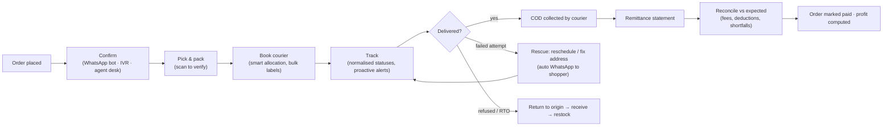
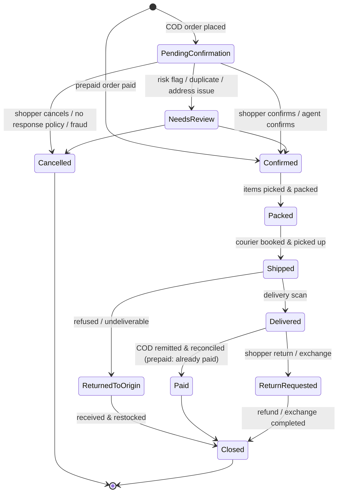
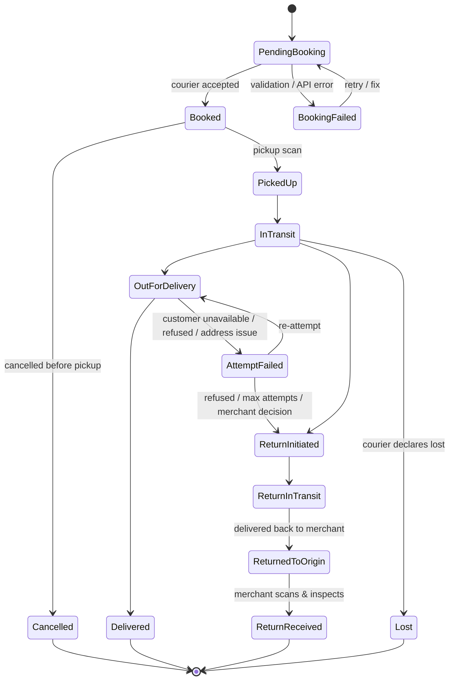
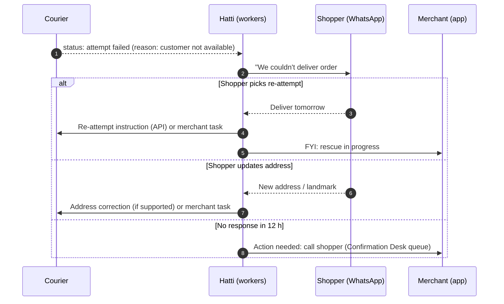
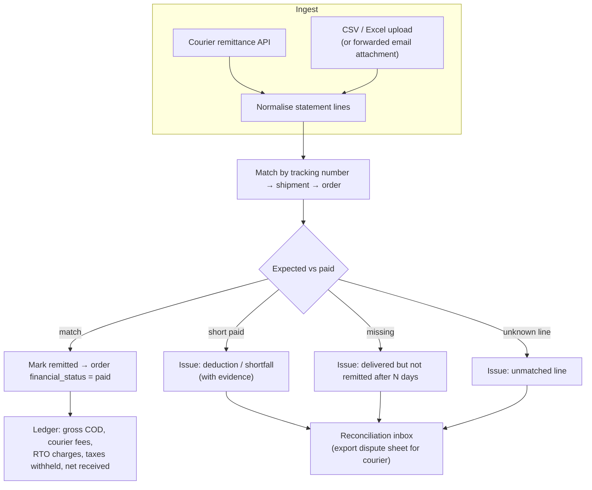

# 06 · Orders, Fulfillment & Logistics ("COD Operating System")

> **Status:** Draft v0.1 · **Last updated:** 2026-09-27
> In Pakistan most orders are paid in cash at the door. Much of a merchant's margin is lost to
> unconfirmed orders, refused deliveries (RTO), slow couriers and unreconciled cash. This module is
> where Hatti is **structurally better than Shopify**: Shopify treats COD as a "manual payment
> method", while Hatti runs the whole order-to-cash loop.

---

## 1. Order-to-cash at a glance



---

## 2. Order lifecycle

### 2.1 Order states (combined view)



The underlying data keeps the four independent dimensions (`status`, `confirmation_status`,
`financial_status`, `fulfillment_status`; see [03](./03-multi-tenancy-and-data.md)). The combined
state above is what merchants see as a single, human-friendly **stage** with filters and counts.

### 2.2 Order sources

`online_store`, `whatsapp` (chat-to-order), `instagram`/`facebook` (DM → draft order),
`pos`, `manual` (entered by staff), `api` (apps), `marketplace` (Daraz sync), `reseller` (Scale phase). The source
drives attribution, confirmation policy and reporting.

---

## 3. Order confirmation

### 3.1 Channels and policy

| Step | Channel | How | Cost profile (indicative) | Default use |
|---|---|---|---|---|
| 0 | **"Confirm on WhatsApp" link on the thank-you page** | The shopper taps a pre-filled `wa.me` message, so the conversation is customer-initiated | Lowest (opens a service window) | Always offered |
| 1 | **WhatsApp utility template with buttons** | "Confirm ✅ / Cancel ❌ / Change address ✏️" | ≈ PKR 4 per message at current Meta utility rates (USD-billed; verify) | Default first outbound message |
| 2 | **SMS with a short confirmation link** | Tap-to-confirm link, not "reply 1": two-way SMS is limited in Pakistan and branded sender IDs need operator pre-registration | Lower per message than WhatsApp (verify with aggregators) | WhatsApp undelivered after 15 min or channel degraded |
| 3 | **IVR robocall (Urdu)** | "Press 1 to confirm, 2 to cancel" | Medium | High-value or high-risk orders; no response after 2 h |
| 4 | **Agent call (Confirmation Desk)** | Human call/WhatsApp from the desk UI | Highest (staff time) | Needs-review, high value, repeated no-response |

Guardrails: at most **2–3 WhatsApp messages per order** for confirmation. **Orders are never
auto-cancelled for "no response" while a channel outage or regional block is detected**; they move
to review instead.

Merchant policy (per shop, with sensible defaults):

```yaml
confirmation:
  required_for: [cod, partial_advance]          # prepaid orders skip confirmation
  sequence:
    - { channel: whatsapp, at: 0m }
    - { channel: sms, at: 15m, if: whatsapp_undelivered }
    - { channel: whatsapp_reminder, at: 3h, if: no_response }
    - { channel: ivr, at: 5h, if: no_response and total >= 5000 }
    - { channel: agent_queue, at: 8h, if: no_response }
  quiet_hours: "22:00-09:00 Asia/Karachi"        # never message/call at night
  on_final_no_response: move_to_review           # or auto_cancel after 48h
  auto_book_courier_on_confirm: true
```

### 3.2 Confirmation Desk (agent UI)

* A **prioritised queue**: needs-review first, then by value, risk and age, with SLA timers.
* One tap to **call** (`tel:`), **WhatsApp** (pre-filled), or record the outcome: `confirmed`,
  `no answer (retry in 2 h)`, `wrong number`, `cancelled: reason`, `address updated`.
* Scripts in Urdu and English, customer history (orders, refusals across this shop, network risk
  tier), and the parsed address with a map.
* Agent performance: confirmations per hour, confirmation rate, and the RTO rate of the orders
  each agent confirmed. This last metric stops agents from confirming everything.

---

## 4. Fulfillment

### 4.1 Fulfillment orders and routing

On confirmation, an order is split into **fulfillment orders** per location. Routing picks the
location by stock availability, then priority order, then proximity to the destination city, and
avoids splitting when possible. Merchants can override the choice.

### 4.2 Pick & pack

* Pick lists (by batch or by order) and bilingual **packing slips**.
* **Scan-to-verify** in the merchant app (camera barcode scan) prevents wrong-item shipments,
  a common cause of returns.
* The `Packed` stage makes orders eligible for booking. With **bulk actions**, 200 orders can be
  booked and 200 labels printed in under a minute.
* **Built so far:** a confirmed or paid order waits under `to_pack` until it is marked packed,
  then under `to_book`; shipping does not require the step. Bulk confirm, cancel, pack and tag
  take up to 250 orders, each changed on its own, so one that fails leaves the rest done
  ([conventions](../engineering/conventions.md#orders)). Bilingual packing slips print for up to
  250 orders at a time (§10). Pick lists and scan-to-verify come with the merchant app, and
  booking with the courier adapters (spike 2).

---

## 5. Courier integration layer

### 5.1 Adapter contract

```ts
interface CourierAdapter {
  readonly id: CourierId;                                   // 'tcs' | 'leopards' | 'mnp' | 'postex' | 'trax' | ...
  capabilities(): CourierCapabilities;                      // booking, cancel, labels, rates, pickups,
                                                            // tracking: 'webhook' | 'poll', batchTracking,
                                                            // remittanceApi, reverseLogistics, cod
  syncCities(): Promise<CourierCity[]>;                     // refresh serviceability + city codes
  quote?(q: QuoteRequest): Promise<Quote[]>;
  book(s: ShipmentRequest): Promise<Booking>;               // tracking no., label ref, courier charges if returned
  cancel(trackingNo: string): Promise<void>;
  labels(trackingNos: string[], format: LabelFormat): Promise<Pdf>;
  track(trackingNos: string[]): Promise<TrackingUpdate[]>;  // raw → normalised by mapping tables
  requestPickup?(p: PickupRequest): Promise<PickupRef>;
  remittances?(range: DateRange): Promise<RemittanceStatement[]>;
}
```

* **Credentials:** in the MVP each merchant connects **their own courier accounts** (API keys,
  stored envelope-encrypted). The courier remits COD **directly to the merchant**.
* **Status mapping tables** (data, not code) translate each courier's raw statuses and reason codes
  into our canonical states, so fixing a mapping needs no deploy.
* **City mapping** uses the global courier city map (see [03 §7](./03-multi-tenancy-and-data.md)).
  An unmapped city blocks booking with a clear "choose the courier's city" prompt, and the answer
  improves the shared mapping.
* **Resilience:** per-courier timeouts, retries with jitter, circuit breakers, and BullMQ rate
  limiters matched to each API's limits. Bookings during a courier outage are **queued** and
  retried, and the merchant sees "booking pending" instead of an error.
* **Contract tests:** every adapter ships with recorded fixtures and a nightly sandbox smoke test.
  Courier APIs change without notice, so a failure pages the integrations on-call.
* **Legacy API hygiene:** some courier APIs still use plain HTTP, pass credentials in query
  strings, or accept bookings via `GET`. All courier traffic goes through an **egress proxy** with
  fixed IPs. URLs are never logged unredacted, and we move each courier to HTTPS/header auth as
  soon as it offers it.
* **Webhooks are rare** among Pakistani couriers (at the time of research only one showed
  evidence of them, unsigned). Polling (§5.3) is therefore the default. Any webhook is treated as
  a hint and verified by a tracking call.

### 5.2 Shipment state machine



### 5.3 Tracking updates

| Shipment state | Poll interval (if no webhooks) |
|---|---|
| Booked, awaiting pickup | 6 h |
| In transit | 3 h |
| Out for delivery | 30 min |
| Attempt failed | 1 h |
| Return in transit | 6 h |
| Terminal (delivered / returned) | Stop, with one confirmation poll 24 h later |

Where a courier supports webhooks, polling drops to a daily safety net. Each normalised
transition emits `shipment.status_changed`. That event drives shopper notifications, merchant
alerts, analytics and the order stage.

### 5.4 Smart courier allocation

For each confirmed order the allocator scores the eligible couriers:

```text
score(courier) = w1·P(delivered | courier, city, COD band)      ← network data
               − w2·expected_cost(weight, zone, COD fee)          ← merchant's rate cards
               − w3·expected_days(courier, city)
               + w4·merchant_preference(courier)
subject to: serviceable(city), COD supported, weight/value limits, daily capacity caps
```

* Strategies: **cheapest**, **fastest**, **best delivery rate**, **balanced** (default), or fixed
  rules ("Karachi → Courier A, rest → Courier B").
* Every allocation is **explainable** ("Chose B: 94% delivery rate in Sukkur vs 81%, +Rs 20").
* Performance data comes from `network_courier_perf` (anonymised, aggregated across shops). It
  improves as more merchants join, which gives us a network effect Shopify doesn't have here.

### 5.5 Launch courier line-up

Ordered by API completeness and merchant demand, from our research. Details and verification
status are in [Research · Local Ecosystem](../research/03-local-ecosystem.md).

| Wave | Couriers | Notes |
|---|---|---|
| MVP | **PostEx**, **Leopards**, **TCS** (current API generation), **Trax** | Full booking, tracking, cancel, labels/airway bills, load sheets, rate lookup; PostEx and Leopards expose COD payment status and re-delivery instructions |
| V1 | **M&P**, **BlueEx**, **Call Courier**, **Rider**, **Swyft** (API to confirm), **Daewoo FastEx** | Thinner APIs; some gaps are filled with generated labels and polling |
| V1 (manual) | **Pakistan Post** | No API; CSV/manifest export + tracking-number import |
| Later | Same-day/intra-city riders, 3PL warehouses | Via partnerships |

---

## 6. Failed delivery rescue (NDR) and RTO



* **Rescue rate** (share of failed attempts that end in delivery) is a headline metric on the
  merchant dashboard.
* **RTO handling:** a return initiated by the courier creates an expected-return record. The
  merchant scans the parcel on arrival, marks it **restock** or **damaged**, and inventory and
  loss accounting update automatically.
* The RTO cost (forward and return fees plus packaging) is recorded per order. It feeds the true
  profit report and the risk model's training labels.

---

## 7. COD remittance & reconciliation



* **Receivables ageing** per courier ("Rs 3.2 lakh delivered but not remitted for more than 7
  days") is shown on the home screen.
* **Deductions** are itemised: shipping fees, fuel surcharges, COD handling fees, RTO charges and
  **tax withheld at source**. Since Finance Act 2025, couriers withhold income tax on COD
  collections and intermediaries on digital payments, both rates doubling for non-filers, plus
  2% sales tax. The merchant's tax profile (NTN, filer status) predicts the expected deduction, and
  mismatches are flagged. Withheld amounts roll up into a **tax credit report** the merchant's
  accountant can use (see [Research · Local Ecosystem](../research/03-local-ecosystem.md)).
* A one-click **dispute sheet** (Excel) in each courier's expected format.
* Prepaid orders reconcile against **payment provider settlements** in the same inbox.

---

## 8. Returns & exchanges

* A **shopper return portal** (link in WhatsApp/SMS and on the order status page): pick items,
  reason, photos, and preference (**exchange for another size**, store credit, or refund).
* **Exchange-first** flows suit fashion: the new size is reserved immediately, and a **reverse
  pickup** is booked where the courier supports it (otherwise the shopper drops the parcel off).
* **Refunds** go to store credit (instant), wallet or bank (manual with a proof upload, or via a
  provider API where one exists), or the original method for prepaid. *Built so far:* staff
  record refunds they sent by bank transfer, mobile wallet or cash, up to what was paid, and the
  financial status follows
  ([ADR-029](./13-decision-log.md#adr-029--refunds-record-money-staff-sent-back-only-owners-and-managers-make-them)).
  Store credit, proof uploads and gateway refunds come later.
* Return rules: windows, eligible products (final-sale items excluded), restocking fees, and who
  pays reverse shipping.

---

## 9. Own riders and local delivery (Growth phase)

For merchants with their own riders (bakeries, grocers, same-city fashion):

* Delivery zones drawn on a map (polygons or city areas) with fees, minimum order and time slots.
* A **rider mode** in the merchant app: assigned deliveries, navigation deeplink, call and WhatsApp
  the customer, proof of delivery (photo or OTP), cash collected, and end-of-day **cash
  hand-over** reconciliation.
* Routing optimisation arrives later (Scale phase).

---

## 10. Documents

| Document | Formats | Notes |
|---|---|---|
| Courier labels | A4 (1/2/4-up), thermal 4×6 / 4×4 | From the courier API when provided, otherwise generated to the courier's spec with barcode |
| Load sheet / manifest | A4 | Handed over at pickup, signed by the rider |
| Packing slip | A4, thermal | Bilingual, optional marketing insert (QR to review or reorder) |
| Invoice | A4, PDF email/WhatsApp | FBR-compliant fields (NTN/STRN, tax breakdown); POS invoices carry FBR fiscal data when integrated |

All documents render through the documents service (HTML → PDF with correct Nastaliq shaping) and
are generated in bulk through the queue.

*Built so far* ([ADR-028](./13-decision-log.md#adr-028--printable-documents-are-html-pages-with-print-styles-pdfs-will-render-the-same-pages)):
packing slips and invoices as HTML pages that the browser prints, for up to 250 orders at a time,
on A4, 4×6 inch thermal labels or 80 mm rolls, in English, Urdu or both. The PDF step, marketing
inserts and the FBR fields wait for the documents service and the tax module.

---

## 11. Key metrics (merchant dashboard)

| Metric | Definition |
|---|---|
| Confirmation rate | Confirmed ÷ COD orders placed |
| Delivery success rate | Delivered ÷ shipped (by courier, city, product, source) |
| RTO rate | Returned to origin ÷ shipped |
| Rescue rate | Delivered after a failed attempt ÷ failed attempts |
| Avg days to deliver | Booked → delivered (by courier × city) |
| Cash conversion days | Delivered → remitted |
| Pending COD | Delivered, not yet remitted (ageing buckets) |
| RTO loss | Fees + packaging + damaged stock from returns |
