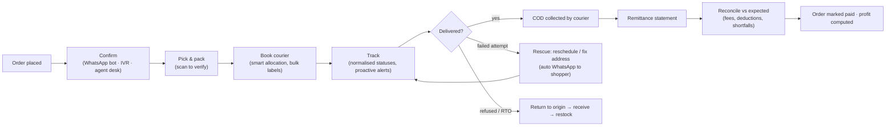
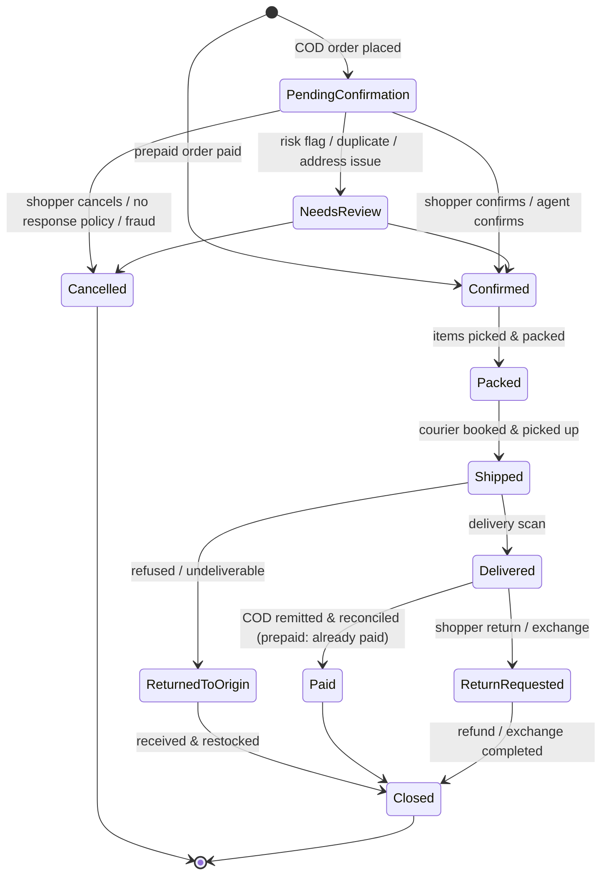
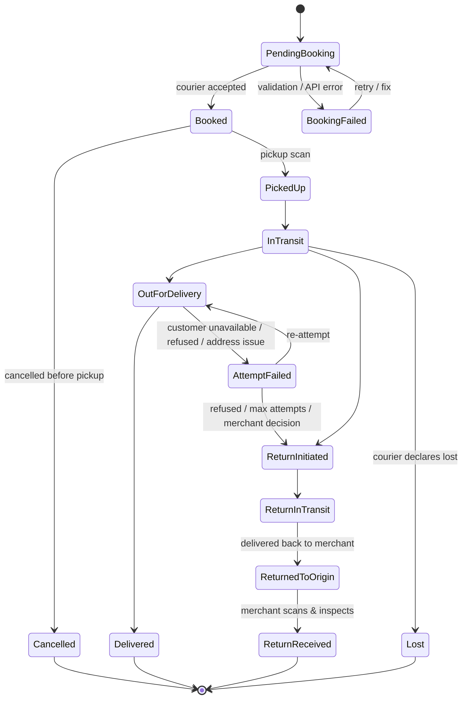
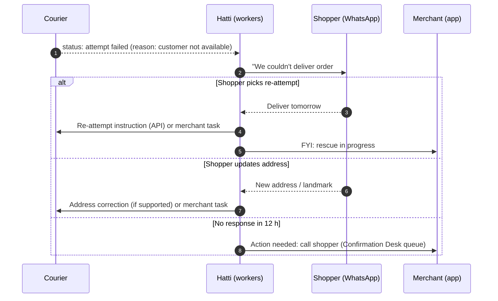
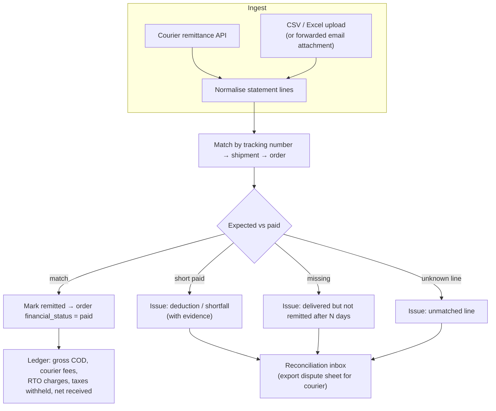

# 06 · Orders, Fulfillment & Logistics ("COD Operating System")

> **Status:** Draft v0.1 · **Last updated:** 2026-10-01
> In Pakistan most orders are paid in cash at the door. Much of a merchant's margin is lost to
> unconfirmed orders, refused deliveries (RTO), slow couriers and unreconciled cash. This module is
> where Hatti is **structurally better than Shopify**: Shopify treats COD as a "manual payment
> method", while Hatti runs the whole order-to-cash loop.

---

## 1. Order-to-cash at a glance



---

## 2. Order lifecycle

### 2.1 Order states (combined view)



The underlying data keeps the four independent dimensions (`status`, `confirmation_status`,
`financial_status`, `fulfillment_status`; see [03](./03-multi-tenancy-and-data.md)). The combined
state above is what merchants see as a single, human-friendly **stage** with filters and counts.
*Built so far:* an order paid by bank transfer needs no confirming; it waits at a stage of its
own, `awaiting_payment`, until staff see the money and mark it paid, and can't be packed or
shipped before; so does a cash-on-delivery order asking for an advance, as staff, a draft
([ADR-085](./13-decision-log.md#adr-085--a-draft-may-ask-for-an-advance-as-an-order-does-once-its-customer-confirms-it-the-drafts-link-shows-where-to-pay-and-takes-the-receipt)) or the shop's rules at checkout ask ([ADR-084](./13-decision-log.md#adr-084--checkout-asks-for-the-advance-the-shops-rules-name-an-amount-a-share-of-the-items-or-the-delivery-charge-on-every-order-or-above-a-total-said-beside-cash-on-delivery)), until staff record the
advance, the rest collected at the door ([ADR-083](./13-decision-log.md#adr-083--a-cash-on-delivery-order-may-ask-for-an-advance-paid-by-transfer-before-it-ships-it-waits-for-it-as-a-transfer-waits-for-its-money-and-staff-record-it-when-it-is-in))
([ADR-074](./13-decision-log.md#adr-074--a-shop-that-gives-its-bank-account-offers-bank-transfer-the-order-waits-for-the-money-at-a-stage-of-its-own-and-keeps-the-account-its-customer-was-told-to-pay-into)).
Its customer may send the receipt through the order's page, which staff see with the order
([ADR-080](./13-decision-log.md#adr-080--a-customer-sends-the-receipt-of-their-transfer-through-their-orders-page-in-a-form-the-core-reads-and-keeps-in-storage-by-order-the-shop-sees-it-with-the-order)).

### 2.2 Order sources

`online_store`, `whatsapp` (chat-to-order), `instagram`/`facebook` (DM → draft order),
`pos`, `manual` (entered by staff), `api` (apps), `marketplace` (Daraz sync), `reseller` (Scale phase). The source
drives attribution, confirmation policy and reporting. *Built so far:* `manual` and `api` orders,
`whatsapp`, `instagram` and `facebook` orders placed from draft orders
([ADR-031](./13-decision-log.md#adr-031--draft-orders-keep-agreed-prices-and-hold-no-stock-customers-confirm-them-through-a-secret-link)),
and `online_store` orders placed through checkout; the Admin API names `pos`, `marketplace` and
`reseller` as reserved.

---

## 3. Order confirmation

### 3.1 Channels and policy

| Step | Channel | How | Cost profile (indicative) | Default use |
|---|---|---|---|---|
| 0 | **"Confirm on WhatsApp" link on the thank-you page** | The shopper taps a pre-filled `wa.me` message, so the conversation is customer-initiated | Lowest (opens a service window) | Always offered |
| 1 | **WhatsApp utility template with buttons** | "Confirm ✅ / Cancel ❌ / Change address ✏️" | ≈ PKR 4 per message at current Meta utility rates (USD-billed; verify) | Default first outbound message |
| 2 | **SMS with a short confirmation link** | Tap-to-confirm link, not "reply 1": two-way SMS is limited in Pakistan and branded sender IDs need operator pre-registration | Lower per message than WhatsApp (verify with aggregators) | WhatsApp undelivered after 15 min or channel degraded |
| 3 | **IVR robocall (Urdu)** | "Press 1 to confirm, 2 to cancel" | Medium | High-value or high-risk orders; no response after 2 h |
| 4 | **Agent call (Confirmation Desk)** | Human call/WhatsApp from the desk UI | Highest (staff time) | Needs-review, high value, repeated no-response |

*Built so far:* the tap-to-confirm page of step 2, for draft orders
([ADR-031](./13-decision-log.md#adr-031--draft-orders-keep-agreed-prices-and-hold-no-stock-customers-confirm-them-through-a-secret-link))
and for any order
([ADR-032](./13-decision-log.md#adr-032--customers-confirm-or-cancel-cash-on-delivery-orders-through-a-link-that-then-follows-the-order)).
The customer confirms, or cancels after being asked whether they are sure, and the page then
follows the order. Until the order is packed, the customer can also correct its address there,
all but the number, which is the "Change address" button's page
([ADR-033](./13-decision-log.md#adr-033--customers-correct-an-orders-address-through-its-link-until-it-is-packed-the-number-stays-the-shops)).
A draft's link can go out before the address: its page asks the customer for it, and for their
number while the draft has none
([ADR-034](./13-decision-log.md#adr-034--customers-add-a-drafts-address-and-their-number-while-it-has-none-through-its-link)),
and says the sales tax its total includes, as the order it becomes will keep it
([ADR-106](./13-decision-log.md#adr-106--a-draft-says-the-sales-tax-its-prices-include-an-open-ones-at-the-shops-rates-now-as-placing-it-would-work-it-out-a-completed-ones-as-its-order-keeps-it)),
and above its button what confirming agrees to, the shop's policies, which the order keeps with
where it was confirmed from, as checkout's orders do
([ADR-114](./13-decision-log.md#adr-114--a-draft-its-customer-confirms-through-its-link-keeps-what-they-agreed-to-as-checkouts-orders-do-the-page-names-the-shops-policies-above-its-button-and-the-order-keeps-their-versions-and-where-it-was-confirmed-from)); so does an order's page, for an order staff or
an app placed, which keeps when its customer confirmed it too
([ADR-115](./13-decision-log.md#adr-115--an-order-staff-or-an-app-placed-keeps-what-its-customer-agreed-to-in-confirming-it-through-its-link-the-page-names-the-shops-policies-and-the-order-keeps-their-versions-where-it-was-confirmed-from-and-when)).
Staff send the links themselves, on WhatsApp or by SMS; the sequence above sends them once
messaging exists (spike 3). Links' pages are in the shop's colour and show its logo, as its
checkout's page does ([ADR-069](./13-decision-log.md#adr-069--the-checkouts-page-takes-the-shops-accent-colour-from-its-published-theme-on-its-buttons-and-on-its-links-where-they-stay-readable), [ADR-081](./13-decision-log.md#adr-081--a-shops-logo-is-one-of-its-files-chosen-as-its-brands-the-checkouts-page-shows-it-in-place-of-the-shops-name-through-a-url-signed-for-an-hour-that-the-pages-policy-allows-alone)).

Guardrails: at most **2–3 WhatsApp messages per order** for confirmation. **Orders are never
auto-cancelled for "no response" while a channel outage or regional block is detected**; they move
to review instead.

Merchant policy (per shop, with sensible defaults):

```yaml
confirmation:
  required_for: [cod, partial_advance]          # prepaid orders skip confirmation
  sequence:
    - { channel: whatsapp, at: 0m }
    - { channel: sms, at: 15m, if: whatsapp_undelivered }
    - { channel: whatsapp_reminder, at: 3h, if: no_response }
    - { channel: ivr, at: 5h, if: no_response and total >= 5000 }
    - { channel: agent_queue, at: 8h, if: no_response }
  quiet_hours: "22:00-09:00 Asia/Karachi"        # never message/call at night
  on_final_no_response: move_to_review           # or auto_cancel after 48h
  auto_book_courier_on_confirm: true
```

### 3.2 Confirmation Desk (agent UI)

* A **prioritised queue**: needs-review first, then by value, risk and age, with SLA timers.
  An order waiting in it is scored again when its customer's history changes, such as a parcel
  of theirs refused, and held if that makes it risky
  ([ADR-112](./13-decision-log.md#adr-112--an-order-waiting-to-be-confirmed-is-scored-again-when-its-customers-history-changes-by-the-worker-a-score-that-makes-it-risky-holds-it-and-a-held-order-stays-held)).
* One tap to **call** (`tel:`), **WhatsApp** (pre-filled), or record the outcome: `confirmed`,
  `no answer (retry in 2 h)`, `wrong number`, `cancelled: reason`, `address updated`.
* Scripts in Urdu and English, customer history (orders, refusals across this shop, network risk
  tier), and the parsed address with a map.
* Agent performance: confirmations per hour, confirmation rate, and the RTO rate of the orders
  each agent confirmed. This last metric stops agents from confirming everything.

*Built so far* ([ADR-073](./13-decision-log.md#adr-073--the-confirmation-desk-deals-orders-waiting-for-their-customers-to-agents-one-at-a-time-the-most-urgent-due-first-and-keeps-the-calls-that-did-not-settle-them)):
the queue of orders waiting for their customers to confirm them, the most urgent due first: high
value, as the shop's risk policy sets it, then those due longest, then the riskier. An agent asks
for the next and gets one no one else has, theirs for 15 minutes. Calls that do not settle an
order are kept: no answer, due again in two hours, and after three the customer could not be
reached; asked to call back, due then; a wrong number, held for review. Held orders are reviewed
on their own tab rather than dealt out. Agents' performance says, for each agent over a period,
the orders they confirmed and cancelled, their calls that settled nothing, their hours on the desk
and how the orders they confirmed turned out, worked out from the calls and the orders' timelines
([ADR-090](./13-decision-log.md#adr-090--agents-performance-is-worked-out-when-asked-from-the-calls-the-desk-keeps-and-the-confirmations-and-cancellations-on-orders-timelines-by-who-made-them-with-how-the-orders-each-agent-confirmed-turned-out)).
The shop may keep calling hours, outside which the desk deals out no order and after which an
unanswered one falls due, and a target for the first call, past which, counting those hours, an
order is overdue
([ADR-091](./13-decision-log.md#adr-091--a-shops-confirmation-desk-keeps-calling-hours-outside-which-it-deals-out-no-order-and-after-which-an-unanswered-one-falls-due-an-order-waiting-longer-for-its-first-call-than-the-shops-target-counting-those-hours-is-overdue)).
An order whose customer could not be reached is cancelled as many days after it was placed as
the shop says, its stock let go, by a sweep in the worker
([ADR-092](./13-decision-log.md#adr-092--an-order-whose-customer-could-not-be-reached-is-cancelled-as-many-days-after-it-was-placed-as-the-shop-says-by-a-sweep-in-the-worker-shop-by-shop-and-order-by-order)).
Not yet: alerts for overdue orders, and WhatsApp and IVR attempts.

Beside the desk, an owner or manager gives an order to one member of staff to see through, from
confirming it to its delivery, and other staff take an order no one has for themselves; each
finds theirs with `assignee:me`, and a member who leaves gives their open orders back
([ADR-127](./13-decision-log.md#adr-127--an-order-is-given-to-one-member-of-staff-at-a-time-to-see-it-through-owners-managers-and-apps-give-it-to-anyone-other-staff-take-one-no-one-has-staff-find-theirs-with-assigneeme-and-those-who-leave-give-their-open-orders-back)).
The desk deals out orders whoever has them: an assignment says who answers for an order, the
desk who calls now.

On the call the customer may want another size, two instead of one, or something to go with
it: staff change the order's items while it waits to be packed, the lines kept at the prices
they were sold at and a variant added at its price now, and the stock, totals, sales tax and
cash to collect follow, so the agent reads the new total back. An order scored when it was
placed is scored again, and waits for review if the change makes it risky
([ADR-131](./13-decision-log.md#adr-131--an-orders-items-change-while-it-waits-to-be-packed-quantities-set-and-variants-added-in-one-edit-the-lines-kept-keeping-their-prices-its-amounts-and-tax-worked-out-again-and-the-difference-collected-at-the-door-its-stock-committed-and-let-go-at-once)).
An order its customer placed twice, or a second one for something to go with the first, is
merged into the other while both wait to be packed: one parcel and one delivery charge, the
other's items, discount and note taken in, and the order merged cancelled as merged, its link
naming the order it joined; it counts for nothing in the customer's history
([ADR-132](./13-decision-log.md#adr-132--an-order-its-customer-placed-twice-is-merged-into-the-other-while-both-wait-to-be-packed-the-other-takes-its-items-and-discount-and-keeps-its-own-delivery-charge-as-one-parcel-the-order-merged-is-cancelled-as-merged-naming-it-and-counts-for-nothing-in-its-customers-history)).
Splitting an order and changing an order's charges come later.

---

## 4. Fulfillment

### 4.1 Fulfillment orders and routing

On confirmation, an order is split into **fulfillment orders** per location. Routing picks the
location by stock availability, then priority order, then proximity to the destination city, and
avoids splitting when possible. Merchants can override the choice.

### 4.2 Pick & pack

* Pick lists (by batch or by order) and bilingual **packing slips**.
* **Scan-to-verify** in the merchant app (camera barcode scan) prevents wrong-item shipments,
  a common cause of returns.
* The `Packed` stage makes orders eligible for booking. With **bulk actions**, 200 orders can be
  booked and 200 labels printed in under a minute.
* **Built so far:** a confirmed or paid order waits under `to_pack` until it is marked packed,
  then under `to_book`; shipping does not require the step. Bulk confirm, cancel, pack and tag
  take up to 250 orders, each changed on its own, so one that fails leaves the rest done
  ([conventions](../engineering/conventions.md#orders)). Bilingual packing slips print for up to
  250 orders at a time (§10). Pick lists and scan-to-verify come with the merchant app, and
  booking with the courier adapters (spike 2).

---

## 5. Courier integration layer

### 5.1 Adapter contract

```ts
interface CourierAdapter {
  readonly id: CourierId;                                   // 'tcs' | 'leopards' | 'mnp' | 'postex' | 'trax' | ...
  capabilities(): CourierCapabilities;                      // booking, cancel, labels, rates, pickups,
                                                            // tracking: 'webhook' | 'poll', batchTracking,
                                                            // remittanceApi, reverseLogistics, cod
  syncCities(): Promise<CourierCity[]>;                     // refresh serviceability + city codes
  quote?(q: QuoteRequest): Promise<Quote[]>;
  book(s: ShipmentRequest): Promise<Booking>;               // tracking no., label ref, courier charges if returned
  cancel(trackingNo: string): Promise<void>;
  labels(trackingNos: string[], format: LabelFormat): Promise<Pdf>;
  track(trackingNos: string[]): Promise<TrackingUpdate[]>;  // raw → normalised by mapping tables
  requestPickup?(p: PickupRequest): Promise<PickupRef>;
  remittances?(range: DateRange): Promise<RemittanceStatement[]>;
}
```

* **Credentials:** in the MVP each merchant connects **their own courier accounts** (API keys,
  stored envelope-encrypted). The courier remits COD **directly to the merchant**.
* **Status mapping tables** (data, not code) translate each courier's raw statuses and reason codes
  into our canonical states, so fixing a mapping needs no deploy.
* **City mapping** uses the global courier city map (see [03 §7](./03-multi-tenancy-and-data.md)).
  An unmapped city blocks booking with a clear "choose the courier's city" prompt, and the answer
  improves the shared mapping.
* **Resilience:** per-courier timeouts, retries with jitter, circuit breakers, and BullMQ rate
  limiters matched to each API's limits. Bookings during a courier outage are **queued** and
  retried, and the merchant sees "booking pending" instead of an error.
* **Contract tests:** every adapter ships with recorded fixtures and a nightly sandbox smoke test.
  Courier APIs change without notice, so a failure pages the integrations on-call.
* **Legacy API hygiene:** some courier APIs still use plain HTTP, pass credentials in query
  strings, or accept bookings via `GET`. All courier traffic goes through an **egress proxy** with
  fixed IPs. URLs are never logged unredacted, and we move each courier to HTTPS/header auth as
  soon as it offers it.
* **Webhooks are rare** among Pakistani couriers (at the time of research only one showed
  evidence of them, unsigned). Polling (§5.3) is therefore the default. Any webhook is treated as
  a hint and verified by a tracking call.

### 5.2 Shipment state machine



### 5.3 Tracking updates

| Shipment state | Poll interval (if no webhooks) |
|---|---|
| Booked, awaiting pickup | 6 h |
| In transit | 3 h |
| Out for delivery | 30 min |
| Attempt failed | 1 h |
| Return in transit | 6 h |
| Terminal (delivered / returned) | Stop, with one confirmation poll 24 h later |

Where a courier supports webhooks, polling drops to a daily safety net. Each normalised
transition emits `shipment.status_changed`. That event drives shopper notifications, merchant
alerts, analytics and the order stage.

### 5.4 Smart courier allocation

For each confirmed order the allocator scores the eligible couriers:

```text
score(courier) = w1·P(delivered | courier, city, COD band)      ← network data
               − w2·expected_cost(weight, zone, COD fee)          ← merchant's rate cards
               − w3·expected_days(courier, city)
               + w4·merchant_preference(courier)
subject to: serviceable(city), COD supported, weight/value limits, daily capacity caps
```

* Strategies: **cheapest**, **fastest**, **best delivery rate**, **balanced** (default), or fixed
  rules ("Karachi → Courier A, rest → Courier B").
* Every allocation is **explainable** ("Chose B: 94% delivery rate in Sukkur vs 81%, +Rs 20").
* Performance data comes from `network_courier_perf` (anonymised, aggregated across shops). It
  improves as more merchants join, which gives us a network effect Shopify doesn't have here.

### 5.5 Launch courier line-up

Ordered by API completeness and merchant demand, from our research. Details and verification
status are in [Research · Local Ecosystem](../research/03-local-ecosystem.md).

| Wave | Couriers | Notes |
|---|---|---|
| MVP | **PostEx**, **Leopards**, **TCS** (current API generation), **Trax** | Full booking, tracking, cancel, labels/airway bills, load sheets, rate lookup; PostEx and Leopards expose COD payment status and re-delivery instructions |
| V1 | **M&P**, **BlueEx**, **Call Courier**, **Rider**, **Swyft** (API to confirm), **Daewoo FastEx** | Thinner APIs; some gaps are filled with generated labels and polling |
| V1 (manual) | **Pakistan Post** | No API; CSV/manifest export + tracking-number import |
| Later | Same-day/intra-city riders, 3PL warehouses | Via partnerships |

---

## 6. Failed delivery rescue (NDR) and RTO



* **Rescue rate** (share of failed attempts that end in delivery) is a headline metric on the
  merchant dashboard.
* **RTO handling:** a return initiated by the courier creates an expected-return record. The
  merchant scans the parcel on arrival, marks it **restock** or **damaged**, and inventory and
  loss accounting update automatically.
* The RTO cost (forward and return fees plus packaging) is recorded per order. It feeds the true
  profit report and the risk model's training labels.
* *Built so far* ([ADR-071](./13-decision-log.md#adr-071--a-parcel-coming-back-is-checked-in-by-the-tracking-number-on-its-label-matched-as-couriers-statements-are-those-on-their-way-back-are-listed-the-longest-first)):
  a parcel marked coming back waits in `returningParcels`, the longest on its way first, with
  the days since it started back, by courier if asked. On arrival it is checked in by the
  tracking number on its label, as scanned, spaces and letter case ignored, with each item
  restocked or written off as damaged; one brought back unmarked is checked in all the same.
  A parcel the courier lost, on its way out or back, is written off, and an order with nothing
  delivered or brought back ends at the `lost` stage
  ([ADR-072](./13-decision-log.md#adr-072--a-parcel-the-courier-lost-is-written-off-and-an-order-with-nothing-delivered-or-back-ends-at-a-stage-of-its-own-lost-before-reaching-the-customer-it-is-never-their-refusal)): lost before reaching
  the customer, it is never their refusal. A parcel keeps what couriers' statements charged for
  it, out and back, as they are imported, and COD health adds up what the parcels that came back
  cost, by city, product, source and courier
  ([ADR-088](./13-decision-log.md#adr-088--a-parcel-keeps-what-couriers-statements-charged-for-it-which-cod-health-adds-up-for-those-that-came-back-a-statement-with-the-lines-of-one-imported-before-is-refused)).
  A lost parcel is claimed from its courier at its worth, or what the shop says, and the claim,
  the parcel's, is followed until the courier pays it, in a statement or otherwise, or refuses
  it, or the shop withdraws it; a statement's cash for a lost parcel pays its claim, filed or not,
  and `lostParcels` lists the lost parcels with their claims, those to claim and the claims open
  counted on the home
  ([ADR-093](./13-decision-log.md#adr-093--a-claim-on-the-courier-that-lost-a-parcel-is-the-parcels-followed-until-the-courier-pays-it-or-refuses-it-a-statements-cash-for-a-lost-parcel-pays-its-claim-filed-or-not)).
  What of a parcel that came back was written off as damaged is claimed the same way, at its
  items' prices on the order, and settled by hand: statements pay lost parcels' claims alone.
  `parcelClaims` lists every claim, lost or damaged, the oldest first, to follow up
  ([ADR-098](./13-decision-log.md#adr-098--a-parcel-that-came-back-with-items-written-off-as-damaged-is-claimed-from-its-courier-for-their-worth-as-a-lost-parcel-is-for-its-own-every-claim-is-listed-the-oldest-first-to-follow-up)).
  Not yet: packaging and stock in the RTO cost, photos of the damage kept with its claim, and
  returns couriers report through their APIs.

---

## 7. COD remittance & reconciliation



* **Receivables ageing** per courier ("Rs 3.2 lakh delivered but not remitted for more than 7
  days") is shown on the home screen. *Built so far:* the home's cash still to come, in one
  figure: cash on delivery not yet received on parcels on their way and on delivered orders not
  yet marked paid; and what couriers owe, by courier and by days since delivery: up to a week,
  a fortnight, a month, and longer
  ([ADR-066](./13-decision-log.md#adr-066--what-couriers-owe-is-worked-out-from-the-orders-when-asked-delivered-cash-on-delivery-orders-not-yet-paid-by-courier-and-by-days-since-delivery)).
  Statements are imported as the CSV couriers send, their columns found by the names couriers
  use; each line is matched to a parcel by its tracking number and its cash received on the
  parcel's order, at most what the order owes, in one transaction; lines that match nothing, or
  a parcel paid for before, or an order that owes nothing, are kept to look into
  ([ADR-067](./13-decision-log.md#adr-067--couriers-remittance-statements-are-imported-whole-into-a-logistics-module-each-lines-cash-received-on-its-parcels-order-at-most-what-the-order-owes-and-a-parcels-cash-once)).
  Each line's charges are kept on its parcel, and a statement is imported once: one with the
  same lines as one before, however it was saved, is refused (ADR-088, §6). Cash for a parcel the
  courier lost pays the parcel's claim, and the statement keeps what of its cash did so (ADR-093,
  §6). Couriers' APIs, the
  ledger, tax credits and dispute sheets come later.
* **Deductions** are itemised: shipping fees, fuel surcharges, COD handling fees, RTO charges and
  **tax withheld at source**. Since Finance Act 2025, couriers withhold income tax on COD
  collections and intermediaries on digital payments, both rates doubling for non-filers, plus
  2% sales tax. The merchant's tax profile (NTN, filer status) predicts the expected deduction, and
  mismatches are flagged. Withheld amounts roll up into a **tax credit report** the merchant's
  accountant can use (see [Research · Local Ecosystem](../research/03-local-ecosystem.md)).
* A one-click **dispute sheet** (Excel) in each courier's expected format.
* Prepaid orders reconcile against **payment provider settlements** in the same inbox.

---

## 8. Returns & exchanges

* A **shopper return portal** (link in WhatsApp/SMS and on the order status page): pick items,
  reason, photos, and preference (**exchange for another size**, store credit, or refund).
* **Exchange-first** flows suit fashion: the new size is reserved immediately, and a **reverse
  pickup** is booked where the courier supports it (otherwise the shopper drops the parcel off).
* **Refunds** go to store credit (instant), wallet or bank (manual with a proof upload, or via a
  provider API where one exists), or the original method for prepaid. *Built so far:* staff
  record refunds they sent by bank transfer, mobile wallet or cash, up to what was paid, and the
  financial status follows
  ([ADR-029](./13-decision-log.md#adr-029--refunds-record-money-staff-sent-back-only-owners-and-managers-make-them)).
  Store credit, proof uploads and gateway refunds come later.
* Return rules: windows, eligible products (final-sale items excluded), restocking fees, and who
  pays reverse shipping.

---

## 9. Own riders and local delivery (Growth phase)

For merchants with their own riders (bakeries, grocers, same-city fashion):

* Delivery zones drawn on a map (polygons or city areas) with fees, minimum order and time slots.
* A **rider mode** in the merchant app: assigned deliveries, navigation deeplink, call and WhatsApp
  the customer, proof of delivery (photo or OTP), cash collected, and end-of-day **cash
  hand-over** reconciliation.
* Routing optimisation arrives later (Scale phase).

---

## 10. Documents

| Document | Formats | Notes |
|---|---|---|
| Courier labels | A4 (1/2/4-up), thermal 4×6 / 4×4 | From the courier API when provided, otherwise generated to the courier's spec with barcode |
| Load sheet / manifest | A4 | Handed over at pickup, signed by the rider |
| Packing slip | A4, thermal | Bilingual, optional marketing insert (QR to review or reorder) |
| Invoice | A4, PDF email/WhatsApp | FBR-compliant fields (NTN/STRN, tax breakdown); POS invoices carry FBR fiscal data when integrated |

All documents render through the documents service (HTML → PDF with correct Nastaliq shaping) and
are generated in bulk through the queue.

*Built so far* ([ADR-028](./13-decision-log.md#adr-028--printable-documents-are-html-pages-with-print-styles-pdfs-will-render-the-same-pages)):
packing slips and invoices as HTML pages that the browser prints, for up to 250 orders at a time,
on A4, 4×6 inch thermal labels or 80 mm rolls, in English, Urdu or both. Invoices say the sales
tax their total includes, a line per rate, as the order kept it when it was placed
([ADR-096](./13-decision-log.md#adr-096--sales-tax-is-included-in-prices-at-a-rate-the-tax-module-keeps-each-order-keeps-the-tax-in-it-as-it-was-placed-line-by-line-and-in-its-delivery)). The PDF step, marketing inserts and the FBR fields
(NTN and STRN, invoice series, digital invoicing) wait for the documents service and the tax
profile.

---

## 11. Key metrics (merchant dashboard)

| Metric | Definition |
|---|---|
| Confirmation rate | Confirmed ÷ COD orders placed |
| Delivery success rate | Delivered ÷ shipped (by courier, city, product, source) |
| RTO rate | Returned to origin ÷ shipped |
| Rescue rate | Delivered after a failed attempt ÷ failed attempts |
| Avg days to deliver | Booked → delivered (by courier × city) |
| Cash conversion days | Delivered → remitted |
| Pending COD | Delivered, not yet remitted (ageing buckets) |
| RTO loss | Fees + packaging + damaged stock from returns |

*Built so far*
([ADR-060](./13-decision-log.md#adr-060--cod-health-follows-a-periods-cash-on-delivery-orders-worked-out-from-them-when-asked-its-rates-of-those-that-turned-out)):
the Admin API's `codHealth` gives the first three for a period's cash-on-delivery orders, for the
shop and by city, product, source or courier, each rate of those that turned out (confirmed of
those confirmed or cancelled, delivered and returned of those delivered or returned), with what
still waits counted beside it. The others need couriers' tracking and remittances.
