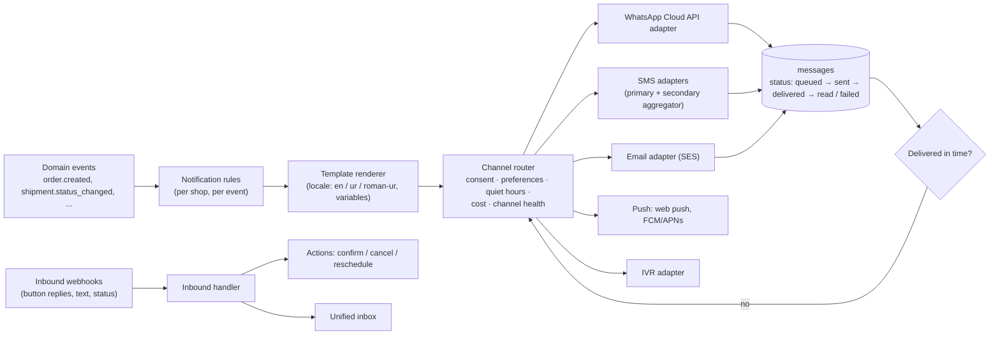
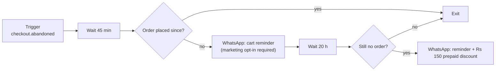
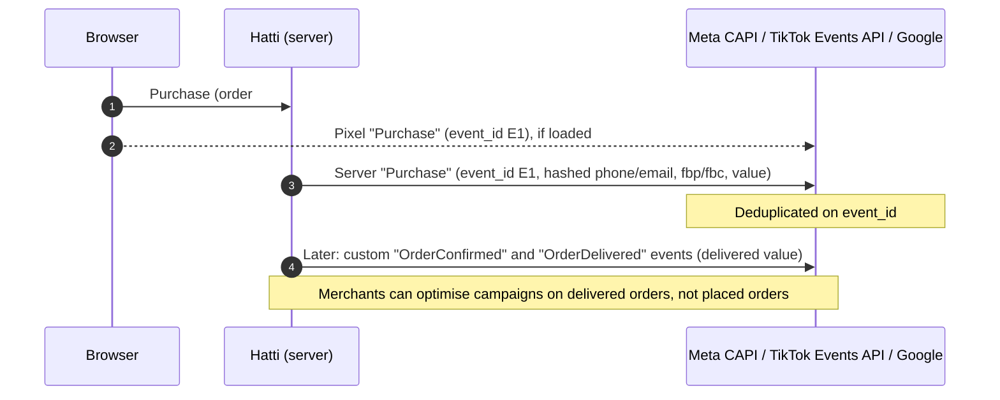

# 07 · Messaging, Notifications & Marketing

> **Status:** Draft v0.1 · **Last updated:** 2026-09-27
> In Pakistan, **WhatsApp is the storefront's second screen**. Customers confirm orders, ask
> questions, track parcels and discover products there. SMS is the dependable fallback. Email
> matters less, except for diaspora and B2B. This module turns those channels into a
> reliable, cost-controlled system.

---

## 1. Notification pipeline

**Router decisions, in order:**

1. **Is this message allowed?** Transactional messages go out on the legitimate-interest basis
   of the order. Marketing messages require an explicit opt-in per channel.
2. **Quiet hours.** No marketing between 21:00 and 10:00 and no calls between 22:00 and 09:00
   (shop timezone). Transactional OTPs are exempt.
3. **Channel preference and health.** Use WhatsApp unless it is failing for this shopper or
   degraded nationally (for example during a regional block), then fall back to SMS.
4. **Cost.** Use the cheapest channel that achieves the purpose, following the shop's messaging
   cost policy (see §2.3): the free service-message allowance first, then utility templates or
   SMS, with marketing templates only for opted-in campaigns.
5. **Fallback timers.** For example, send SMS if the WhatsApp message is not *delivered* within
   15 min.

*Built so far* ([ADR-146](./13-decision-log.md#adr-146--a-shops-customers-hear-of-their-orders-from-hattis-shared-whatsapp-number-or-by-sms-where-the-shop-saves-or-whatsapp-cannot-deliver-each-message-waits-in-postgres-queued-once-from-the-orders-events-until-the-worker-sends-it-and-whatsapps-webhook-follows-it-and-hears-customers-ask-to-stop)):
customers hear of their orders from Hatti's shared WhatsApp number (MSG-03): the order placed,
each parcel shipped with its tracking number and delivered, and the order cancelled (MSG-01).
The worker queues each from the order's events, once by a key however often its event comes, in
`messaging.messages`; nothing for a part split from an order, an order merged into another or an
erased customer's. The shop chooses rich or economy (§2.3), English or Urdu, and the notifications
to turn off (`messagingSettingsUpdate`). Every five seconds the worker sends what is due: each
WhatsApp message as one of Hatti's templates (`hatti_order_placed` …), each SMS as its words
through an aggregator's HTTP gateway from the shared sender ID. What a channel cannot take yet is
tried again a minute on, doubling to an hour, for a day. What WhatsApp refuses for good goes by
SMS instead, as does what it took and did not deliver within 15 minutes. WhatsApp's webhook,
signed with the app's secret, moves each message forward to delivered and read. A customer's
"STOP", "band karo" or "بند کرو" stops the shop they answered, or else the one that last wrote to
them, on that channel (MSG-09). `messages` lists each with how sending it went. A
cash-on-delivery order waiting for its customer asks them to confirm it instead, with three quick
replies; their answer comes back through the webhook as `message.replied`, and the worker acts on
it ([ADR-147](./13-decision-log.md#adr-147--a-cash-on-delivery-order-waiting-for-its-customer-asks-them-on-whatsapp-to-confirm-it-with-confirm-cancel-and-change-address-buttons-and-its-link-their-answer-comes-through-the-webhook-as-an-event-and-the-worker-confirms-or-cancels-the-order-as-their-link-would)). Checkout's codes go the same way, as
`one_time_code`, which no shop can turn off and whose code is dropped once it is sent
([ADR-148](./13-decision-log.md#adr-148--checkout-asks-a-shopper-paying-on-delivery-for-a-code-sent-to-the-number-they-typed-on-whatsapp-or-by-sms-where-the-shops-risk-rules-score-the-order-at-its-mark-a-digest-of-the-code-alone-is-kept-and-the-order-keeps-when-its-number-was-proved)). Not yet: quiet hours and consent for marketing, channel health, a second
aggregator, email, push and IVR.

---

## 2. WhatsApp

### 2.1 Account model

| Model | For | How |
|---|---|---|
| **Merchant's own WhatsApp Business Account** (recommended) | Brands that want their own name and number | Hatti acts as a Meta **Tech Provider** using **Embedded Signup**: the merchant connects or creates a WABA in a few clicks inside the Hatti admin. Messages come from the merchant's verified business name. |
| **Shared Hatti notifications number** | New and small shops before they set up their own WABA | Transactional utility templates only ("Your order from *Ayesha's Closet* …"), no marketing. |

**Coexistence matters for small merchants.** Meta allows a business to keep using the free
**WhatsApp Business app** on its phone while the same number is connected to the Cloud API (outside
a few excluded countries; Pakistan is not excluded). The shop owner keeps chatting from their phone
as today, while Hatti sends automated confirmations and updates from the same, familiar number.
Onboarding offers this by default.

### 2.2 Template library

Hatti ships a pre-written, policy-compliant **template library** in English, Urdu and Roman Urdu. It
is auto-submitted for approval to each connected WABA:

| Event | Category | Buttons |
|---|---|---|
| Order confirmation request | Utility | Confirm · Cancel · Change address |
| Confirmation reminder, three hours on without an answer | Utility | Confirm · Cancel · Change address |
| Order confirmed / packed | Utility | Track order |
| Shipped with tracking | Utility | Track · Contact us |
| Payment received (in full, or the advance and what is left) | Utility | — |
| Payment reminder, a day before an unpaid order is cancelled | Utility | Pay now (the order's page) |
| Out for delivery (keep cash ready) | Utility | Reschedule |
| Delivery attempt failed | Utility | Deliver tomorrow · Change address · Cancel |
| Delivered + review request | Utility / Marketing* | Rate your order |
| OTP for checkout / login | Authentication | Copy code |
| Abandoned cart | Marketing | Complete order |
| Back in stock / price drop | Marketing | Shop now |
| Broadcasts (sales, new drops) | Marketing | Custom |

\* Meta decides the category based on content. The library is written to keep order-related
messages in the cheaper utility category.

*Built so far* ([ADR-160](./13-decision-log.md#adr-160--each-parcels-way-is-kept-step-by-step-as-shopifys-fulfillmentevent-its-couriers-changes-recorded-once-from-the-workers-tracking-and-staffs-for-couriers-hatti-does-not-follow-the-orders-page-shows-them-the-latest-first-in-english-and-urdu-the-shipped-message-links-that-page-and-a-parcel-out-for-delivery-with-cash-to-collect-tells-its-customer-what-to-keep-ready)): shipped, with a button to the order's page, where the parcel's way
shows; and out for delivery, with what to keep ready for the rider and the same button, each time
a parcel with cash to collect goes out. A payment while the order waits to ship is told too, in
full or its advance with what is left for the rider ([ADR-171](./13-decision-log.md#adr-171--a-customer-hears-on-whatsapp-or-by-sms-where-the-shop-saves-that-the-shop-has-their-payment-while-the-order-waits-to-ship-once-it-is-paid-in-full-by-transfer-online-or-as-staff-record-it-and-paying-on-delivery-once-its-advance-is-in-with-what-is-left-for-the-rider-cash-paid-at-the-door-is-no-news-to-whoever-paid-it)); and an order still waiting for its payment reminds its customer a day before it is cancelled, with its page ([ADR-174](./13-decision-log.md#adr-174--an-order-still-waiting-for-its-payment-in-a-shop-that-cancels-such-orders-reminds-its-customer-once-a-day-before-its-days-run-out-and-no-sooner-than-half-a-day-after-it-was-placed-what-it-waits-for-by-when-in-the-shops-time-and-its-page-which-says-how-to-pay)); and a customer who has not answered the question to confirm their order is asked once more three hours on, in the shop's calling hours ([ADR-175](./13-decision-log.md#adr-175--a-cash-on-delivery-order-whose-customer-has-not-answered-three-hours-after-it-was-placed-asks-them-once-more-with-the-same-buttons-and-link-in-the-shops-calling-hours-a-sweep-in-the-worker-finds-them-and-an-order-placed-more-than-three-days-before-is-left-to-the-desk)).

### 2.3 Throughput, billing and cost control

* **Queues per sending number**, with rate limiters sized to the number's current Meta messaging
  tier. Broadcasts are paced and can be paused.
* **Pricing model (as researched):** Meta has charged **per message** since July 2025, by
  category (marketing, utility, authentication) and destination country, **billed in USD**. At
  current Pakistan rates a marketing message is roughly 3× a utility message; a utility message is
  about PKR 4. From **1 October 2026**, Meta also charges for free-form and utility replies
  *inside* the 24-hour customer-service window beyond a monthly free allowance per number.
  Conversations started from click-to-WhatsApp ads keep a longer free window. Rates and rules
  change often, so the router reads them from configuration. Sources and verification status are
  in [Research · Local Ecosystem](../research/03-local-ecosystem.md).
* **Alerts to the shop itself** go the same way, from Hatti's number to the one the shop gives
  for them. *Built so far* ([ADR-157](./13-decision-log.md#adr-157--the-shop-hears-on-whatsapp-when-a-variant-runs-low-on-stock-and-again-when-it-runs-out-at-the-number-it-gives-for-hattis-alerts-once-for-each-spell-of-low-stock-which-inventory-keeps-until-the-variant-is-stocked-above-the-threshold-again-the-worker-hears-each-levels-change-and-queues-the-alert-as-a-message-the-shops-credit-pays-for)): its low stock, once a spell, and when a variant runs
  out; and its bills with Hatti ([ADR-169](./13-decision-log.md#adr-169--hatti-tells-a-shop-on-whatsapp-at-the-number-it-gives-for-hattis-alerts-when-its-plans-next-period-is-invoiced-when-its-plan-ends-unpaid-and-when-its-message-credit-falls-below-rs-100-each-once-queued-with-its-messages-from-billings-events-at-hattis-cost-whatever-its-credit-and-never-turned-off)): each renewal's
  invoice, a plan ended unpaid, and credit fallen below Rs 100, at Hatti's cost and whatever the
  shop's credit, which it cannot turn off.
* **Billing in PKR:** most small merchants cannot pay Meta in USD, so Hatti offers **prepaid
  message credits in PKR**, bought through a Business Solution Provider at first (flat-licence
  providers avoid per-message markups) and later extended directly as an approved partner.
  Merchants who can pay Meta directly keep their own payment method. *Built so far*
  ([ADR-155](./13-decision-log.md#adr-155--a-shops-messages-are-paid-from-credit-in-rupees-it-buys-from-hatti-with-an-invoice-of-its-own-each-is-charged-as-it-is-sent-at-what-it-costs-hatti-and-hattis-fee-in-a-ledger-kept-beside-the-balance-a-message-the-credit-cannot-pay-for-waits-and-a-code-is-not-sent-and-what-whatsapp-could-not-deliver-is-given-back)): credit in rupees bought from Hatti with an invoice of its own, each message charged
  as it is sent at what it costs Hatti (WhatsApp's by its template's category, an SMS's by its
  parts) and Hatti's fee, waiting while the credit cannot pay for it, a code not sent, and what
  WhatsApp could not deliver given back.
* **Messaging cost policy per shop:** *Rich* (WhatsApp for all updates) or *Economy* (WhatsApp
  only for interactive steps such as confirmation and failed-delivery rescue; SMS for
  informational updates like "shipped"). With per-message pricing, SMS can be cheaper for one-way
  updates, while WhatsApp wins where buttons and replies matter.
* **Pre-send estimates:** "This broadcast to 4,200 opted-in customers will cost about Rs X" before
  sending.
* **Channel risk:** WhatsApp has been restricted in parts of Pakistan at times. The router tracks
  delivery rates per network and region and switches to SMS automatically.

---

## 3. SMS, IVR, email, push

| Channel | Design |
|---|---|
| **SMS** | Two aggregators behind one adapter interface (primary + failover), health-checked by delivery-report rates. Branded sender IDs need operator pre-registration (about two weeks), so shops start on a shared sender and upgrade later. Two-way SMS is limited, so actions use **short links** (tap to confirm, track, reschedule) rather than reply keywords. Unicode (Urdu) SMS is costed per segment; Roman Urdu is the default because it fits more text per segment. |
| **IVR** | Pre-recorded Urdu prompts with text-to-speech for variables (amount, store name). DTMF result ("1 = confirm") posts back via webhook. Used selectively (see [06 §3](./06-orders-fulfillment-logistics.md)). |
| **Email** | Amazon SES (or equivalent) with per-shop sending domains (SPF/DKIM/DMARC wizard) or the platform domain with the shop's reply-to. MJML templates, bilingual. *Built:* Hatti's own emails about accounts, through SES's v2 API: links proving an account's email and resetting a password ([ADR-165](./13-decision-log.md#adr-165--hatti-sends-its-own-email-about-accounts-through-amazon-ses-a-link-proving-an-accounts-email-good-once-for-a-day-and-one-resetting-a-forgotten-password-good-once-for-an-hour-each-carrying-a-token-of-its-own-in-the-links-fragment-kept-as-a-digest-the-last-of-its-kind-alone-working-a-reset-ends-every-session-and-proves-the-email-and-the-accounts-second-factor-is-still-asked)); its bounces and complaints, through an SNS topic, stop Hatti's emails to the address ([ADR-170](./13-decision-log.md#adr-170--hatti-hears-amazon-sess-bounces-and-complaints-through-an-sns-topic-of-its-own-posted-to-its-webhook-and-checked-against-the-certificate-sns-signs-with-served-from-snss-own-host-an-address-that-bounced-for-good-or-whose-recipient-marked-an-email-as-spam-is-sent-none-of-hattis-emails-again-and-the-webhook-confirms-its-topics-subscription-itself)). A shop's customers hear of their orders by email too, where they gave one at checkout: each message about an order queues a copy for the address, with its words and the order's link, and the worker sends it through SES from Hatti's address under the shop's name, at no cost to the shop ([ADR-181](./13-decision-log.md#adr-181--a-shops-customers-hear-of-their-orders-by-email-too-where-they-gave-one-at-checkout-each-message-about-an-order-queues-a-copy-for-the-address-with-the-same-words-and-link-which-the-worker-sends-through-amazon-ses-from-hattis-address-under-the-shops-name-emails-cost-the-shop-nothing)). Not yet: per-shop sending domains and reply-to, MJML templates in the shop's look, SES's delivery events. |
| **Web push** | Storefront PWA opt-in (Android Chrome), used for back-in-stock and order updates when the shopper opted in. |
| **Merchant push** | New order, needs-review order, low stock, COD remittance received, daily summary. |

---

## 4. Unified inbox (Growth phase)

* **Channels:** WhatsApp, Instagram DMs, Facebook Messenger, website chat widget.
* **Order context panel:** the customer's orders, delivery status, risk tier and lifetime value,
  shown next to the conversation.
* **Actions from chat:** create a draft order, send a product card, payment link or COD
  confirmation link, update an address, start a return.
* **Assignment** and SLAs, saved replies (Urdu and English), and **AI suggested replies** grounded in
  order data and store policies (see [09](./09-ai-and-intelligence.md)).
* **AI auto-replies** outside business hours for FAQs and order status ("Mera order kahan hai?"),
  with a clean hand-off to a human.

---

## 5. Marketing engine

### 5.1 Segments

Segments are defined by a filter language over customers, orders and behaviour. Examples:
`city in (Lahore, Islamabad) AND orders_count >= 2 AND last_order_at > -90d`,
`cod_refusals >= 1`, `viewed_product_in_collection('eid-edit', 7d) AND NOT purchased`. Segments are
evaluated on demand for campaigns and incrementally for automations.

**Built so far** ([ADR-024](./13-decision-log.md#adr-024--segments-are-queries-evaluated-on-demand-over-fields-modules-contribute)):
saved segments and previews over customer fields (tags, when added, blocked) and order fields
(orders, amount spent, first and last order, delivered, returned and cancelled orders, city and
province), in a language close to Shopify's: `number_of_orders >= 2 AND city IN (Lahore,
Islamabad) AND last_order_date > -90d`. Consent and behaviour fields come with those features.

### 5.2 Automations (flow builder)

| Built-in recipe | Trigger | Notes |
|---|---|---|
| Abandoned checkout | `checkout.abandoned` | Phone captured at the first step; respects opt-in |
| Welcome series | `customer.subscribed` | Brand story, bestsellers |
| Post-delivery review request | `shipment.delivered` + 2 days | Photo reviews via WhatsApp |
| COD → prepaid nudge | `order.created` (COD) | Pay now for store credit; improves cash flow |
| Win-back | No order in N days | Segment-based offer |
| Back in stock / price drop | Inventory or price change on a watched item | Web push or WhatsApp |
| Replenishment | Days since purchase of consumables | Skincare, grocery |
| Birthday / anniversary | Customer date fields | Optional |

The engine runs on durable, delayed jobs (BullMQ) keyed by `(automation_id, customer_id,
trigger_event_id)`, so duplicate triggers never double-send.

### 5.3 Loyalty, referrals, affiliates, reviews

* **Loyalty:** points per rupee, tiers, redemption at checkout, points expiry; ledger-based for
  auditability.
* **Referrals:** "Give Rs 300, get Rs 300" with fraud checks (same phone/device/address).
* **Affiliates and influencers:** unique codes and links, commission rules (per delivered order,
  not per placed order), a payout report. Influencer selling is a major channel in Pakistan.
* **Reviews:** photo and video reviews, WhatsApp review requests, moderation, star ratings in
  structured data, a "verified buyer" badge.

---

## 6. Ads measurement: pixels and conversion APIs

Pakistani DTC brands depend on Meta and TikTok ads. Client-side pixels are increasingly lossy
(ad blockers, iOS, flaky networks), and **COD fake orders poison ad optimisation**: the algorithm
learns to find people who place orders but never accept them.

* Built in and free on paid plans. On Shopify this typically costs a separate app.
* PII is normalised and SHA-256 hashed per each platform's spec. Events are sent only when the
  shopper's consent state allows it.
* **Delivered-value optimisation:** custom events for confirmed and delivered orders let ad
  platforms optimise toward real buyers. This is one of the most valuable features for COD
  merchants.

*Built so far* ([ADR-143](./13-decision-log.md#adr-143--orders-placed-through-checkout-go-to-metas-conversions-api-from-the-worker-as-they-are-placed-confirmed-and-delivered-the-shop-choosing-which-is-purchase-each-moment-waits-in-postgres-until-meta-takes-it-or-its-seven-days-are-up)):
Meta's conversions API, from the server. A shop connects its dataset through the Admin API
(`metaConversionsUpdate`): its pixel's ID and an access token for the conversions API, sealed and
never shown again, and which moment of an order is Meta's `Purchase`: placed, confirmed or
delivered. Each order placed through checkout then goes to Meta as it is placed, confirmed and
delivered. The other moments go as `OrderPlaced`, `OrderConfirmed` and `OrderDelivered`, each
with the event ID `order-{number}-{moment}`. Each carries the order's total and items by variant,
its customer's mobile number, email, names, city and postcode hashed with SHA-256, their ID hashed,
the address and browser they ordered from, and Meta's click ID from the visit that brought them.
The worker records each moment from the order's events and sends what is due every fifteen
seconds. It tries again while Meta cannot take a moment, and gives up after Meta's seven days.
`conversionEvents` lists every moment with how sending it went.

The pixel is on the storefront's pages while the shop has Meta connected
([ADR-144](./13-decision-log.md#adr-144--a-shops-storefront-loads-its-meta-pixel-while-meta-is-connected-for-the-steps-shoppers-take-before-checkout-orders-go-from-the-server-alone-each-keeping-the-pixels-browser-and-click-ids-for-them)): `PageView` on every page,
`ViewContent` on a product's page, by the catalog feed's IDs, and `AddToCart` and
`InitiateCheckout` as shoppers send the cart's forms. Orders' events go from the server alone:
checkout's page runs none of the pixel's scripts, so there is nothing to
deduplicate. The pixel's browser and click
IDs, from its `_fbp` and `_fbc` cookies, go with the order placed, and its conversions send them.
TikTok, Google and a consent banner come later.

---

## 7. Catalog feeds & social channels

| Channel | Mechanism | Phase | Availability notes (verify at build time) |
|---|---|---|---|
| Meta (Facebook/Instagram) catalog | Catalog API sync + scheduled feed for catalogue/dynamic ads | V1 | On-platform checkout is not available in Pakistan; Instagram product tagging availability uncertain. Ads to the Hatti store are the core use |
| TikTok catalog | Catalog API / feed for catalogue ads | Growth | TikTok is Pakistan's largest social platform by adult reach, but TikTok Shop had not launched there at research time |
| Google Merchant Center | Merchant API / feed for free listings and Shopping ads | V1 | Confirm free-listing eligibility for Pakistan |
| WhatsApp catalog | Catalog linked to the merchant's WABA; chat-to-order | Growth | In-chat payments are not available in Pakistan; orders complete via COD or a payment link |
| Daraz | Product, inventory and order sync via the Daraz Open Platform seller API (app key, seller OAuth, signed requests) | Growth | Marketplace commission rules apply on Daraz orders |
| Link in bio | The shop's link page at `/links` for Instagram and TikTok bios and chats: its links, and products a tap from checkout through cart permalinks | MVP | *Built* ([ADR-161](./13-decision-log.md#adr-161--a-shops-link-page-at-links-is-a-line-about-it-up-to-ten-links-and-up-to-24-of-its-products-kept-with-what-it-sets-for-its-storefront-the-storefront-shows-it-in-the-platforms-markup-inside-the-shops-theme-in-the-pages-language-a-product-with-nothing-to-choose-a-tap-from-checkout-and-the-edge-keeps-it-until-the-shop-or-any-of-its-products-changes)); the admin's share kit and QR code to come |

Feeds are generated from the storefront product documents (see [03 §8](./03-multi-tenancy-and-data.md))
with per-channel **feed rules**: title templates, category mapping, excluded products, and Urdu or
English variants.

*Built so far* ([ADR-142](./13-decision-log.md#adr-142--a-shops-catalog-feed-is-its-storefronts-at-its-own-address-an-item-for-each-variant-of-its-products-with-an-image-in-googles-rss-which-metas-catalogs-read-too-made-from-its-documents-a-chunk-at-a-time)):
every storefront gives its shop's catalog feed at `/feeds/products.xml`, on the shop's own
address, in the RSS of Google's product data specification, which Meta's catalogs read too. It
has an item for each variant of the shop's products with an image, grouped by product, with its
price and sale price, stock, images, brand, product type, size and colour. It is made from the
storefront's documents a hundred products a round trip, sent as it is made, and kept at the edge
for an hour. The Admin API gives its address, `Shop.productFeedUrl`, for each platform's
scheduled fetch. Feed rules, Urdu feeds, the platforms' APIs and TikTok come later.

---

## 8. Attribution

* Captured at session start: UTM parameters, click IDs (`fbclid`, `ttclid`, `gclid`), referrer,
  landing page, affiliate or influencer code.
* Stored on the order (`attribution` JSONB) and in ClickHouse for first-touch and last-touch
  reports.
* **ROAS on delivered revenue:** combines daily ad spend (pulled from ad platform APIs) with
  delivered and reconciled revenue, so merchants see real profit instead of vanity revenue.

*Built so far*
([ADR-139](./13-decision-log.md#adr-139--a-shoppers-browser-keeps-the-visits-that-brought-them-the-first-and-the-last-from-elsewhere-checkout-passes-them-on-and-the-order-keeps-them-as-shopifys-customer-journey)):
storefront pages are the same for every shopper and kept at the edge, so a small script in each
page's head keeps the visits that brought the shopper in a first-party cookie of the shop's: the
first, and the last from elsewhere (an ad's click ID, UTM tags, or another site linking), each
with when it began, its landing page and the site that linked to it, for 30 days. The storefront
passes them when checkout starts, a cart permalink's own with them, and a discount link carries
its campaign on to its page. The checkout keeps them, checked, and the order placed copies them,
with where each came from (its `utm_source`, the platform of its ad or of the site linking, that
site's domain, or `direct`) and its UTM parameters; the Admin API gives them as Shopify's
`Order.customerJourneySummary`. An erasure clears their pages and keeps where they came from.
The sales report and COD health break orders down by the source and the campaign of their last
visit from elsewhere: what each sold, and how its orders were confirmed and delivered
([ADR-140](./13-decision-log.md#adr-140--sales-and-cod-health-are-broken-down-by-where-orders-came-from-the-source-and-the-campaign-of-each-orders-last-visit-from-elsewhere-orders-without-one-together)). Not yet: ClickHouse, reports by first visit, medium
or ad, every visit rather than the first and last, the consent banner the cookie should wait for
where the law asks, and ad spend.
