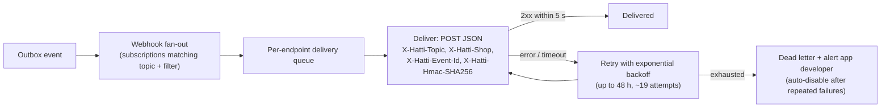
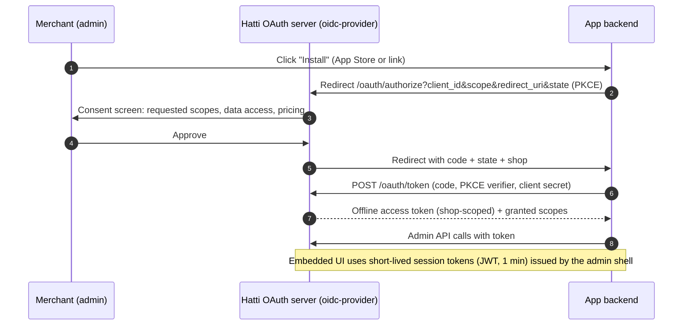
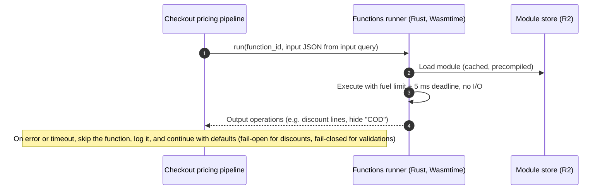

# 08 · APIs & App Platform

> **Status:** Draft v0.1 · **Last updated:** 2026-09-27
> Our strategy is **"built-in first, extensible always."** Everything a typical Pakistani store
> needs ships in the box. The APIs and app platform serve integrators (ERPs, couriers, 3PLs),
> agencies and the long tail of specialised needs. They also give Pakistan's large Shopify
> developer community a new market that pays in PKR.

---

## 1. API surface

| API | Consumers | Protocol | Auth |
|---|---|---|---|
| **Admin API** | Admin web, merchant app, apps, integrations | GraphQL | OAuth access tokens (apps), custom-app tokens (merchant-created), staff sessions (first-party) |
| **Storefront API** | Themes (AJAX), headless storefronts, mobile shopping apps, AI agents | GraphQL (+ small AJAX cart REST for themes) | Public storefront token (read + cart), private token (server-side) |
| **Customer Account API** | Storefront customer pages, headless | GraphQL | Customer session (phone OTP) |
| **Partner API** | Agencies, app developers | GraphQL | Partner tokens |
| **Webhooks** | Apps, integrations | HTTPS POST (JSON), HMAC-signed | Shared secret per app |
| **Bulk Operations** | Migrations, ERPs, analytics exports | Async GraphQL → JSONL files | Same as Admin API |
| **Files** | Media uploads | Signed upload URLs (R2) | Admin API mutation issues the URL |

### 1.1 Conventions

* **Versioned by date:** `/admin/api/2026-10/graphql.json`. A new version ships each quarter and
  each is supported for **12 months**. Deprecations are announced in the changelog and in response
  headers.
* **IDs:** type-prefixed opaque strings (`prod_…`, `ord_…`); see [03 §4](./03-multi-tenancy-and-data.md).
* **Pagination:** Relay cursor connections with a maximum of 250 nodes per page.
* **Money:** `{ amount: "12500.00", currencyCode: PKR }`. The amount is a decimal string, never a
  float.
* **Mutations** return `userErrors { field, code, message }`. They accept an
  `Idempotency-Key` header, which is mandatory for order, refund and fulfilment mutations.
* **Localisation:** translatable fields expose `translations(locale: UR)`. The `Accept-Language`
  header sets the default.

```graphql
mutation BookShipments($input: ShipmentsBookInput!) {
  shipmentsBook(input: $input) {
    shipments { id trackingNumber courier { code name } label { url } status }
    userErrors { field code message }
  }
}
```

### 1.2 Rate limiting

* **Cost-based for GraphQL:** each query has a calculated cost (fields × page sizes). Each
  `(app, shop)` pair has a leaky bucket: **1,000 points, refilling at 50 points/s** by default, and
  more on higher plans. Every response returns `extensions.cost` with the requested, actual and
  remaining throttle status, so clients can pace themselves.
* **Storefront API:** per-IP and per-token limits sized for real shoppers. Persisted queries get
  higher limits. The same limits protect AI-agent traffic.
* **Bulk operations** run outside the bucket, one concurrent operation per app per shop.

---

## 2. Webhooks



* **At-least-once, unordered.** Payloads carry `event_id`, `occurred_at` and the resource
  `version`, so consumers can dedupe and discard stale updates.
* **Filters:** subscriptions can filter (for example `orders/updated` only where `source =
  online_store`) to cut noise.
* **Mandatory privacy topics** for public apps: `customers/data_request`, `customers/redact`,
  `shop/redact`.
* **Topics (initial):** `products/*`, `inventory_levels/update`, `orders/create|updated|confirmed|cancelled|paid`,
  `fulfillments/*`, `shipments/status_changed`, `remittances/reconciled`, `refunds/create`,
  `returns/*`, `customers/*`, `checkouts/abandoned`, `app/uninstalled`, `shop/update`.
* **High-volume delivery** (Scale phase): partners can consume a dedicated event stream instead of
  HTTPS.

---

## 3. App platform

### 3.1 App types

| Type | Built by | Distribution | Example |
|---|---|---|---|
| **Built-in** | Hatti | Every shop (plan-gated) | Reviews, loyalty, COD confirmation, courier booking |
| **Public app** | Partners | Hatti App Store (reviewed) | ERP connector, accounting sync, 3PL integration |
| **Unlisted app** | Partners | Install link | Agency tools for their clients |
| **Custom app** | Merchant or their developer | Created in the shop's admin, single-shop token | Warehouse system sync |

### 3.2 Install and auth (OAuth 2.0)



* **Scopes** are granular (`read_orders`, `write_fulfillments`, `read_customers`, …).
  **Protected customer data** (names, phones, addresses) requires justification and review for
  public apps, mirroring Shopify's protected customer data programme. Pakistan's COD reality means
  phone and address data is especially sensitive.
* Tokens are stored **hashed**. Merchants can see and revoke every app's access, and uninstalling an
  app revokes its tokens instantly.

### 3.3 Extension points

| Extension | What it lets apps do | Sandboxing | Phase |
|---|---|---|---|
| **Embedded admin app** | Full app UI inside the Hatti admin (iframe + App Bridge SDK: navigation, toasts, modals, resource pickers) | Cross-origin iframe, session tokens | Growth |
| **Admin blocks & actions** | Cards on order/product/customer pages; bulk actions | Remote-rendered components from a restricted component set | Scale |
| **Theme app extensions** | App blocks (e.g. "size recommender") and app embeds (chat widgets) that merchants place in the theme editor, with no theme code edits | Liquid sandbox limits; assets served from our CDN; performance budget checks | Growth |
| **Checkout UI extensions** | Custom fields and content at defined checkout slots | Web Worker + remote DOM; no access to payment steps | Scale |
| **Functions** | Server-side logic: discounts, delivery/payment customisation, cart validation, courier allocation, order routing | Wasm, fuel-metered, no network, 5 ms budget | Scale |
| **Flow actions/triggers** | Add triggers and actions to the automation builder | Webhooks + Admin API | Growth |

### 3.4 Functions (Wasm) execution



Functions are written in Rust or JavaScript (compiled with Javy) with our SDK. Each declares a
GraphQL **input query**, so the runner hands it exactly the data it needs. There are no database
calls from Wasm.

### 3.5 App Store & billing

* **Review:** security (OAuth, HMAC verification, data handling), UX, and **storefront performance
  impact**. Apps that add more than a set budget of JS or regress the Lighthouse score are rejected.
* **Billing API:** apps charge merchants **through Hatti in PKR**: recurring, usage-based or
  one-time charges on the merchant's Hatti invoice. Local developers can monetise without building
  a payment stack. Proposed revenue share: **0% on a developer's first Rs 5 million of annual
  revenue, 10% above that** (a business decision; see
  [Pricing & Business Model](../product/03-pricing-and-business-model.md)).

---

## 4. Developer experience

| Tool | Purpose |
|---|---|
| **Hatti CLI** | `hatti theme dev` (hot reload against a dev store), `theme push/pull/check`, `app init/dev/deploy`, `function build/test` |
| **Dev stores** | Free, unlimited for partners; sample data generator (Pakistani cities, names, products, COD outcomes) |
| **Sandbox integrations** | Mock couriers, mock payment providers and a WhatsApp simulator, for end-to-end testing without real parcels |
| **GraphiQL explorer** | In admin and docs, pre-authenticated |
| **SDKs** | TypeScript (first-party), PHP (Laravel is popular locally), Python; generated from the schema |
| **Docs** | Reference docs generated from the schema; tutorials in English with Urdu video walkthroughs |
| **Changelog & status** | API changelog, deprecation feed, public status page |

---

## 5. Migration & import services

| Source | Method | Data |
|---|---|---|
| **Shopify** | Admin API via a merchant-created custom-app token, or CSV exports | Products (variants, images, metafields), collections, customers, orders (history), discount codes, pages, blogs, **redirects** |
| **WooCommerce** | REST API keys | Products, customers, orders, coupons |
| **Daraz** | Seller API / exports | Products, stock |
| **Instagram** | Instagram Graph API (business accounts) | Posts → draft products; AI extracts title, price and variants from captions and comments |
| **CSV / Excel** | Upload with templates (Urdu-safe UTF-8) | Products, inventory, customers |

**URL continuity:** Hatti uses the same URL patterns as Shopify (`/products/{handle}`,
`/collections/{handle}`, `/pages/{handle}`), and the importer creates redirects for anything that
differs. Search rankings survive the move, which removes a common objection to switching.
