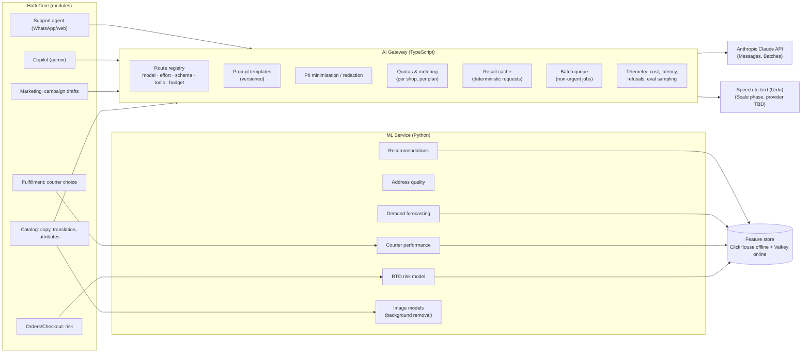
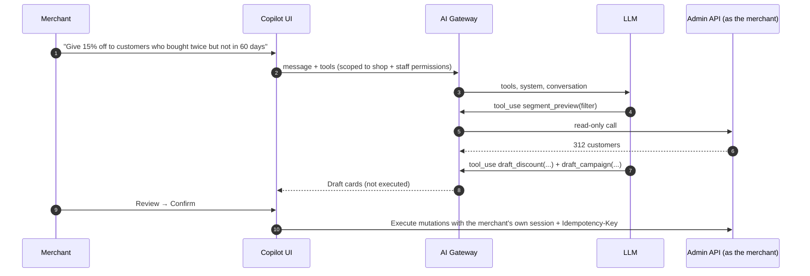

# 09 · AI & Intelligence

> **Status:** Draft v0.1 · **Last updated:** 2026-09-27
> Two kinds of intelligence power Hatti:
> 1. **Generative AI (LLMs)** for content, translation, a merchant copilot and a customer-support
>    agent, working in English, Urdu and Roman Urdu.
> 2. **Predictive ML**, trained on network data, for COD risk, courier performance, address
>    quality, demand and recommendations. This is where our data moat builds up.

---

## 1. Principles

1. **Assistive, not autonomous, where money or stock moves.** The copilot can *draft* a discount,
   refund or broadcast, but a human confirms it. Read-only questions are answered directly.
2. **Urdu is a first-class language.** Every generative feature is evaluated on Urdu (Nastaliq
   script) and Roman Urdu, not just English.
3. **AI never blocks commerce.** If a model is slow, refuses, or is unavailable, checkout, orders
   and fulfilment continue on deterministic defaults.
4. **Cost is a product constraint.** Every AI route has a budget and is metered per shop against
   plan quotas.
5. **Untrusted text is data, not instructions.** Product descriptions, reviews, customer chats and
   imported captions may contain prompt injection. The tools available to a model are scoped to
   the current shop and to the user's permissions.
6. **Transparency.** AI-generated content is labelled in the admin until a merchant edits or
   approves it. Shoppers are told when they are chatting with an assistant.

---

## 2. Architecture



### 2.1 AI Gateway

Every LLM call goes through the gateway. No module calls a model provider directly.

```yaml
# Route registry (illustrative)
routes:
  product_copy:              # title, description, SEO meta, alt text (en / ur / roman-ur)
    model: flagship            # tier alias → current Claude Opus-tier model ID (gateway config)
    effort: low
    output: schema:product_copy_v1       # structured output, validated
    inputs: [product_fields, images]     # vision for attribute extraction
    batchable: true                      # bulk imports go through the Batches API
    quota_unit: generation
  translate:
    model: flagship
    effort: low
    output: schema:translation_v1
    glossary: per_shop                   # brand terms that must not be translated
    batchable: true
  merchant_copilot:
    model: flagship
    effort: medium
    tools: [read_*, draft_*]             # write actions return drafts for UI confirmation
    prompt_cache: [tools, system]
    quota_unit: message
  support_agent:
    model: flagship
    effort: low
    tools: [order_lookup_verified, policy_search, handoff_to_human]
    prompt_cache: [tools, system, shop_policies]
    quota_unit: conversation
```

| Gateway responsibility | Design |
|---|---|
| **Model defaults** | **The flagship Claude model (Opus tier)** on every route, with `effort` tuned per route: `low` for extraction, classification, translation and short copy; `medium`/`high` for copilot reasoning. |
| **Cost tuning** | Measure per route against its eval before changing anything. The cheapest lever is usually lower effort on the same model plus caching, not a model cascade. Moving high-volume routes to cheaper Claude tiers (Sonnet, Haiku) is a **product/finance decision** made per route with eval evidence. |
| **Structured outputs** | JSON-schema-constrained outputs (`output_config.format`) for every machine-consumed result; `strict: true` on tool definitions. |
| **Prompt caching** | Stable prefixes first (tool definitions → system prompt → shop policies), volatile content last. The cache hit rate is monitored per route. |
| **Batches** | Non-urgent bulk work (catalogue imports, nightly translation, SEO backfills) runs through the Message Batches API at about half the cost. |
| **Refusals and failures** | Check `stop_reason` before using content (handle `refusal`); timeouts and retries with jitter; deterministic fallback per feature (for example, keep the merchant's original text). |
| **Privacy** | Send the minimum PII needed. Phone numbers and addresses are sent only when the task needs them (support order lookup) and are masked in logs. Review provider data-retention settings. |
| **Metering** | Tokens → AI credits per shop; plan quotas plus PKR top-ups; hard stops with a friendly message. |

> Model IDs and prices change. The gateway reads them from configuration, so upgrades are config
> changes validated by evals, not code changes. Reference prices (Anthropic first-party, per
> million tokens, as of mid-2026): flagship Opus tier $5 input / $25 output; Sonnet tier $2 / $10;
> Haiku tier $1 / $5. Batch processing costs about 50% less, and cache reads cost a small fraction of the
> input price. **Verify current pricing before budgeting.**

---

## 3. Generative features

| Feature | Pattern | Phase | Notes |
|---|---|---|---|
| **Product copy** (EN/UR/Roman) | Single call + vision + structured output | V1 | Tone presets ("premium", "friendly", "Gen-Z"); fabric/material vocabulary for eastern wear |
| **Translation** EN↔UR | Single call, glossary, batch | V1 | Human-approval workflow; "machine translated" label |
| **Attribute extraction & categorisation** | Vision + structured output | V1 | Colour, fabric, pieces (2-pc/3-pc), stitched/unstitched, season; maps to the taxonomy for feeds |
| **Instagram import** | Vision + structured output over post image and caption | V1 | Draft products with price/variants parsed from captions ("3pc lawn, Rs 4,500, S/M/L") |
| **AI store builder** | Structured output validated against the theme schema | V1 | From "I sell handmade jewellery in Karachi" → theme, colours, homepage sections, pages, policies |
| **Policy generator** | Templated generation | MVP | Returns/refund, privacy, shipping, T&Cs in English and Urdu, aligned with local norms; labelled "not legal advice" |
| **Merchant copilot** | Tool use over the Admin API | Growth | "Create a 20% Eid discount on lawn ending Sunday", "Which cities had the most RTO last month?", "Draft a WhatsApp broadcast for Lahore VIPs". Drafts need confirmation |
| **Customer support agent** | Tool use: verified order lookup, policy retrieval, human hand-off | Growth | WhatsApp and web chat; "Mera order kahan hai?"; escalates on refunds, complaints, low confidence |
| **Analytics Q&A** | Tool use over the metrics API (semantic layer), not free-form SQL | Growth | Queries are always shop-scoped by the tool, never by the model |
| **Bank-transfer proof parsing** | Vision + structured output | Growth | Extracts amount, reference, date and sender from screenshots; the merchant confirms the match |
| **Review summaries & moderation** | Single call | Growth | "What customers say" summaries; spam/abuse filtering |
| **Marketing drafts** | Single call | V1 | Broadcast copy, ad primary text, Eid/Ramadan campaign ideas |
| **Voice-note orders** | Urdu ASR → LLM extraction → draft order | Scale | Many customers send voice notes on WhatsApp. ASR provider to be selected on Urdu accuracy |
| **Image tools** | Open-source segmentation models (GPU) in the ML service; image generation via a third-party provider (TBD) | V1 / Growth | Background removal, auto-crop and lifestyle scenes. Claude reads images but does not generate them |

### 3.1 Copilot safety model



* The model never holds a credential. Tools run on the server **as the signed-in staff member**,
  so the copilot can't exceed that person's permissions.
* Tools that write data return **drafts**. Only an explicit UI confirmation executes the mutation.
* Every copilot action is written to the audit log with the conversation reference.

---

## 4. Predictive ML

### 4.1 RTO / COD risk model (V1)

The MVP's transparent rules are built, and this model replaces them behind the same answer: a
score from 0 to 1, a level and reasons, kept on the order
([ADR-025](./13-decision-log.md#adr-025--order-risk-is-a-snapshot-taken-when-an-order-is-placed-or-re-addressed)).

| Aspect | Design |
|---|---|
| Label | For confirmed COD shipments: **delivered** vs **refused / returned / undeliverable** |
| Features: order | Value, item count, categories, discount usage, source, hour/day, first order in shop |
| Features: customer | Shop history, **network history** (hashed phone: delivered and refused counts across shops, with consent-based terms), name/phone consistency |
| Features: address | City/area, address-quality score, landmark present, map pin present |
| Features: logistics | Courier × city delivery rate, distance class, holiday proximity |
| Features: session | Time from landing to order, pages viewed, repeat visits, IP-city vs address-city mismatch, velocity |
| Model | Gradient-boosted trees (LightGBM), calibrated probabilities; per-shop thresholds set by merchant policy |
| Explainability | Top reasons (SHAP) shown to merchants: "3 refused deliveries across Hatti stores", "vague address" |
| Serving | ML service, < 30 ms p95; online features in Valkey; fallback to rules if unavailable |
| Retraining | Weekly; drift monitoring; champion/challenger evaluation on hold-out weeks |
| Fairness guardrails | City alone never triggers "prepaid only"; merchants can override; shoppers can clear their record by completing a prepaid order; reviewed for disparate impact |

### 4.2 Other models

| Model | Purpose | Phase |
|---|---|---|
| **Address quality & normalisation** | Score vagueness, extract area/landmark, map to courier city codes | V1 |
| **Courier performance** | P(delivered), expected days per courier × city × COD band, feeding smart allocation | V1 |
| **Demand forecasting** | Reorder suggestions and stock-out alerts with **Hijri-calendar features** (Ramadan and Eid move about 11 days earlier each year), lawn seasons, sale events | Growth |
| **Recommendations** | "Frequently bought together", "similar items" (per-shop co-purchase + text/image embeddings for cold start) | V1 |
| **Search ranking** | Learning-to-rank from clicks and add-to-carts | Growth |
| **Fraud (merchant side)** | Detect scam stores (prepaid collected, no fulfilment) for Trust & Safety | Growth |

---

## 5. Agent-ready commerce

AI assistants are becoming a shopping channel. Hatti stores should be easy for them to discover
and transact with, without sacrificing merchant control.

This is no longer speculative. Shopify's Winter '26 Edition centred on "agentic storefronts". Every
Shopify store now exposes a Storefront **MCP** endpoint (catalogue search, policy/FAQ search, cart
tools), and stores publish a **Universal Commerce Protocol (UCP)** profile. UCP is an open
protocol co-developed by Google, Shopify and major retailers, with releases in January, April and
August 2026. OpenAI and Stripe's **Agentic Commerce Protocol (ACP)** is a parallel effort. Hatti
should be protocol-ready early, because this is a channel where a small Pakistani brand can appear
next to large ones.

| Capability | Design | Phase |
|---|---|---|
| High-quality product data | Structured attributes, taxonomy, GTIN/brand where available, bilingual titles | V1 |
| Structured data and feeds | JSON-LD on every page; shopping feeds per channel | V1 |
| Crawler policy | Per-shop allow/deny for AI crawlers (robots.txt presets) | V1 |
| **Store MCP server** | Per-store endpoint (e.g. `/api/mcp`) with tools: search catalogue, product details, policies/FAQs, delivery estimate and COD availability by city, get/update cart → returns a checkout link | Growth |
| **UCP profile & capabilities** | Publish the store's commerce profile (for example at `/.well-known/ucp`) and implement the catalogue, cart and checkout capabilities as the spec stabilises | Growth |
| Agentic checkout | ACP/UCP checkout flows once they support Pakistani methods (wallets, Raast). **COD orders from agents always pass through our confirmation flow**, and agent-originated orders are tagged for risk scoring | Scale |

---

## 6. Evaluation & quality

| Feature | Eval set | Metric | Gate |
|---|---|---|---|
| Product copy (Urdu) | 300 real products across verticals, rated by native speakers | Fluency, accuracy, no hallucinated attributes | ≥ 4.2/5 average, 0 critical errors |
| Translation | 500 phrase pairs incl. fashion vocabulary | Human adequacy/fluency | ≥ baseline before launch |
| Attribute extraction | 1,000 labelled images | Field-level F1 | ≥ 0.9 on required fields |
| Copilot | 200 scripted tasks | Correct tool choice + arguments; no unconfirmed writes | 95% / 100% |
| Support agent | 300 conversations (EN/UR/Roman) | Resolution correctness, escalation precision, **prompt-injection resistance** | 0 data leaks across orders/shops |
| RTO model | Hold-out weeks | AUC, calibration, lift at merchant thresholds | Beats rules baseline |

Every prompt or model change runs the relevant eval in CI (sampled) and fully before release.
Production samples, with merchant consent, feed back into the eval sets.

---

## 7. Cost envelope (planning numbers)

Assumptions: flagship-tier list prices above; a product-copy generation ≈ 2k input + 0.6k output tokens
(more with images).

| Route | Est. cost per unit | Unit economics lever |
|---|---|---|
| Product copy | ≈ US$0.02–0.04 (≈ Rs 6–11); about half via Batches | Batch bulk imports; cache the system prompt and schema |
| Translation (per product) | ≈ US$0.01–0.02 | Batch; cache the glossary; deduplicate repeated strings |
| Copilot message | ≈ US$0.03–0.15 depending on tools and context | Prompt caching of tools and system; effort tuning |
| Support conversation | ≈ US$0.02–0.10 | Low effort; cached policies; hand off early |

Plan quotas (proposal, aligned with [Pricing](../product/03-pricing-and-business-model.md)):
**Free** 10 generations/month · **Starter** 50 · **Growth** 150 · **Pro** 600, plus PKR top-up
packs (Rs 999 per 100). Copilot and support agent are included from Growth upward with fair-use
limits. **Target: AI cost ≤ 5% of plan revenue.** Quotas are revisited after route-level cost
tuning (effort, caching, batching and, if product and finance approve per route, cheaper model
tiers).
