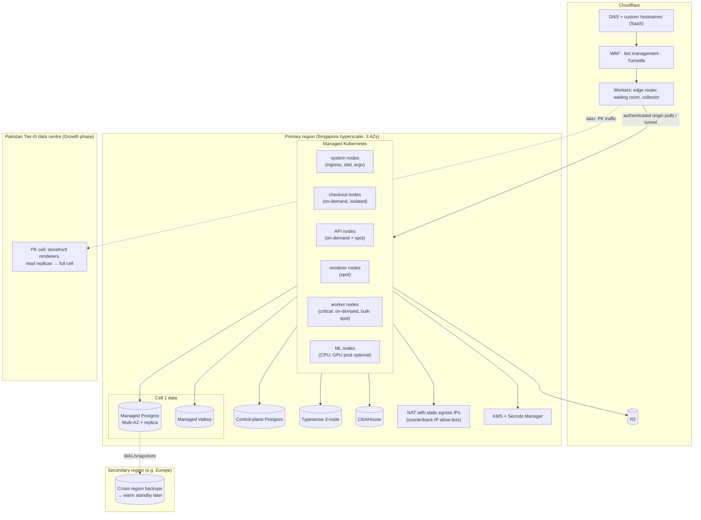

# 10 · Infrastructure & DevOps

> **Status:** Draft v0.1 · **Last updated:** 2026-09-27
> Principles: **managed where it hurts, portable everywhere, cheap by default.** We earn in PKR and
> pay for infrastructure in USD, so every fixed cost is scrutinised.

---

## 1. Environments

| Environment | Purpose | Data | Deploys |
|---|---|---|---|
| **Local** | Developer machines | Seeded fake data (Pakistani names, cities, products, COD outcomes) | Docker Compose: Postgres, Valkey, Typesense, ClickHouse, MinIO (S3), Mailpit, mock courier/payment/WhatsApp simulators |
| **Preview** | Per pull request (admin-web, checkout-web, themes; optional backend namespace) | Seeded | On every PR |
| **Staging** | Production-like integration; courier/payment sandboxes | Synthetic + anonymised samples | On merge to `main` |
| **Production** | Cells + control plane | Real | Progressive: canary cell → all cells |
| **Partner sandbox** | Dev stores for partners, living in production but flagged `development` (no real payments, mocked couriers) | Partner-created | Same as production |

---

## 2. Production topology

**Key choices**

* **Origin protection:** the origin accepts traffic only from Cloudflare (a tunnel or authenticated
  origin pulls with mTLS). There are no public load balancers without Cloudflare in front.
* **Static egress IPs:** several Pakistani courier and bank APIs require **IP allow-listing**. All
  outbound integration traffic leaves through NAT gateways with fixed IPs, published to partners.
  FBR's digital-invoicing API lets each taxpayer allow-list **at most 3 IPs**, so FBR traffic for
  every merchant must leave through **≤ 3 dedicated egress IPs**, and those IPs must survive
  region changes (keep them behind a portable egress proxy).
* **Node isolation:** checkout pods run on dedicated on-demand nodes. Renderers and bulk workers use
  spot capacity to cut cost.
* **Managed data services** (Postgres, Valkey, KMS) reduce on-call burden. Typesense and
  ClickHouse can be self-hosted on Kubernetes or bought as managed services, whichever is cheaper
  at our scale.
* **"Sovereign cell" option:** the cell architecture lets us place a cell in a **Pakistani data
  centre** later, for data-residency requirements (government-adjacent or regulated merchants) or
  cost reasons, without changing application code.

---

## 3. Hosting decision (see ADR-015)

**What the research changed.** The Gulf regions are physically the closest hyperscaler regions to
Pakistan: about 20–50 ms from most ISPs. But in **March 2026 drone strikes reportedly damaged AWS's
UAE (`me-central-1`) and Bahrain (`me-south-1`) regions** during the regional conflict. By
April AWS described the UAE region as unable to reliably support customer applications, and later
reports describe permanent data loss in one zone. Other Gulf regions have no reported damage but
share the same geopolitical risk. No hyperscaler has a region in Pakistan. Details and sources are
in [Research · Local Ecosystem](../research/03-local-ecosystem.md).

| Option | Latency from Pakistan (measured 2026) | Cost | Ops burden | Verdict |
|---|---|---|---|---|
| **Singapore hyperscaler region** (AWS `ap-southeast-1`, GCP `asia-southeast1`, others) | ~90–130 ms in practice (60–90 ms floor) | Medium (USD) | Low (managed services) | **Recommended for launch.** Stable, mature, and where several large Pakistani platforms already host |
| Gulf regions (Azure UAE, GCP Doha/Dammam, Oracle Gulf) | ~20–50 ms | Medium (USD) | Low | **Not as primary in 2026** (demonstrated war risk). Acceptable only with out-of-region failover |
| AWS UAE / Bahrain | n/a | n/a | n/a | **Avoid** (impaired / offline in 2026) |
| Mumbai | Unreliable routing via third countries | Medium | Low | **Avoid** (routing and geopolitical risk) |
| Europe (Frankfurt etc.) | ~130–200 ms | Low–medium | Low–high | **Secondary region** for backups and DR; budget providers for analytics/batch |
| **Pakistani Tier-III DC / local cloud** | **~2–40 ms**; immune to submarine-cable faults | PKR-denominated (FX hedge) | Medium-high; power and managed-service maturity vary | **Growth-phase "PK cell"**: start with storefront renderers + read replicas, then full cells, once SLAs, multi-homing (PTCL + Transworld + Nayatel) and generator/UPS resilience are proven |

**Why latency still works from Singapore.** Storefront HTML and media are served from Cloudflare
caches, while checkout and admin calls reuse warm edge-to-origin connections. The chatty paths
(cart, checkout) are designed for few round trips. One caveat to test: Cloudflare does not peer at
Pakistani internet exchanges, and some ISPs are served from Singapore or Muscat edge locations even
when a Karachi/Lahore/Islamabad PoP exists. The **PK cell** is the structural fix for both origin
latency and cable-fault exposure: in-country traffic was unaffected during the 2026 SMW5 fault,
while international round-trip times rose 2–6×.

**Decision process:** (1) latency bake-off from PTCL, Transworld, Nayatel, StormFiber, Jazz, Zong
and Telenor/Ufone in Karachi, Lahore and Islamabad (for example with Globalping), including which
Cloudflare edge serves our custom hostnames; (2) credits and pricing negotiation; (3) the managed
Postgres features we rely on (PITR, replicas, upgrades, extensions); (4) a legal review of
data-localisation direction (the draft data-protection bill restricts transfers of "critical
personal data"); (5) a shortlist of Pakistani DCs with verified tier certification, power
redundancy and multi-homing for the PK cell.

---

## 4. Delivery pipeline

```mermaid
flowchart LR
    PR["Pull request"] --> CI1["Lint · typecheck · unit<br/>(affected packages)"]
    CI1 --> CI2["Integration tests<br/>(Testcontainers)"]
    CI2 --> CI3["Contract tests<br/>(courier/payment adapters)"]
    CI3 --> CI4["Security: SAST, deps,<br/>secrets, IaC, image scan"]
    CI4 --> PV["Preview env + E2E (Playwright)<br/>Lighthouse budgets"]
    PV --> MRG["Merge to main"]
    MRG --> IMG["Build, SBOM, sign images"]
    IMG --> STG["Deploy staging (Argo CD)<br/>smoke + synthetic checkout"]
    STG --> CAN["Canary cell (internal & friendly shops)<br/>SLO watch 30–60 min"]
    CAN --> ALL["Progressive rollout to all cells"]
```

* **Database migrations:** expand → deploy → migrate data (resumable jobs) → contract. Migrations
  run as a separate job per cell before app rollout. Destructive changes need two releases.
* **Feature flags** decouple deploy from release: per shop, per plan, per cell, percentage rollouts.
* **Edge workers** deploy with Wrangler from CI, using versioned deployments and instant rollback.
* **Mobile apps:** EAS builds; staged Play Store rollouts (5% → 20% → 100%); OTA updates for JS-only
  fixes, following store policies.
* **Change freezes** around major sale events (see [12 §9](./12-scalability-and-reliability.md)).

---

## 5. Observability stack

| Signal | Tooling |
|---|---|
| Traces | OpenTelemetry SDKs → OTel Collector → Tempo (tail sampling) |
| Metrics | Prometheus-compatible (Mimir) + Grafana dashboards; SLO burn-rate alerts |
| Logs | Structured JSON → Loki; PII scrubbing at the collector; security stream separated |
| Errors | Sentry (backend, admin, merchant app, storefront runtime) |
| RUM | Storefront Web Vitals beacon → ClickHouse |
| Synthetics | Probes on Pakistani ISPs and mobile networks + external uptime checks |
| On-call | Alertmanager → paging tool; runbooks linked from every alert |
| Status | Public status page per component (storefront, checkout, admin, each courier and messaging integration) |

---

## 6. Cost model (planning estimates)

Rough monthly infrastructure costs in USD, **excluding** third-party pass-through costs (WhatsApp,
SMS, courier, payment fees) and people. They assume a Singapore hyperscaler region with an
ARM-heavy fleet, spot capacity for stateless pools, and savings plans after month 6.

| Phase | Active stores | Est. infra cost / month | Cost per active store | Main drivers |
|---|---|---|---|---|
| MVP | ≤ 500 | $1,500–3,000 | n/a (fixed-cost floor) | Kubernetes baseline, Multi-AZ Postgres, Valkey, NAT, observability |
| V1 | ≤ 5,000 | $4,000–8,000 | ≈ $0.8–1.6 | API/renderer pods, search, ClickHouse, image transforms |
| Year 2 | ≤ 25,000 | $15,000–30,000 | ≈ $0.6–1.2 | 2–4 cells, replicas, event log |
| Year 3 | ≤ 100,000 | $40,000–70,000 | **≈ $0.4–0.7** | Scale efficiencies, reserved capacity, offloading analytics/batch to cheaper providers |

**Cost levers:** edge cache hit ratio (every point saves origin compute); R2's zero egress;
ARM instances; spot for renderers and bulk workers; right-sized Postgres with read replicas instead
of oversized primaries; ClickHouse instead of per-query warehouses; **startup credits** in year 1;
moving analytics, ML training and backups to cheaper providers once volumes justify it.

**FX risk:** infrastructure is ~USD, revenue is PKR. Mitigations: price reviews tied to an FX
band, annual plans (cash upfront), credits, and the sovereign-cell option for PKR-denominated
capacity.

---

## 7. Access & operations

* **No SSH to production nodes.** Break-glass access goes through an audited session manager with
  JIT approval.
* **Infrastructure as code** for everything (OpenTofu/Terraform + Helm + Argo CD). Manual changes are
  detected and reverted.
* **Secrets:** cloud Secrets Manager → External Secrets Operator → Kubernetes secrets (encrypted at
  rest). Application-level secrets (merchant credentials) use envelope encryption in the database
  (see [11](./11-security-and-compliance.md)).
* **Backups & restore tests** are automated and alarmed.
* **On-call:** follow-the-sun is not feasible early, so we run a primary/secondary rotation in PKT
  with a strict alert-quality bar (every page must be actionable) and a quarterly review.
