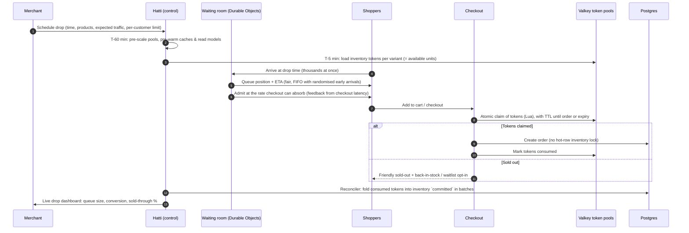

# 12 · Scalability, Reliability & Performance

> **Status:** Draft v0.1 · **Last updated:** 2026-09-27
> Pakistani commerce peaks hard and predictably: **Chand Raat before Eid**, Ramadan evenings,
> **White Friday** (Pakistan's Black Friday), **11.11 / 12.12**, and fashion **lawn-collection
> launches** where a brand's whole drop can sell out in minutes. The platform must stay fast and
> correct at those moments. That is when merchants decide whether to trust us.

---

## 1. Service level objectives

| Surface | SLI | SLO (monthly) |
|---|---|---|
| Storefront (edge + renderer) | Successful responses for page requests | **99.95%** |
| Storefront | p75 LCP on mid-range Android over 4G (RUM) | ≤ 2.0 s |
| Checkout | Successful checkout API calls (excluding shopper errors) | **99.95%** |
| Checkout | Order placement latency p95 (excluding provider redirects) | ≤ 800 ms |
| Payments | Paid intent → order created, p99 | ≤ 60 s (callback) / ≤ 5 min (inquiry path) |
| Admin & merchant app | Successful API calls | 99.9% |
| Admin | GraphQL p95 | ≤ 500 ms |
| Webhooks (outbound) | Delivered to healthy endpoints within 1 min | 99% |
| Order confirmation messages | Sent within 60 s of order creation | 99% |
| Courier booking | Booked within 5 min of request (courier API healthy) | 99% |

**Error budgets** gate releases. A surface that burns more than 50% of its monthly budget freezes
risky deploys for that surface until the budget recovers.

---

## 2. Capacity planning (assumptions to revisit quarterly)

| Horizon | Active stores | Orders / month | Peak orders / min | Storefront page views / month | Peak req/s at edge |
|---|---|---|---|---|---|
| End of MVP | 500 | 50k | 150 | 3M | 300 |
| End of V1 (≈ month 9) | 5,000 | 600k | 1,500 | 40M | 3,000 |
| Year 2 | 25,000 | 4M | 8,000 | 250M | 15,000 |
| Year 3 | 100,000 | 15M | 30,000 | 1B | 50,000 |

These are engineering design targets with roughly **2× headroom** over the business base case in
[Pricing & Business Model](../product/03-pricing-and-business-model.md). Peak multipliers assume
**20–30×** the average minute on Eid and White Friday, and up to **100×** for one shop during a
hyped drop. Edge caching is expected to absorb **> 90%** of storefront
requests. Origin capacity is sized for cache misses plus all cart, checkout and API traffic.

---

## 3. Scaling by tier

| Tier | Scale-out mechanism | Limits & guardrails |
|---|---|---|
| Edge | Cloudflare global network; KV-cached directory | Cache hit ratio SLO ≥ 90% for storefront HTML |
| Storefront renderer | Stateless pods; HPA on CPU/RPS; spot nodes allowed | Per-render CPU/iteration limits; read models in Valkey |
| API pools (admin, storefront, checkout) | HPA per pool; separate node groups for checkout | Per-shop GraphQL cost buckets; request timeouts per pool |
| Workers | KEDA autoscaling on queue depth per queue | Per-shop concurrency caps; per-integration rate limiters |
| Postgres (per cell) | Vertical scaling → read replicas → **new cells** | `statement_timeout` per pool (admin 5 s, storefront 1 s, checkout 2 s); query budgets tracked via `pg_stat_statements` |
| Valkey | Cluster mode per cell | Key TTL discipline; memory alerts at 70% |
| Typesense | Replicas (3-node Raft) → more nodes; per-cell collections | Scoped keys; per-shop query rate limits |
| ClickHouse | Vertical → shards by `shop_id` hash | Async inserts; materialised views for dashboards |
| Object storage/images | R2 + CDN | Immutable URLs; transform cache |

**Cell sizing rule of thumb:** a cell is "full" when the primary Postgres reaches ~60% CPU at the
p99 hour, storage passes 2 TB, or it serves 20k active shops, whichever comes first. New shops then
go to a new cell, and the busiest shops can be moved (see [03 §3](./03-multi-tenancy-and-data.md)).

---

## 4. Noisy-neighbour protection

* **Per-shop API cost buckets** (GraphQL) and bulk-operation serialisation.
* **Fair queueing:** each queue is partitioned by shop hash with weighted round-robin consumption,
  so one shop's 50,000-product import cannot delay another shop's order confirmations. Critical
  queues (orders, payments, confirmations) never share workers with bulk queues.
* **Per-shop job concurrency caps** (for example, at most 10 concurrent courier bookings per shop).
* **Resumable, chunked long jobs** (imports, exports, reindexing) that checkpoint progress. They can
  pause during peaks and survive deploys or shop moves (the same idea as Shopify's `job-iteration`).
* **Dedicated cells** for the largest brands.

---

## 5. Drop Mode (flash sales and lawn launches)

Launches of popular lawn collections regularly overwhelm brand websites in Pakistan. Drop Mode is a
merchant-scheduled capability that turns a stampede into an orderly queue.

**Why tokens:** during a drop, thousands of checkouts would contend on the same
`inventory_levels` rows. Claiming pre-loaded tokens in Valkey with an atomic script is fast, needs
no database locks, and cannot oversell, because the tokens equal the units available when the drop
started. Manual stock edits during a drop adjust the token pool. A reconciler keeps Postgres
authoritative after the rush.

**Also in Drop Mode:** per-customer purchase limits (by phone and device, to stop hoarding for
resale); bot defences (Turnstile on anomalies, stricter velocity rules); COD confirmation
auto-scaled (WhatsApp throughput pre-checked); a **scheduled theme publish** at drop time.

---

## 6. Resilience patterns

| Pattern | Where | Detail |
|---|---|---|
| Timeouts | Every network call | Explicit budgets; no default infinite timeouts |
| Retries | Idempotent operations only | Exponential backoff + jitter; retry budgets to avoid storms |
| Circuit breakers | Each courier, payment provider, messaging channel, AI provider | Open on error-rate or latency thresholds; half-open probes (the same idea as Shopify's Semian) |
| Bulkheads | Process pools, worker queues, DB connection pools per pool | Checkout never starves because of admin or bulk work |
| Load shedding | Edge and API gateways | Priority order: checkout > cart > storefront API > admin reads > admin bulk > background analytics |
| Queue-based decoupling | All third-party writes | Bookings, messages, webhooks and feed syncs are asynchronous, with visible status |
| Fault injection | Dev, CI and staging | Proxy-based fault injection (latency, resets, timeouts) against adapters, in the style of Toxiproxy, so failure paths are tested continuously |
| Idempotency | Mutations, consumers, webhooks | Idempotency keys; dedup tables; unique constraints |

### 6.1 Degradation matrix

| Dependency down | What still works | What degrades | User-facing behaviour |
|---|---|---|---|
| Cell Postgres primary | Cached storefront pages (stale-if-error); status page | Cart, checkout, admin writes | "We're experiencing a short delay"; automatic failover to a replica (managed HA) |
| Valkey | Storefront (renderer falls back to DB/API), checkout (slower) | Queues pause; rate limiting falls back to in-memory | Slightly slower pages; delayed notifications |
| A payment provider | Other methods, COD | That provider's method | Method hidden automatically; merchant alerted |
| A courier API | Order processing, other couriers | Bookings and tracking for that courier | Bookings queued "pending"; allocator avoids the courier |
| WhatsApp (outage or regional block) | Everything | WhatsApp messaging | Automatic SMS fallback; IVR for confirmations |
| Search (Typesense) | Browsing by collection | Search and filters | Fallback to Postgres FTS (reduced relevance) |
| ClickHouse | Commerce | Analytics dashboards | "Reports delayed" banner; events buffered |
| AI provider | Commerce | AI features | Buttons disabled with explanation; queued batch jobs resume later |
| Control plane | Existing storefronts and checkouts (edge-cached directory), admin sessions | New sign-ups, logins, billing, domain changes | Status banner |
| International connectivity from Pakistan degraded (submarine-cable fault; 8 since 2024) | Cached pages served from in-country PoPs | Origin-dependent actions 2–6× slower | Lighter payloads; longer client timeouts with retry UX; queued FBR submissions. **Structural fix: the Pakistan data-centre cell** ([10 §3](./10-infrastructure-and-devops.md)) |
| Mobile-internet shutdown in a region (has happened during unrest and elections) | Fixed-line shoppers, admin on broadband | Mobile shoppers, WhatsApp delivery | Pause automatic no-response cancellations; extend confirmation timers; merchant banner |

---

## 7. Disaster recovery

| Item | Target |
|---|---|
| RPO (cell databases) | ≤ 5 min (continuous WAL archiving / PITR) |
| RTO (single cell, regional infrastructure intact) | ≤ 1 h |
| RTO (full region loss) | MVP: ≤ 24 h from cross-region backups · Scale phase: ≤ 4 h with a warm standby region |
| Backups | Daily snapshots + PITR (35 days) + monthly archives (12 months), copied to a **second, geopolitically separate region** (e.g. Europe). The 2026 Gulf data-centre strikes showed that "multi-AZ" does not cover regional loss |
| Object storage | R2 with versioning; periodic replication to a second provider for critical buckets |
| Drills | Restore test monthly (automated); full DR game day twice a year |
| Runbooks | Cell failover, region evacuation, credential rotation, courier/payment provider outage, messaging block |

---

## 8. Performance engineering

* **Budgets in CI:** storefront JS/CSS size budgets, Lighthouse CI on reference themes, GraphQL
  query cost budgets for first-party clients.
* **Load testing (k6):** weekly baseline; **pre-event tests** before Ramadan, White Friday and
  11.11, plus merchant-requested drop rehearsals for large brands. Scenarios replay realistic
  traffic mixes (browse-heavy, then checkout surges).
* **Database hygiene:** top queries by total time reviewed weekly; N+1 detection in tests; indexes
  always led by `shop_id`; migrations use the expand/contract pattern and online index builds.
* **Real-user monitoring:** Core Web Vitals per store, device class and network type, shown to
  merchants as a **store speed score** with fixes ("Your hero image is 1.8 MB").

---

## 9. Operational calendar

| When | Event | Operations posture |
|---|---|---|
| Ramadan (moves ~11 days earlier each year) | Evening peaks (after Iftar, late night) | Scale schedules shift to evenings; support hours extended |
| Chand Raat / Eid ul Fitr | Largest retail peak of the year | Change freeze from 72 h before; war room; pre-scaled |
| Eid ul Adha | Second religious peak | Change freeze 48 h |
| 14 August | Independence Day sales | Pre-scale |
| Late November | White Friday | Change freeze 72 h; war room |
| 11.11 / 12.12 | Marketplace-driven sale days | Pre-scale |
| Lawn season launches (spring/summer, and winter collections) | Brand-specific drops | Drop Mode rehearsals |

---

## 10. Observability

* **Golden signals** (latency, traffic, errors, saturation) per pool, cell, module and
  integration. **SLO burn-rate alerts** (fast and slow windows).
* **Business health monitors:** orders per minute vs forecast, payment success rate by provider,
  booking success rate by courier, WhatsApp delivery rate by network. Business anomalies often
  surface before technical ones.
* **Synthetic probes from Pakistani networks** (small probes on major ISPs and mobile operators in
  Karachi, Lahore and Islamabad) test storefront, checkout and admin every minute, so we see what
  merchants see, including throttling and routing problems.
* **Tracing:** OpenTelemetry end to end (edge → renderer → API → DB → queue → worker → provider),
  with `shop_id` on every span. Sampling is tail-based: all errors and slow traces are kept.
