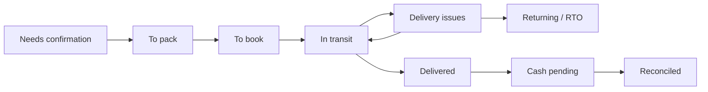
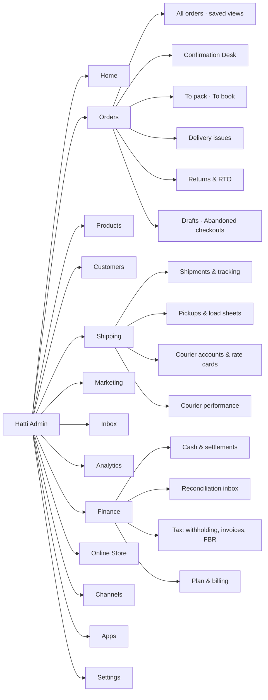

# 02 · Information Architecture

> **Status:** Draft v0.1 · **Last updated:** 2026-09-27
> How the admin, merchant app and storefront are organised, and how a merchant's mental model
> ("where is my order, where is my money") maps to navigation.

---

## 1. The merchant's mental model

Merchants think in a **pipeline**, not in database objects. The admin is organised around moving
orders from left to right and cash into the bank.

Each stage has a count on Home and in Orders, and each is one tap from a bulk action (confirm,
print, book, receive, reconcile).

*Built so far:* the Admin API's order stages run from needs confirmation (and needs review, for
held orders) through to pack, to book, in transit and delivered, with a count for each, and bulk
confirm, cancel, pack and tag for up to 250 orders at a time.

---

## 2. Admin navigation (web)

| Section | Contents | Primary roles |
|---|---|---|
| **Home** | Next best actions with counts and rupee amounts; today's sales, delivered, RTO, cash pending; setup checklist for new stores. *Built:* variants low or out of stock at the shop's threshold ([ADR-125](../architecture/13-decision-log.md#adr-125--low-stock-is-a-variant-of-an-active-product-with-the-shops-threshold-or-fewer-units-for-sale-online-five-until-it-says-otherwise-worked-out-from-the-levels-when-asked-counted-on-the-home-and-listed-the-fewest-first)); today's sales, delivered and RTO, from midnight in the shop's time zone, through the Admin API's `home.today` ([ADR-121](../architecture/13-decision-log.md#adr-121--the-home-says-how-the-shops-day-has-gone-from-midnight-in-its-time-zone-todays-sales-as-the-sales-report-works-them-out-and-the-parcels-delivered-and-turned-back-today-at-their-worth)) | Everyone (role-filtered) |
| **Orders** | All orders with stage tabs and saved views; Confirmation Desk; To pack / To book; Delivery issues; Returns & RTO; Drafts; Abandoned checkouts. *Built:* drafts found by number, mobile or words with filters ([ADR-123](../architecture/13-decision-log.md#adr-123--a-drafts-search-finds-a-draft-by-its-number-its-customers-mobile-or-words-of-their-name-city-or-email-with-filters-among-them-as-the-orders-search-does-each-draft-keeps-its-words-folded)); saved views as the shop's saved searches of its orders, each a query the orders search takes, through the Admin API ([ADR-119](../architecture/13-decision-log.md#adr-119--the-shop-keeps-searches-of-its-orders-by-name-for-all-its-staff-as-shopifys-saved-searches-each-a-query-the-orders-search-takes-checked-when-saved)); orders given to a member of staff, whose "Mine" tab is `assignee:me` ([ADR-127](../architecture/13-decision-log.md#adr-127--an-order-is-given-to-one-member-of-staff-at-a-time-to-see-it-through-owners-managers-and-apps-give-it-to-anyone-other-staff-take-one-no-one-has-staff-find-theirs-with-assigneeme-and-those-who-leave-give-their-open-orders-back)); the timeline with staff's comments, each signed by who wrote it ([ADR-128](../architecture/13-decision-log.md#adr-128--staff-and-apps-comment-on-an-orders-timeline-each-comment-its-authors-to-change-kept-apart-from-the-events-and-read-among-them-every-entry-saying-who-made-it-and-comments-going-with-the-customers-details-in-an-erasure)); an order's items changed while it waits to be packed, the total following ([ADR-131](../architecture/13-decision-log.md#adr-131--an-orders-items-change-while-it-waits-to-be-packed-quantities-set-and-variants-added-in-one-edit-the-lines-kept-keeping-their-prices-its-amounts-and-tax-worked-out-again-and-the-difference-collected-at-the-door-its-stock-committed-and-let-go-at-once)); an order its customer placed twice merged into the other ([ADR-132](../architecture/13-decision-log.md#adr-132--an-order-its-customer-placed-twice-is-merged-into-the-other-while-both-wait-to-be-packed-the-other-takes-its-items-and-discount-and-keeps-its-own-delivery-charge-as-one-parcel-the-order-merged-is-cancelled-as-merged-naming-it-and-counts-for-nothing-in-its-customers-history)); its delivery charge waived or something taken off on the call ([ADR-134](../architecture/13-decision-log.md#adr-134--an-orders-delivery-charge-and-discount-change-while-it-waits-to-be-packed-as-its-items-do-its-totals-tax-and-cash-at-the-door-following-what-was-taken-off-for-paying-by-transfer-stays-part-of-the-discount-and-the-fee-stays)); items sent apart as an order of their own, its cash collected apart ([ADR-135](../architecture/13-decision-log.md#adr-135--items-sent-apart-from-an-order-paid-on-delivery-become-an-order-of-their-own-as-its-cash-is-collected-by-order-at-their-prices-with-their-share-of-the-discount-the-rest-of-the-order-as-it-is-and-its-stock-where-it-was-both-orders-scored-as-the-one-their-customer-placed)); what a customer sends back of a delivered parcel, recorded with why and checked in, restocked or written off ([ADR-136](../architecture/13-decision-log.md#adr-136--a-customers-return-of-delivered-items-is-recorded-by-staff-each-item-with-its-reason-and-checked-in-when-it-arrives-each-unit-back-in-stock-where-it-came-back-to-or-written-off-money-given-back-stays-a-refund-and-the-sales-report-counts-what-came-back)), and another size sent at once in exchange ([ADR-137](../architecture/13-decision-log.md#adr-137--a-return-may-send-another-size-at-once-as-an-order-of-its-own-paid-by-what-was-paid-for-what-comes-back-credited-from-its-order-as-a-refund-by-exchange-in-which-no-money-moves-the-door-collecting-the-rest)); returns on their way, the longest first, to chase ([ADR-138](../architecture/13-decision-log.md#adr-138--customer-returns-on-their-way-are-listed-the-longest-first-with-their-days-and-items-and-counted-on-the-home-as-parcels-coming-back-are)); where an order placed through checkout came from, its customer's first visit and last from elsewhere with their campaigns, for the order page's conversion summary ([ADR-139](../architecture/13-decision-log.md#adr-139--a-shoppers-browser-keeps-the-visits-that-brought-them-the-first-and-the-last-from-elsewhere-checkout-passes-them-on-and-the-order-keeps-them-as-shopifys-customer-journey)) | Owner, Manager, Confirmation Agent, Packer |
| **Products** | Products, collections, inventory (by location), transfers and purchase orders (Growth), gift cards, reviews. *Built:* the products list's status tabs and filters as searches, `status:draft`, a vendor, type, tag, SKU or barcode, and the shop's saved searches of them ([ADR-124](../architecture/13-decision-log.md#adr-124--saved-searches-take-the-shops-drafts-and-products-as-well-as-its-orders-each-query-checked-by-its-own-lists-search-names-unique-within-a-list-and-keeping-one-needs-the-scope-that-changes-its-list)), through the Admin API ([ADR-120](../architecture/13-decision-log.md#adr-120--a-products-search-takes-shopifys-filters-among-its-words-in-the-syntax-the-orders-search-reads-which-the-admins-lists-share)); the list exported as Shopify's product CSV, filtered as it is, which the import takes back ([ADR-129](../architecture/13-decision-log.md#adr-129--products-leave-as-shopifys-product-csv-a-file-the-import-takes-back-whole-filtered-as-the-products-list-is-each-tracked-variants-stock-for-callers-who-may-read-it-a-larger-catalog-in-parts-the-import-links-variants-to-their-images)); stock exported and counted back as Shopify's inventory CSV, location by location ([ADR-133](../architecture/13-decision-log.md#adr-133--stock-leaves-and-comes-back-as-shopifys-inventory-csv-a-row-for-each-tracked-variant-at-each-active-location-named-by-handle-options-and-location-a-count-sets-on-hand-where-on-hand-new-says-and-refuses-a-row-whose-on-hand-changed-since-the-file-was-exported)) | Owner, Manager |
| **Customers** | Customers, segments, blocklist. *Built:* the customers list's filters, a tag and each channel's consent, with segments as its saved views ([ADR-126](../architecture/13-decision-log.md#adr-126--a-customers-search-takes-a-tag-and-each-channels-marketing-consent-among-its-number-or-words-in-the-syntax-the-lists-share-segments-stay-the-shops-saved-views-of-customers)) | Owner, Manager, Marketer |
| **Shipping** | Shipments and tracking, pickups and load sheets, courier accounts, rate cards, allocation rules, courier performance | Owner, Manager, Packer |
| **Marketing** | Campaigns (WhatsApp/SMS/email), automations, discounts, loyalty/referrals/affiliates, pixels and feeds, marketing calendar. *Built:* the shop's Meta dataset, which its orders from checkout go to as they are placed, confirmed and delivered, through the Admin API's `metaConversions`, with every moment sent and how it went in `conversionEvents` ([ADR-143](../architecture/13-decision-log.md#adr-143--orders-placed-through-checkout-go-to-metas-conversions-api-from-the-worker-as-they-are-placed-confirmed-and-delivered-the-shop-choosing-which-is-purchase-each-moment-waits-in-postgres-until-meta-takes-it-or-its-seven-days-are-up)); connecting it puts its pixel on the shop's pages ([ADR-144](../architecture/13-decision-log.md#adr-144--a-shops-storefront-loads-its-meta-pixel-while-meta-is-connected-for-the-steps-shoppers-take-before-checkout-orders-go-from-the-server-alone-each-keeping-the-pixels-browser-and-click-ids-for-them)) | Owner, Marketer |
| **Inbox** *(Growth)* | Unified conversations with order context | Support staff |
| **Analytics** | Dashboard, COD health, profit, sales, products, customers, marketing attribution, store speed | Owner, Manager |
| **Finance** | Cash and settlements (couriers and gateways), reconciliation inbox, tax (withholding, invoices, FBR), plan and billing | Owner, Accountant |
| **Online Store** | Themes and editor, pages, blog, navigation, redirects, domains, preferences (SEO, social sharing, password page) | Owner, Manager |
| **Channels** | WhatsApp, Facebook & Instagram, Google, TikTok, Daraz, POS, AI agents. *Built:* the catalog feed Google Merchant Center and Meta's catalogs fetch, its address from the Admin API's `shop { productFeedUrl }` ([ADR-142](../architecture/13-decision-log.md#adr-142--a-shops-catalog-feed-is-its-storefronts-at-its-own-address-an-item-for-each-variant-of-its-products-with-an-image-in-googles-rss-which-metas-catalogs-read-too-made-from-its-documents-a-chunk-at-a-time)) | Owner, Manager |
| **Apps** | Installed apps, App Store, custom apps | Owner |
| **Settings** | See §4 | Owner (some for Manager) |

*Built so far:* the Admin API's `home` gives Home's next actions for orders: how many orders wait
to be confirmed, reviewed, packed and booked, and how many parcels are coming back, each with what
they come to in rupees, and the cash on delivery still to come; its `setupChecklist` gives the
setup checklist for new stores, step by step, done while what each asks for holds
([ADR-095](../architecture/13-decision-log.md#adr-095--the-setup-checklist-is-worked-out-when-asked-from-what-each-module-keeps-in-one-transaction-a-step-is-done-while-what-it-asks-for-holds)).
Today's sales and filtering by role come later. Its `codHealth` gives Analytics' COD health: a
period's cash-on-delivery orders confirmed, delivered and returned, for the shop and by city,
product, source or courier; and `salesReport` its sales, in Shopify's terms, day by day, week
by week or month by month, with the products that sold most, and Analytics' profit: the cost of
goods, at what each line cost when sold, couriers' charges and write-offs taken off, claims added
back ([ADR-141](../architecture/13-decision-log.md#adr-141--an-orders-lines-keep-what-their-variants-cost-when-sold-and-the-sales-report-works-out-the-cost-of-goods-gross-profit-and-what-orders-made-less-couriers-charges-and-write-offs-plus-claims)). Both break the orders down by
where their last visits came from and by campaign, Analytics' marketing attribution
([ADR-140](../architecture/13-decision-log.md#adr-140--sales-and-cod-health-are-broken-down-by-where-orders-came-from-the-source-and-the-campaign-of-each-orders-last-visit-from-elsewhere-orders-without-one-together)).

**Global elements:** a search bar that understands phone numbers, order numbers, tracking numbers,
product names and customer names; **quick create** (+ Order, + Product, Book parcels); a
notifications centre; store switcher (multi-store); language toggle (EN/اردو); help (WhatsApp
support, articles, videos).

---

## 3. Merchant mobile app

Bottom navigation (5 slots max):

| Slot | Contents |
|---|---|
| **Home** | Next best actions, today's numbers, cash widget |
| **Orders** | Stage tabs, Confirmation Desk mode, bulk select |
| **Add** (centre action) | Camera-first product, manual order, payment link |
| **Shipping** | Book, print (Bluetooth), scan to pack, receive RTO |
| **More** | Products, customers, marketing, analytics, finance, settings |

A **Chats** tab replaces Shipping for support-role users once the Inbox ships (Growth).

**Role modes:** *Packer mode* shows only To pack / To book / Receive returns, with large scan
targets and no customer phone numbers. *Agent mode* opens straight into the Confirmation Desk.

---

## 4. Settings structure

| Group | Settings |
|---|---|
| Store | Store details, contact and WhatsApp number, addresses and locations, languages, currency and formats, policies |
| Plan & billing | Plan, invoices, payment methods, credits (messaging, AI) |
| Users & security | Staff and roles, collaborators, MFA and sessions, activity log, support access. *Built:* staff invited by link, their roles changed and staff removed, and the shop handed to a manager ([ADR-104](../architecture/13-decision-log.md#adr-104--the-owner-hands-the-shop-to-one-of-its-managers-who-has-a-second-factor-and-stays-on-as-a-manager-the-shop-has-one-owner-throughout)), through the Admin API ([ADR-101](../architecture/13-decision-log.md#adr-101--owners-and-managers-invite-staff-by-a-link-they-send-themselves-accepted-once-by-a-signed-in-account-the-owner-manages-every-role-but-its-own-managers-those-below-them-apps-none)); passkeys and authenticator apps through `/auth`, and confirming who you are before sensitive actions ([ADR-103](../architecture/13-decision-log.md#adr-103--sensitive-actions-need-staff-to-have-proved-who-they-are-in-the-last-15-minutes-by-signing-in-or-confirming-with-the-strongest-factor-their-account-has-apps-are-not-asked)) |
| Payments | Gateways, manual methods (bank transfer, Raast QR), payment method rules, refunds |
| Checkout | Fields, branding, OTP policy, order notes and gifts, abandoned checkout |
| **COD & risk** | COD availability rules, COD fee, prepaid incentives, partial advance, risk thresholds, blocklist, confirmation policy (channels, timing, quiet hours, auto-cancel) |
| Shipping & delivery | Zones and rates, courier accounts, allocation rules, local delivery, pickup, packaging defaults, label formats |
| Notifications & messaging | Templates (EN/UR/Roman), channel settings, WhatsApp account, SMS sender ID, cost policy (Rich/Economy) |
| Taxes & compliance | Tax-inclusive pricing, tax categories, tax profile (NTN/STRN, filer status), invoice series, FBR connections. *Built:* the sales tax rate, whether delivery includes it, and tax categories with rates of their own that variants' tax codes name, through the Admin API's `taxSettings` ([ADR-097](../architecture/13-decision-log.md#adr-097--tax-categories-are-the-shops-codes-with-rates-of-their-own-which-variants-name-by-shopifys-tax-code-every-other-variant-it-taxes-is-at-the-shops-rate)) ([ADR-096](../architecture/13-decision-log.md#adr-096--sales-tax-is-included-in-prices-at-a-rate-the-tax-module-keeps-each-order-keeps-the-tax-in-it-as-it-was-placed-line-by-line-and-in-its-delivery)) |
| Customer accounts | OTP login, account features (wishlist, loyalty, returns portal) |
| Domains | Primary domain, connected domains, redirects |
| Developer | Custom apps, API tokens, webhooks |
| Data & privacy | Consent settings, data requests, exports, retention. *Built:* a customer's own data as a file an owner or manager sends them, and erasing it, through the Admin API ([ADR-102](../architecture/13-decision-log.md#adr-102--a-customers-own-data-is-one-json-file-of-everything-the-shop-keeps-of-them-which-each-module-with-their-data-adds-to-the-blocklist-and-risk-scores-stay-out)) |

---

## 5. Storefront information architecture

| Page | URL pattern | Notes |
|---|---|---|
| Home | `/` (`/ur/` for Urdu) | Sections from the theme editor |
| Collection | `/collections/{handle}` | Filters, sort, pagination/infinite load |
| Product | `/products/{handle}` | Variants, delivery estimate, WhatsApp CTA, reviews |
| Search | `/search?q=` | Roman Urdu-aware, with typo tolerance |
| Cart | `/cart` (drawer on most pages) | Delivery estimate by city |
| Checkout | `/checkouts/{token}` | Served by Hatti Checkout on the merchant's domain |
| Thank you / order status | `/orders/{token}` | Tracking, address fix before dispatch, WhatsApp opt-in |
| Track order | `/track` | Order number + phone, no login needed |
| Account | `/account` (OTP login) | Orders, addresses, wishlist, loyalty, returns |
| Returns portal | `/returns` | Exchange-first |
| Pages | `/pages/{handle}` | About, contact, FAQ, size guide |
| Policies | `/policies/{handle}`, such as `/policies/refund-policy` | Refund, privacy, shipping, terms, contact information |
| Blog | `/blogs/{blog}/{article}` | |
| Store locator | `/pages/stores` | Retailers (Growth) |
| Agent endpoints | `/api/mcp`, `/.well-known/ucp` | Growth (see architecture 09) |

URL patterns mirror Shopify's, so migrations keep their search rankings.

---

## 6. Permissions → navigation matrix (presets)

| Area | Owner | Manager | Confirmation Agent | Packer | Marketer | Accountant |
|---|---|---|---|---|---|---|
| Home | Full | Full | Agent view | Packer view | Marketing view | Finance view |
| Orders | Full | Full | Confirmation Desk, view orders | To pack / To book (no phone numbers) | View | View |
| Products | Full | Full | View | View (for picking) | View | View |
| Customers | Full | Full | View (phone reveal logged) | — | Segments (no export by default) | — |
| Shipping | Full | Full | View | Book, print, scan | — | View costs |
| Marketing | Full | Full | — | — | Full | — |
| Finance | Full | View | — | — | — | Full |
| Online Store | Full | Full | — | — | Content only | — |
| Settings | Full | Most | — | — | — | Tax & billing |
