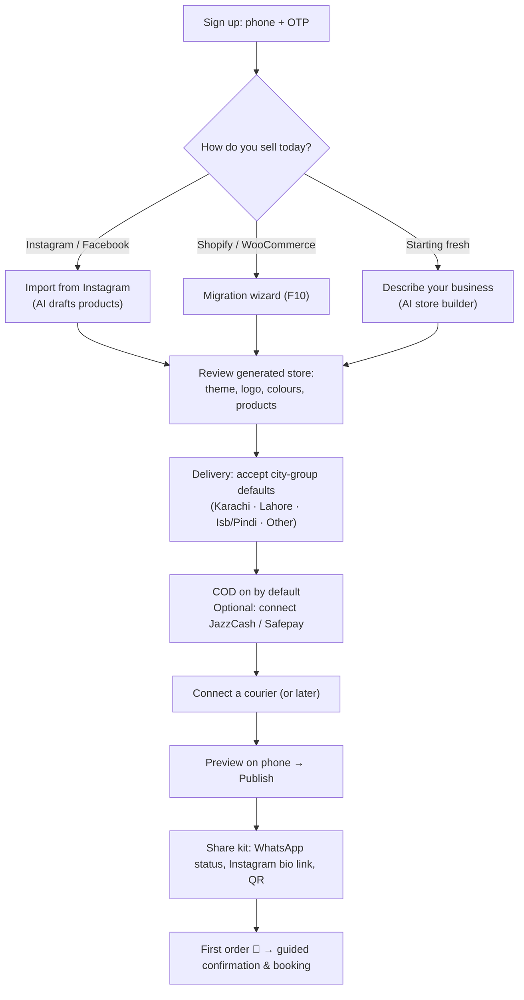
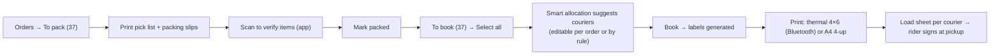
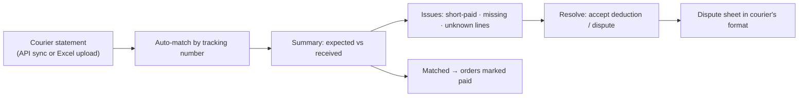
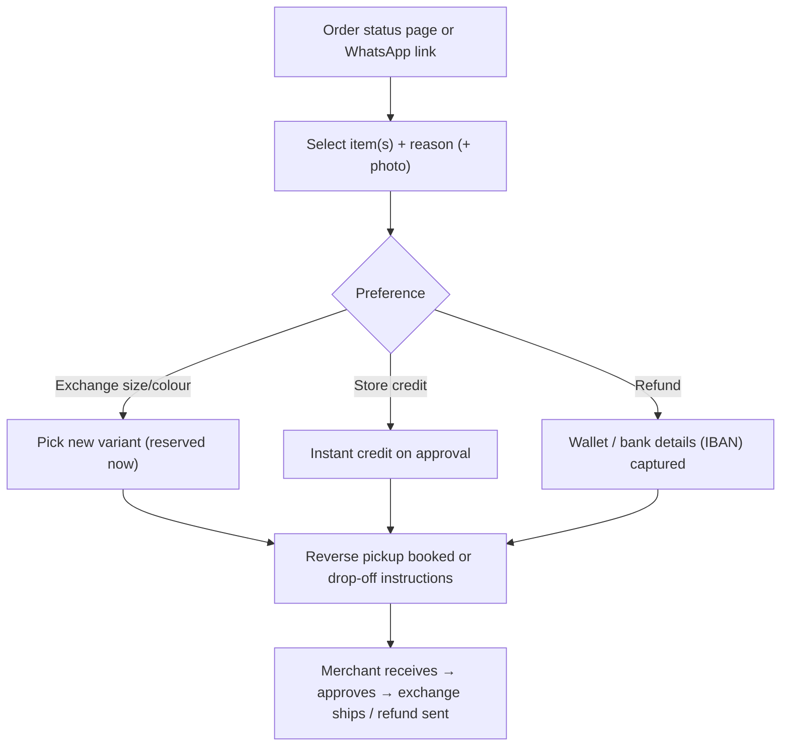
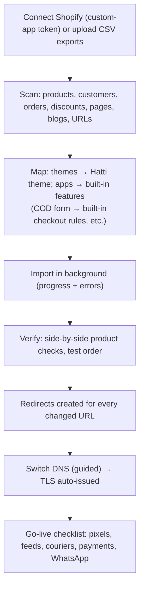

# 03 · Key User Flows

> **Status:** Draft v0.1 · **Last updated:** 2026-09-27
> The flows that decide whether Hatti succeeds. Each lists its goal, target metric, steps, edge cases
> and a low-fidelity wireframe for the critical screen. Wireframes are mobile-first (≈ 360 dp) and
> show layout intent only; visual design follows [01 · Design System](./01-design-principles-and-system.md).

| # | Flow | Actor | Success metric |
|---|---|---|---|
| F1 | Onboarding → first order | New merchant | Store live < 30 min; first order < 72 h |
| F2 | COD checkout on mobile | Shopper | Checkout conversion; < 90 s to complete |
| F3 | Order confirmation (bot + desk) | Shopper, agent | Confirmation rate; time to confirm |
| F4 | Pack & book in bulk | Packer | 100 parcels booked and labelled < 10 min |
| F5 | Delivery issue rescue | Shopper, merchant | Rescue rate |
| F6 | Receive RTO & restock | Packer | Returns processed same day |
| F7 | COD reconciliation | Accountant/owner | Days to reconcile; unexplained deductions |
| F8 | Return / exchange | Shopper | Exchange share of returns |
| F9 | WhatsApp broadcast | Marketer | Revenue per message; opt-out rate |
| F10 | Migrate from Shopify | Merchant/agency | Migration < 1 day; zero SEO loss |
| F11 | Drop Mode launch | Brand | Zero downtime; zero oversell |

---

## F1 · Onboarding → first order



**Edge cases:** no logo (AI text logo); no product photos yet (placeholder plus camera prompt);
courier credentials pending (book manually and paste tracking numbers); merchant wants Urdu-only
(language toggle at step 1).

```text
┌──────────────────────────────────────┐
│ =  Ayesha's Closet        [اردو] (!) │
├──────────────────────────────────────┤
│ Your store is 4/6 ready              │
│ ██████████████░░░░░░░                │
│ ✓ Store created                      │
│ ✓ 12 products added                  │
│ ✓ Delivery charges set               │
│ ✓ Cash on delivery on                │
│ ○ Connect a courier        [Connect] │
│ ○ Share your store         [Share]   │
├──────────────────────────────────────┤
│ Tip: stores that share on WhatsApp   │
│ status get their first order 2×      │
│ faster.                              │
├──────────────────────────────────────┤
│  Home  Orders   (+)   Shipping  More │
└──────────────────────────────────────┘
```

---

## F2 · COD checkout on mobile (shopper)

Architecture and rules: [05 · Checkout & Payments](../architecture/05-checkout-and-payments.md).

```text
┌──────────────────────────────────────┐
│ <  Checkout               (Secure)   │
├──────────────────────────────────────┤
│ Contact                              │
│ ┌──────────────────────────────────┐ │
│ │ 0300 1234567                     │ │
│ └──────────────────────────────────┘ │
│ ┌──────────────────────────────────┐ │
│ │ Full name                        │ │
│ └──────────────────────────────────┘ │
│ Delivery                             │
│ ┌──────────────────────────────────┐ │
│ │ City: Multan                   ▾ │ │
│ └──────────────────────────────────┘ │
│ ┌──────────────────────────────────┐ │
│ │ House / street / area            │ │
│ └──────────────────────────────────┘ │
│ ┌──────────────────────────────────┐ │
│ │ Nearest landmark (e.g. masjid)   │ │
│ └──────────────────────────────────┘ │
│ Standard delivery: Rs 200, 2-4 days  │
├──────────────────────────────────────┤
│ Payment                              │
│ ◉ Cash on delivery (+Rs 100)         │
│ ○ JazzCash / Easypaisa   save Rs 150 │
│ ○ Bank / Raast           save Rs 150 │
│ ○ Debit / credit card                │
├──────────────────────────────────────┤
│ Subtotal               Rs 4,550      │
│ Delivery               Rs   200      │
│ COD fee                Rs   100      │
│ Total                  Rs 4,850      │
│ ┌──────────────────────────────────┐ │
│ │        Place order · Rs 4,850    │ │
│ └──────────────────────────────────┘ │
│ ✓ Verified store · 7-day exchange    │
└──────────────────────────────────────┘
```

**Behaviour:**

* After the phone number is entered, a known shopper gets "Verify to use saved address?"
  (OTP bottom sheet).
* The city list drives the delivery charge, ETA and COD availability immediately.
* On submit, the risk decision may add **OTP verification** (bottom sheet, auto-read on Android)
  or **partial advance** ("Pay Rs 200 delivery online to confirm"), with polite wording.
* The thank-you page offers **"Confirm on WhatsApp"** (a customer-initiated chat), the order
  status link and a post-purchase offer.

**Edge cases:** the courier doesn't serve the city (hide COD or offer pickup, with an
explanation); duplicate order detected; payment app never returns (the order is created on
callback or inquiry; the thank-you page polls); no JavaScript (plain form flow).

---

## F3 · Order confirmation (bot + Confirmation Desk)

**Shopper side (WhatsApp):**

```text
Ayesha's Closet  ✓
──────────────────────────────────────
Assalam-o-Alaikum Hamza! Aap ka order
#1043 (Rs 4,850, COD) mila hai.
3pc Lawn – Firozi, M × 1
Delivery: Multan, 2–4 din.
Kya hum order confirm kar dein?
 [ Confirm order ] [ Cancel ] [ Change address ]
──────────────────────────────────────
                         Confirm order ✓
Shukriya! Aap ka order confirm ho gaya.
Tracking link parcel book hotay hi bhej
diya jaye ga.
```

**Agent side (Confirmation Desk):**

```text
┌──────────────────────────────────────┐
│ Confirmation Desk        23 in queue │
│ [Needs review 4] [High value 6] [All]│
├──────────────────────────────────────┤
│ #1051 · Rs 12,400 · Sukkur  risk 0.62│
│ Sana K. · 0301 ••• 4471 (reveal)     │
│ Why flagged:                         │
│  • 2 refused deliveries on Hatti     │
│  • Address has no area/landmark      │
│ Items: Bridal dupatta × 1            │
│ WhatsApp: delivered, no reply (3h)   │
├──────────────────────────────────────┤
│ [Call]  [WhatsApp]  [Edit address]   │
├──────────────────────────────────────┤
│ Outcome:                             │
│ [Confirmed] [No answer ↻2h]          │
│ [Ask partial advance] [Cancel ▾]     │
└──────────────────────────────────────┘
```

**Rules:** the queue is sorted by review flags, value, risk and age; call outcomes are one tap;
"No answer" schedules a retry; quiet hours are respected; every action lands on the order
timeline.

---

## F4 · Pack & book in bulk



```text
┌──────────────────────────────────────┐
│ Book 37 parcels                      │
├──────────────────────────────────────┤
│ Suggested (balanced):                │
│  PostEx   21 · Lahore, Karachi       │
│  Leopards 12 · Interior Sindh        │
│  TCS       4 · Northern areas        │
│ Why? Tap a courier to see delivery % │
│ and cost per city.                   │
├──────────────────────────────────────┤
│ Est. shipping: Rs 7,420              │
│ COD to collect: Rs 1,86,300          │
├──────────────────────────────────────┤
│ Labels: (•) Thermal 4×6  ( ) A4 4-up │
│ ┌──────────────────────────────────┐ │
│ │     Book & print 37 labels       │ │
│ └──────────────────────────────────┘ │
└──────────────────────────────────────┘
```

**Edge cases:** a city is not mapped for a courier (inline city picker); a courier API is down
(bookings queued as "pending", printed later); weight is missing (default from the product or
prompt).

---

## F5 · Delivery issue rescue

```text
Ayesha's Closet  ✓
──────────────────────────────────────
Hamza, aaj rider aap tak nahi pohanch
saka (order #1043). Kya karein?
 [ Kal deliver karein ] [ Address change ] [ Cancel ]
──────────────────────────────────────
                    Kal deliver karein ✓
Theek hai! Kal dobara koshish ki jaye gi.
Rider aap ko call kare ga.
```

The merchant sees a **Delivery issues** queue with the courier's reason, the shopper's reply and
the action already sent to the courier (re-attempt instruction via API or task). Unanswered cases
escalate to the Confirmation Desk after 12 h.

---

## F6 · Receive RTO & restock

1. Packer mode → **Receive returns** → scan the parcel barcode (or type the tracking number).
2. The app shows the order, items and photos → the packer inspects the items.
3. Choose **Restock all**, **Restock some** (per item) or **Damaged** (photo required).
4. Inventory updates; the RTO cost (forward + return fees + packaging) is recorded on the order;
   the customer's delivery history updates (feeds the risk model).

Target: under 20 seconds per parcel.

---

## F7 · COD reconciliation



```text
┌──────────────────────────────────────┐
│ Leopards · statement 14–20 Sep       │
├──────────────────────────────────────┤
│ Expected COD          Rs 4,12,300    │
│ Courier charges      −Rs   38,640    │
│ Tax withheld         −Rs   16,492    │
│ Received              Rs 3,51,468    │
│ Difference            Rs    5,700 (!)│
├──────────────────────────────────────┤
│ 3 issues                             │
│ ! LE7731… delivered 16 Sep,          │
│   not in statement      Rs 3,200     │
│ ! LE7702… short paid    Rs 1,500     │
│ ! LE7688… RTO fee charged twice      │
│   Rs 1,000                           │
│ [Export disputes]  [Mark reviewed]   │
└──────────────────────────────────────┘
```

---

## F8 · Return / exchange (shopper)



Rules come from the merchant's return policy (window, eligible items, who pays reverse shipping).
Exchange is offered first, because it keeps revenue.

---

## F9 · WhatsApp broadcast

1. Choose a **segment** (e.g. "Lahore · bought 2+ times · no order in 60 days"); only
   **opted-in** contacts are counted.
2. Choose or write a **template** (English/Urdu/Roman Urdu), with a preview on a phone mock.
3. See the **cost estimate** ("4,212 recipients × marketing rate ≈ Rs 56,000") and the expected
   sending time (paced by the number's messaging tier).
4. Schedule (quiet hours enforced) → send → live results: delivered, read, clicked, orders,
   revenue, opt-outs.

Guardrails: frequency cap per customer; auto-pause if the opt-out rate spikes; never send to
non-consented numbers.

---

## F10 · Migrate from Shopify



The app-to-feature mapping report ("You can uninstall 7 apps; estimated saving Rs 41,000/month")
is itself a key sales moment.

*Built so far:* Shopify's product and customer CSV exports go in through the Admin API, products
keeping their handles and so their addresses, with a dry run first
([ADR-059](../architecture/13-decision-log.md#adr-059--a-shopify-product-export-is-imported-product-by-product-as-productcreate-makes-them-keeping-their-handles-the-core-sets-the-stock)); the screens,
the background runs and the rest of the flow come with the admin app.

---

## F11 · Drop Mode launch (Growth)

1. **Schedule:** drop date/time, products and variants, expected traffic, per-customer limits.
2. **Prepare:** scheduled theme publish, countdown section, WhatsApp "notify me" list, rehearsal
   (a synthetic load test run by Hatti for Pro/Enterprise).
3. **Go live:** the waiting room admits shoppers at the rate checkout can absorb; inventory tokens
   prevent oversell; the merchant watches a live dashboard (queue, conversion, sell-through).
4. **After:** automatic reconciliation, waitlist messages for sold-out variants, a drop report.
