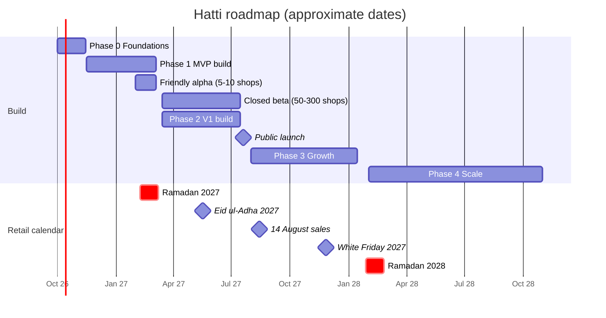

# 04 · Roadmap & Delivery Plan

> **Status:** Draft v0.1 · **Last updated:** 2026-09-27 · Month 0 = October 2026.
> Feature IDs refer to the [Feature Catalog](./02-feature-catalog.md). Islamic calendar dates are
> approximate (moon sighting). Dates assume the core team is in place by November 2026; slip them
> one-for-one with hiring.

---

## 1. Timeline

**Why this shape:** merchants will not switch platforms right before Eid or White Friday. So the
alpha runs quietly with a few friendly shops during Ramadan 2027, the closed beta starts after Eid
ul-Fitr, and public launch lands in July 2027. That is before the 14 August sales and the winter
collection season, and leaves four months to harden for White Friday. Growth features ship before
Ramadan 2028, followed by a change freeze.

---

## 2. Phase 0 · Foundations (Oct – mid-Nov 2026)

**Goal:** remove the big unknowns before writing product code at scale.

| Track | Deliverables |
|---|---|
| Company & legal | Entity and bank; trademark and domain for the final name; written opinions on (1) tax classification as a software platform vs "online marketplace", (2) PECA 2025 obligations, (3) the privacy basis for network risk signals |
| Partnerships | API/sandbox access and co-launch terms with **4 couriers** (PostEx, Leopards, TCS, Trax); **Safepay + JazzCash** (Easypaisa next); Meta Tech Provider application + a BSP for credit lines; 2 SMS aggregators; a KYC partner; cloud credits |
| Discovery | 30 merchant interviews (15 DTC brands on Shopify, 15 social sellers); shadow 3 confirmation teams; 10 shopper interviews; pricing tests |
| Engineering | Monorepo, CI/CD, environments, IaC, observability, auth and tenancy skeleton with RLS, design tokens |
| Spikes (go/no-go) | (1) LiquidJS renders a Dawn-class theme within budget; (2) courier adapter SDK with 2 sandboxes; (3) WhatsApp confirm/cancel end to end; (4) checkout with Safepay and JazzCash sandboxes; (5) RLS and PgBouncer performance; (6) **latency bake-off** from Pakistani ISPs (ADR-015) |
| Design | Brand exploration; Urdu typography tests on low-end phones; clickable prototypes of onboarding, checkout and the Confirmation Desk tested with merchants |

**Exit criteria:** all spikes green or re-scoped; partner LOIs for ≥ 2 couriers and ≥ 1 gateway;
hosting decision made; MVP backlog estimated.

---

## 3. Phase 1 · MVP: "Sell and ship with COD" (mid-Nov 2026 – early Mar 2027)

**Goal:** the thinnest complete **order-to-cash loop**, good enough that 50 real merchants run their
business on it.

| Area | Scope (feature IDs) |
|---|---|
| Store setup | ONB-01, 02, 05 (CSV), 07, 09, 10 · OS-01 (3 themes), 02, 06, 07, 09, 10, 15 · CAT-01–04 · INV-01, 03, 06 · SRC-01 · CH-01, 07 |
| Checkout & payments | CHK-01, 02, 04, 06, 07, 08, 09, 14, 17, 18, 19, 22 · PAY-01 (Safepay, JazzCash), 02, 04, 05, 06 |
| Orders & COD | ORD-01, 02, 03, 05, 06, 09, 10, 11 · COD-01, 02, 04, 06 (rules), 07 (blocklist), 09, 10 (CSV), 12 |
| Shipping | SHP-01 (PostEx, Leopards, TCS, Trax), 02, 03, 04, 05 |
| Customers & messaging | CUS-01, 04, 07 · MSG-01, 03, 04, 09 |
| Admin, analytics, billing | ADM-01, 02, 04, 08 · ANL-01, 02 · TAX-01, 06, 07 · BIL-01, 03, 05 |
| Merchant mobile | Responsive, installable admin (PWA); the native app follows in V1 |

**Exit criteria (end of closed beta, ~July 2027):**
* ≥ 50 active merchants (≥ 20 migrated from Shopify); ≥ 10,000 orders placed and ≥ 6,000 delivered
  through Hatti.
* Checkout success (no platform-caused failures) ≥ 99.5%; zero cross-tenant incidents; zero lost
  paid orders.
* Beta merchants' **delivery success rate improves vs their own baseline**, measured per merchant.
* Merchant NPS ≥ 30; median time to first order < 72 h for new stores.

---

## 4. Phase 2 · V1: "Replace the app stack" (mid-Mar – Jul 2027, public launch ≈ 20 July)

**Goal:** a Shopify-plus-apps replacement that a typical DTC brand can move to with confidence, and
a public launch.

| Area | Scope (feature IDs) |
|---|---|
| COD intelligence | COD-03, 05, 06 (ML), 08, 10 (APIs), 11 · SHP-06, 07, 08, 14, 15 · CHK-03, 05, 10, 11, 12, 13, 16 |
| Growth tools | MKT-01, 02, 04 (recipes), 05, 09, 10, 11, 12 (UTM), 13, 14, 16 · CH-03, 05 |
| Store & catalogue | OS-03, 04, 05, 08, 11, 12, 13 · SRC-02, 03, 05 · CAT-05–08, 10–12, 14, 17, 18, 20, 21 · INV-02 |
| Orders & customers | ORD-04, 07, 12, 13 · CUS-02, 03, 05 |
| Onboarding & trust | ONB-03, 04, 06, 11–14 · TNS-01, 03, 04 |
| Money & tax | PAY-01 (Easypaisa, PayFast, bank), 07, 13 · ANL-03, 05, 07, 09 · TAX-02, 03, 05 |
| Merchant tools | APP-01–04 · ADM-03, 05, 07, 10 · MSG-02 |
| Platform & partners | DEV-01, 03, 04 · PRT-01, 02 · BIL-02, 04, 06, 07 |

**Launch readiness checklist:** pentest done and criticals fixed; status page; support rota in Urdu
and English; SLO dashboards; incident runbooks; pricing and billing live; migration service
staffed; partner programme open; legal pages and DPA published; load test at 3× expected launch
traffic.

**Exit criteria:** ≥ 1,500 paying stores by month 12 (≈ Oct 2027); storefront and checkout SLOs met
for 60 consecutive days; paid churn < 4%/month; support first response < 10 min in business hours.

---

## 5. Phase 3 · Growth: "Omnichannel, payments and ecosystem" (Aug 2027 – mid-Jan 2028)

| Theme | Scope (feature IDs) |
|---|---|
| Retail & compliance | POS-01–07 · TAX-04, 08 · CAT-19, 22 · INV-04, 05, 07, 10 |
| Money | PAY-03, 08, 09, 10 (partner-powered payments) · SHP-09, 10, 11 (Hatti Ship) |
| Conversations & AI | MSG-05–08, 10 · merchant copilot · ANL-04, 06, 08, 10 |
| Channels | CH-02, 04, 06, 09, 11 · OS-23 · ADM-06 |
| Growth features | MKT-03, 04 (flow builder), 06, 07, 08, 12 (ROAS), 15 · CUS-06 · CAT-09, 13, 15, 23 |
| Checkout & returns | CHK-15, 21 · ORD-08 |
| Scale features | OS-14, 16, 17, 18, 20 · INV-09 (Drop Mode) · SRC-04, 06 |
| Ecosystem | DEV-02, 05, 06, 08, 09, 10 · PRT-03, 04 · ONB-08 · APP-05, 06 · TNS-02 |
| Platform | Cell 2 + Shop Mover · **Pakistan data-centre cell pilot** · FBR egress IPs · Drop Mode spike (ADR-019) |

**Exit criteria:** White Friday 2027 with zero Sev-1 incidents; partner-powered payments live with
≥ 1 licensed partner; ≥ 20 partner-built apps/themes; POS live in ≥ 50 retail locations; Ramadan
2028 readiness review passed.

---

## 6. Phase 4 · Scale (Feb – Oct 2028)

Scope: DEV-07 and CHK-20 (Functions) · OS-19 (headless), OS-21, OS-22 · CAT-16 (subscriptions) ·
PAY-11, 12, 14 · SHP-12, 13 · CH-08, 10 (reseller network, after tax review) · CUS-08 (Hatti Pass) ·
INV-08 · SRC-07 · MSG-11 · COD-13 (financing via partners) · ADM-09 (SSO) · POS-08 · DEV-11 ·
Kafka-compatible event log · warm-standby DR region · Pakistan cells as the default home for
Pakistani shops (if the pilot succeeds).

**Exit criteria:** ≥ 6,000 paying stores by month 24; net revenue retention > 105%; per-store
infrastructure cost on track to ≤ $0.7.

---

## 7. Team plan

| Phase | Headcount | Composition |
|---|---|---|
| **0–1** (Foundations, MVP) | **≈ 15** | Founders (CEO/product, CTO/architect) · 1 PM (COD & logistics) · 1 product designer + part-time Urdu UX writer · 1 backend tech lead · 4 full-stack TS engineers · 1 storefront/Liquid engineer · 1 admin/PWA frontend engineer · 1 integrations engineer (couriers/payments) · 1 platform/SRE · 1 QA automation · 1 merchant success lead · 1 partnerships lead |
| **2** (V1) | **≈ 26** | + 2 backend · 1 React Native · 1 data/ML engineer · 1 designer · 1 PM (growth tools) · 3 support (Urdu/English) · 1 partner manager · 1 content marketer (Urdu video) · 1 security/infra engineer |
| **3** (Growth) | **≈ 42** | + POS squad (3) · payments squad (3) · apps platform (3) · AI (2) · Trust & Safety (2) · support/success (+4) · enterprise sales (2) |
| **4** (Scale) | **≈ 60** | Functions/Rust (2), international (3), data platform (2), more squads as needed |

**Squads (from V1):** Storefront & Themes · Checkout & Payments · Orders & COD OS · Logistics ·
Merchant Experience (admin, app, onboarding, analytics) · Platform (infra, identity, tenancy,
messaging engine, APIs). POS, Apps Platform, AI/ML and Growth Tools are added in Phase 3.

---

## 8. Roadmap risks & contingencies

| Risk | Early signal | Contingency |
|---|---|---|
| Courier API access or sandbox delays | No credentials by week 4 of Phase 0 | CSV booking import/export and manual tracking-number entry for that courier; swap in the next courier |
| Meta Tech Provider approval slow | No approval by beta | Launch on a BSP's shared infrastructure; the shared notifications number for utility messages |
| Payment partner delays | Sandbox but no production approval | Manual bank transfer + Raast QR + COD at launch; add gateways as approved |
| Hiring slower than plan | Fewer than 10 engineers by Dec 2026 | Cut MVP scope to one theme, 2 couriers, 1 gateway; keep the beta date |
| Liquid compatibility harder than expected | Spike misses budget | Ship our own themes first; delay compatibility promises to Growth |
| Beta merchants churn back to Shopify | Weekly active drop | Weekly merchant council; fix the top 3 issues per sprint; white-glove support |
| Regulatory surprise (tax classification) | Counsel opinion is unfavourable | Registration gating in onboarding (built as a switch from day one) |

---

## 9. Deliberately not now

| Not now | Why |
|---|---|
| A consumer marketplace / mall app | Could classify us as an "online marketplace" (filing and gating duties) and distracts from merchant success |
| Our own payments licence, or holding funds | Capital and compliance burden; partner-powered payments first |
| Our own courier fleet | Capital-heavy; the network-intelligence layer gives more leverage |
| Lending on our balance sheet | Licensed NBFC partners only |
| International expansion before leadership in Pakistan | Focus; diaspora selling comes first as a feature |
| Native-only features for iOS | Android dominates; iOS parity follows |
